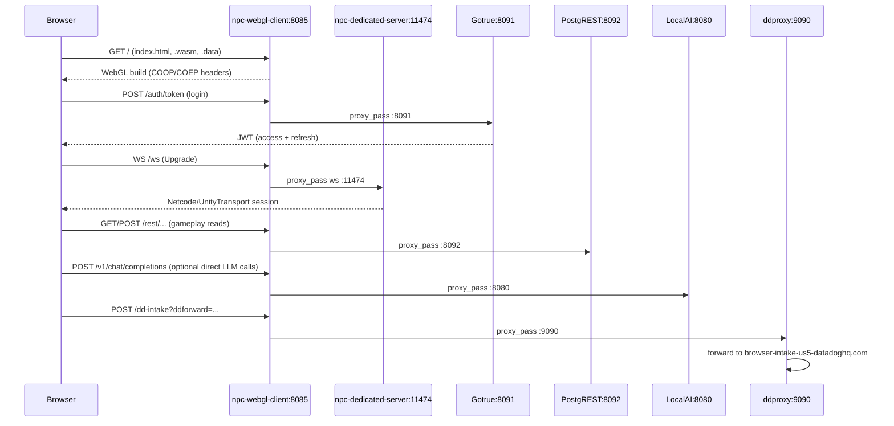
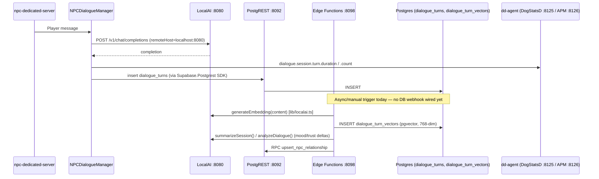
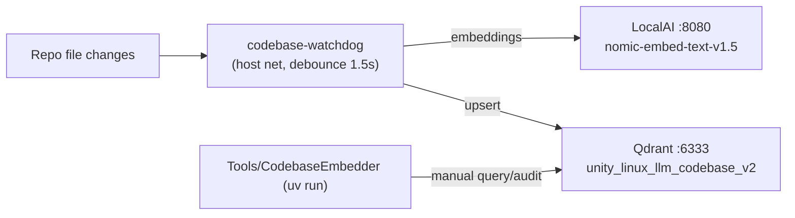
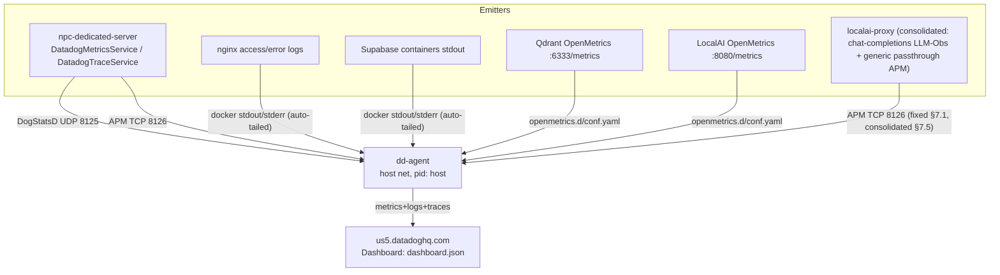

# Backend Services Topology — Local Dedicated-Server Simulation

This document maps the **full local backend** that simulates a production Unity
dedicated-server deployment for `Unity_Linux_LLM`: the WebGL client, the Netcode
dedicated server, LocalAI, Qdrant, Supabase, Cognee, and the Datadog observability
plane. It complements [`2_Architecture/README.md`](README.md) (Unity-internal
architecture) with the **infrastructure/container topology**, real ports,
real config file paths, and the actual live state captured during this audit
(2026-07-17).

Herdr is the operator surface for this stack (see `.herdr/README.md`). This
document is the reference the Herdr `logs` tab and health tokens are built against.

**Table of Contents**
- [1. Live System Graph](#1-live-system-graph)
- [2. Service Inventory](#2-service-inventory)
- [3. Data Flow Diagrams](#3-data-flow-diagrams)
- [4. Full Endpoint Reference](#4-full-endpoint-reference)
- [5. Config File Map](#5-config-file-map)
- [6. Log Sources](#6-log-sources)
- [7. Findings From This Audit](#7-findings-from-this-audit)
- [8. Herdr Operating Plan for Log Tracking](#8-herdr-operating-plan-for-log-tracking)

---

## 1. Live System Graph

Verified against `docker ps`, `systemctl --user status`, and live endpoint probes
on 2026-07-17. All nodes below were confirmed **up** except where noted.

```mermaid
graph TB
    subgraph Browser["Player Browser"]
        WebGLApp["Unity WebGL Build<br/>index.html / .wasm"]
    end

    subgraph WebGLStack["Backend/webgl-client — Docker"]
        Nginx["npc-webgl-client (nginx:stable)<br/>:8085 → :80"]
        DDProxy["ddproxy (Python)<br/>:9090 — DD browser intake proxy"]
    end

    subgraph ServerStack["Backend/unity-dedicated-server — Docker (network_mode: host)"]
        NPCServer["npc-dedicated-server<br/>Netcode + UnityTransport<br/>:11474 (TCP/UDP or WS)"]
    end

    subgraph LocalAIStack["/mnt/data/Projects_SSD/LocalAI — Docker"]
        LocalAI["localai-orchestrator<br/>:8080 — llama.cpp GGUF backends"]
    end

    subgraph LocalAIProxyStack["Backend/localai-proxy — Docker (network_mode: host)"]
        LAIProxy["localai-proxy (FastAPI)<br/>:8090 — consolidated DD LLM-Obs + passthrough proxy (fixed §7.1, consolidated §7.5)"]
    end

    subgraph QdrantStack["Backend/qdrant — Docker"]
        Qdrant["qdrant<br/>:6333 REST/gRPC HTTP, :6334 gRPC internal"]
    end

    subgraph SupabaseStack["Backend/supabase-stack — Docker"]
        Auth["auth (Gotrue)<br/>:8091"]
        Rest["rest (PostgREST)<br/>:8092"]
        Realtime["realtime<br/>:8093"]
        Storage["storage<br/>:8094"]
        Imgproxy["imgproxy<br/>:8095"]
        Meta["meta (postgres-meta)<br/>:8096"]
        Studio["studio<br/>:8097"]
        Functions["functions (Edge Runtime/Deno)<br/>:8098"]
        DB["db (Postgres 17 + pgvector)<br/>:55432 → :5432"]
        PgExporter["pg-exporter<br/>:9187"]
    end

    subgraph CogneeStack["Systemd user services (not Dockerized)"]
        Cognee["cognee-api.service<br/>gunicorn :8000<br/>SQLite+LanceDB+Kuzu, Postgres cognee_db"]
    end

    subgraph WatchdogStack["Backend/codebase-watchdog — Docker (network_mode: host)"]
        Watchdog["codebase-watchdog<br/>indexes repo → Qdrant"]
    end

    subgraph DDStack["Backend/datadog-host — Docker (network_mode: host, pid: host)"]
        DDAgent["dd-agent<br/>DogStatsD :8125/udp, APM :8126/tcp"]
    end

    WebGLApp -->|HTTPS 8085| Nginx
    Nginx -->|"/ws → :11474"| NPCServer
    Nginx -->|"/auth/ → :8091"| Auth
    Nginx -->|"/rest/ → :8092"| Rest
    Nginx -->|"/v1/ → :8080"| LocalAI
    Nginx -->|"/dd-intake → :9090"| DDProxy
    DDProxy -->|HTTPS| DDIntake["browser-intake-us5-datadoghq.com"]

    NPCServer -->|"HTTP :8080/v1/chat/completions"| LocalAI
    NPCServer -->|"HTTP :6333 (disabled: useQdrantRag=false)"| Qdrant
    NPCServer -.->|"disabled: useCogneeMemory=false, no C# client yet"| Cognee
    NPCServer -->|"Supabase.Gotrue/.Postgrest SDK"| Auth
    NPCServer --> Rest
    NPCServer -->|"DogStatsD UDP :8125"| DDAgent
    NPCServer -->|"APM :8126"| DDAgent

    Functions -->|"generateEmbedding/summarize"| LocalAI
    Functions --> DB
    Auth --> DB
    Rest --> DB
    Realtime --> DB
    Storage --> DB
    Meta --> DB
    Studio --> Meta
    Storage --> Imgproxy
    PgExporter --> DB

    Watchdog -->|"index repo"| Qdrant
    Watchdog -->|"embeddings"| LocalAI

    LocalAI -.->|"same compose project, sidecar"| TraceProxy
    TraceProxy -.->|"APM (broken DNS, see §7)"| DDAgent
    LAIProxy -->|"proxies /v1/chat/completions"| LocalAI
    LAIProxy -.->|"APM (traces; verified working after fix, see §7.1)"| DDAgent

    DDAgent -->|"logs/metrics/APM"| DatadogCloud["us5.datadoghq.com"]

    style NPCServer fill:#4da6ff
    style LocalAI fill:#ff9999
    style Qdrant fill:#cc99ff
    style Cognee fill:#ffb3cc
    style DDAgent fill:#e6b3ff
```



**Network isolation note:** Three different Docker networking modes are in play:
- `network_mode: host` (dedicated server, localai-proxy, codebase-watchdog, dd-agent) — these see `localhost` as the real host and can reach every other host-networked or host-port-published service directly.
- Bridged compose networks with published ports (webgl-client, qdrant, supabase-stack, LocalAI's own compose project) — these reach the host via `host.docker.internal` (explicitly added as `extra_hosts` only in `webgl-client`) or via published ports from other containers on the host.
- LocalAI's own compose project (`localai-orchestrator` only, as of §7.5) is a **separate Compose project** from `Backend/datadog-host`. It previously also ran a `trace-proxy` sidecar that couldn't resolve the `dd-agent` hostname across compose projects (root cause of the now-resolved §7.2 finding) — that sidecar was retired in §7.5 rather than re-bridged, since it duplicated `Backend/localai-proxy`'s job.

---

## 2. Service Inventory

| # | Service | Container / Process | Compose File | Network Mode | Published Ports | Image/Runtime | Live Status (2026-07-17) |
|---|---------|---------------------|--------------|---------------|------------------|----------------|---------------------------|
| 1 | WebGL static host | `npc-webgl-client` | `Backend/webgl-client/docker-compose.yml` | bridge | `8085:80` | `nginx:stable` | Up |
| 2 | Datadog browser intake proxy | `ddproxy` | `Backend/webgl-client/docker-compose.yml` | bridge | `9090:9090` | python3.12-slim + ddtrace | Up |
| 3 | Unity dedicated server | `npc-dedicated-server` | `Backend/unity-dedicated-server/docker-compose.yml` | **host** | `11474` (host net, no publish needed) | Ubuntu 22.04 + Unity Linux Dedicated Server build (`Builds/Server1/`) | Up |
| 4 | Codebase RAG indexer | `codebase-watchdog` | `Backend/codebase-watchdog/docker-compose.yml` | **host** | n/a (host net) | Python watcher | Up |
| 5 | LLM inference | `localai-orchestrator` | `/mnt/data/Projects_SSD/LocalAI/docker-compose.yaml` | bridge | `8080:8080` | `localai/localai:latest-gpu-nvidia-cuda-13` | Up (healthy), GPU-backed |
| 6 | ~~LocalAI APM wrapper (LocalAI project's own)~~ `localai-trace-proxy` | *(retired §7.5)* | `/mnt/data/Projects_SSD/LocalAI/docker-compose.yaml` | bridge | `8081:8081` | custom Dockerfile (`./proxy`) | **Removed** — consolidated into row 7 |
| 7 | LocalAI Datadog proxy (consolidated: LLM-Obs chat tracing + generic passthrough) | `localai-proxy` | `Backend/localai-proxy/docker-compose.yml` | **host** | `8090` (host net) | FastAPI + ddtrace≥4.10 | Up, fixed §7.1, absorbed row 6's role §7.5 |
| 8 | Vector DB | `qdrant` | `Backend/qdrant/docker-compose.yml` | bridge | `6333:6333`, `6334:6334` | `qdrant/qdrant:latest` | Up |
| 9 | Postgres (+pgvector) | `supabase-stack-db` | `Backend/supabase-stack/docker-compose.yml` | bridge | `55432:5432` | `supabase/postgres:17.6.1.136` | Up (healthy) |
| 10 | Auth/JWT | `supabase-stack-auth` | same | bridge | `8091:9999` | `supabase/gotrue:v2.189.0` | Up (healthy) |
| 11 | REST auto-API | `supabase-stack-rest` | same | bridge | `8092:3000` | `postgrest/postgrest:v14.12` | Up (healthy) |
| 12 | Realtime (WS) | `realtime-dev.supabase-realtime` | same | bridge | `8093:4000` | `supabase/realtime:v2.102.3` | Up (healthy) |
| 13 | File storage | `supabase-stack-storage` | same | bridge | `8094:5000` | `supabase/storage-api:v1.60.4` | Up (healthy) |
| 14 | Image proxy | `supabase-stack-imgproxy` | same | bridge | `8095:5001` | `darthsim/imgproxy:v3.30.1` | Up |
| 15 | Postgres admin API | `supabase-stack-meta` | same | bridge | `8096:8080` | `supabase/postgres-meta:v0.96.6` | Up (healthy) |
| 16 | Studio dashboard | `supabase-stack-studio` | same | bridge | `8097:3000` | `supabase/studio:2026.07.07-sha-a6a04f2` | Up (healthy) |
| 17 | Edge Functions (Deno) | `supabase-stack-functions` | same | bridge | `8098:9000` | `supabase/edge-runtime:v1.72.0` | Up (healthy) |
| 18 | Postgres exporter | `supabase-stack-pg-exporter` | same | bridge | `9187:9187` | `prometheuscommunity/postgres-exporter:v0.17.1` | Up (healthy) |
| 19 | Memory/graph service | `cognee-api.service` (systemd, **not Docker**) | n/a | host loopback | `8000` | gunicorn + uvicorn workers, `cognee.api.client:app` | **Active (running)**, healthy `/health` |
| 20 | LLM orchestrator (system) | `localai-orchestrator.service` (systemd) | wraps #5/#6 compose | — | — | `docker compose up -d` | Active (exited = compose launched OK) |
| 21 | Observability agent | `dd-agent` | `Backend/datadog-host/docker-compose.yml` | **host**, `pid: host` | `8125/udp`, `8126/tcp` (implicit via host net) | `registry.datadoghq.com/agent:7` | Up (healthy) |

**Not currently running / not applicable:**
- `LLM` / `LLMAgent` / `LLMRAG` LLMUnity GameObjects in-scene — inactive; the manager talks to LocalAI directly over HTTP (per `AGENTS.md` §3.3), not via LLMUnity's local llama.cpp binding.
- `NPCCogneeService`/`CogneeMemoryService` Unity C# client — **does not exist in the codebase** (`grep` found zero matches under `Assets/Scripts`). Cognee is reachable as a bare service but there is no Unity integration layer wired to it yet, despite `useCogneeMemory` existing as a manager flag and being referenced in skills docs.

---

## 3. Data Flow Diagrams

### 3.1 WebGL Player → Backend (via Nginx reverse proxy)



### 3.2 Dialogue Turn → LLM → Persistence



### 3.3 Codebase RAG Indexing (developer tooling, not gameplay)



### 3.4 Observability Plane



**Gameplay-efficiency note:** `NPCDialogueManager`'s `RemotePort` still defaults to `8080` (direct-to-LocalAI, per §3.3 of `AGENTS.md`), so live dialogue traffic currently bypasses this proxy and only reaches Datadog through Unity's own manual `DatadogTraceService`/`DatadogMetricsService` spans (§6.6/§6.3 of `AGENTS.md` — no token counts). Routing gameplay traffic through `localai-proxy:8090` would add token-count/prompt-length/latency tags per NPC turn without any C# code changes, but changing `RemotePort` touches the live scene and is a runtime-architecture change — flagged for explicit user sign-off, not done in §7.5.

---

## 4. Full Endpoint Reference

| Endpoint | Purpose | Auth | Consumers |
|---|---|---|---|
| `http://localhost:8085/` | WebGL client entry | none | Browser |
| `http://localhost:8085/ws` → `:11474` | Netcode transport (WS mode) | game session token | Browser client |
| `http://localhost:8085/auth/*` → `:8091` | Gotrue proxy | JWT | Browser client |
| `http://localhost:8085/rest/*` → `:8092` | PostgREST proxy | JWT/apikey | Browser client |
| `http://localhost:8085/v1/*` → `:8080` | LocalAI proxy (direct) | none (dev) | Browser client (optional) |
| `http://localhost:8085/dd-intake` → `:9090` | DD RUM/logs intake proxy | none | Datadog browser SDK |
| `http://localhost:9090/health` | ddproxy liveness | none | operators |
| `ws/tcp://0.0.0.0:11474` | Unity Netcode/UnityTransport | Supabase JWT via `AuthNetworkBridge` | Native + WebGL clients |
| `http://localhost:8080/v1/chat/completions` | LLM chat completions | none (LAN-only) | `NPCDialogueManager`, Edge Functions, codebase-watchdog |
| `http://localhost:8080/v1/models` | List loaded models | none | health probes |
| `http://localhost:8080/metrics` | LocalAI OpenMetrics | none | dd-agent |
| ~~`http://localhost:8081/`~~ | ~~localai-trace-proxy~~ | n/a | **retired §7.5** — consolidated into `:8090` below |
| `http://localhost:8090/v1/chat/completions` | localai-proxy — rich LLM-Obs wrapper (tokens, latency, prompt/response tags) | none | fixed §7.1 |
| `http://localhost:8090/health` | localai-proxy health | none | fixed §7.1 |
| `http://localhost:8090/{path:path}` (any other method/path) | localai-proxy — generic APM passthrough to LocalAI (models list, embeddings, etc.) | none | added §7.5, absorbs the old `:8081` sidecar's job |
| `http://localhost:6333/collections` | Qdrant collections list | none | `QdrantRAGService`, CodebaseEmbedder, health scripts |
| `http://localhost:6333/metrics` | Qdrant OpenMetrics | none | dd-agent |
| `http://localhost:55432` | Postgres (raw) | `postgres`/`${POSTGRES_PASSWORD}` | Studio, Meta, pg-exporter, direct psql |
| `http://localhost:8091/health` | Gotrue health | none | health scripts |
| `http://localhost:8091/*` | Gotrue auth API | JWT/apikey | `PlayerAuthService` (C#), Nginx proxy |
| `http://localhost:8092/*` | PostgREST auto-API | JWT/apikey (`anon`/`service_role`) | `SupabaseDialogueRepository`, Edge Functions |
| `http://localhost:8093/*` | Realtime websocket channel | JWT | `SupabaseRealtimeService` |
| `http://localhost:8094/*` | Storage API | JWT | (not yet used by gameplay code) |
| `http://localhost:8095/*` | Imgproxy | internal only | Storage service |
| `http://localhost:8096/*` | postgres-meta admin API | none (LAN-only) | Studio |
| `http://localhost:8097/*` | Supabase Studio | Gotrue-issued session | operators/dev |
| `http://localhost:8098/health`, `/matchmaking/join`, `/npc/dialogue-hook`, `/memory/process-turn`, `/memory/summarize-session`, `/memory/update-relationship`, `/room/broadcast-dialogue` | Edge Functions routes | service-role key internally | `EdgeFunctionClient` (C#) |
| `http://localhost:9187/metrics` | Postgres exporter | none | dd-agent / Prometheus scrape |
| `http://localhost:8000/health`, `/api/v1/*` | Cognee memory/graph API | none configured | none yet (no C# client) |
| `udp://127.0.0.1:8125` | DogStatsD | n/a | `DatadogMetricsService` |
| `tcp://127.0.0.1:8126` | DD APM trace intake | n/a | `DatadogTraceService`, localai-proxy |

---

## 5. Config File Map

| Concern | File |
|---|---|
| WebGL nginx routing/headers | `Backend/webgl-client/nginx.conf` |
| WebGL + ddproxy compose | `Backend/webgl-client/docker-compose.yml` |
| DD browser intake proxy source | `Backend/webgl-client/ddproxy.py` |
| Dedicated server container | `Backend/unity-dedicated-server/{Dockerfile,docker-compose.yml,entrypoint.sh}` |
| Unity transport defaults (C#) | `Assets/Scripts/Runtime/Networking/NPCTransportConfig.cs` (default port `11474`, `webSocketPath="/npc-dialogue"`) |
| Network bootstrap / CLI flags | `Assets/Scripts/Runtime/Networking/NPCNetworkBootstrap.cs`, `NPCNetworkBootstrap.TransportConfig.cs` |
| Qdrant server config | `Backend/qdrant/config.yaml`, compose `Backend/qdrant/docker-compose.yml` |
| Qdrant client defaults (C#) | `Assets/Scripts/Runtime/NPCDialogue/QdrantRAGService.cs` (`host=localhost`, `port=6333`) |
| LocalAI orchestrator | `/mnt/data/Projects_SSD/LocalAI/docker-compose.yaml`, `/mnt/data/Projects_SSD/LocalAI/models/*.yaml`, `/mnt/data/Projects_SSD/LocalAI/.env` |
| LocalAI proxy (project-local) | `Backend/localai-proxy/{Dockerfile,docker-compose.yml,main.py,requirements.txt}` |
| Supabase stack | `Backend/supabase-stack/docker-compose.yml`, `.env` (from `.env.example`), `supabase/migrations/*.sql`, `supabase/functions/main/{index.ts,lib/localai.ts}` |
| Datadog agent + integrations | `Backend/datadog-host/docker-compose.yml`, `Backend/datadog-host/conf.d/openmetrics.d/conf.yaml`, `Backend/datadog-host/dashboard.json` |
| Codebase watchdog / RAG indexing | `Backend/codebase-watchdog/{Dockerfile,docker-compose.yml,entrypoint.sh}`, `Tools/CodebaseEmbedder/` |
| Cognee (external, not in repo) | `/mnt/data/Projects_SSD/pc-resource-agent-team/decisions/cognee-memory-policy.md`, systemd unit `~/.config/systemd/user/cognee-api.service`, data root `/mnt/data/Projects_SSD/cognee/` |
| Unity DD metrics/trace clients | `Assets/Scripts/Runtime/Monitoring/{DatadogMetricsService.cs,DatadogTraceService.cs}` |
| Unity auth client | `Assets/Scripts/Runtime/NPCDialogue/PlayerAuthService.cs`, `AuthUIController.cs`, `Assets/Scripts/Runtime/Networking/AuthNetworkBridge.cs` |
| Herdr operating guidance | `.herdr/README.md`, `.herdr/bin/service-health.sh`, `.herdr/bin/snapshot.sh` |

---

## 6. Log Sources

| Service | Command |
|---|---|
| WebGL nginx | `docker logs npc-webgl-client` |
| DD browser proxy | `docker logs ddproxy` |
| Dedicated server | `docker logs npc-dedicated-server` (stdout redirected from `-logFile /dev/stdout`) |
| Codebase watchdog | `docker logs codebase-watchdog` |
| LocalAI | `docker logs localai-orchestrator` |
| LocalAI proxy (consolidated: chat LLM-Obs + generic passthrough) | `docker logs localai-proxy` |
| Qdrant | `docker logs qdrant` |
| Supabase (per container) | `docker logs supabase-stack-{db,auth,rest,realtime,storage,imgproxy,meta,studio,functions,pg-exporter}` or `Backend/supabase-stack/status` |
| Cognee | `journalctl --user -u cognee-api.service -f` |
| LocalAI systemd wrapper | `journalctl --user -u localai-orchestrator.service -f` |
| Datadog agent | `docker logs dd-agent`, `docker exec dd-agent agent status`, `docker exec dd-agent agent check dogstatsd` |
| Unity Editor/automation | `Diagnostics/Logs/` (see `unity-build-operator` skill) |
| Herdr point-in-time capture | `.herdr/bin/snapshot.sh` → `.herdr/snapshots/*.md` |

All container logs are also auto-tailed by `dd-agent` (`DD_LOGS_CONFIG_CONTAINER_COLLECT_ALL=true`) and searchable in Datadog Logs Explorer, tagged by container name/image — this is the durable, cross-service source of truth once the two proxy bugs below are fixed.

---

## 7. Findings From This Audit

These are concrete, reproduced issues — not speculation — found while building this map on the live stack.

### 7.1 `localai-proxy` (Backend/localai-proxy) — 100% request failure, including its own health check — **FIXED during this audit**

```
TypeError: TraceMiddleware.__init__() got an unexpected keyword argument 'service'
```

- **Root cause:** `requirements.txt` pins `ddtrace>=4.10.0` (unbounded). In the resolved `ddtrace` version, `ddtrace.contrib.asgi.TraceMiddleware` no longer accepts a `service=` constructor kwarg (service is now set via `DD_SERVICE`/`ddtrace.config`). `main.py` called `app.add_middleware(TraceMiddleware, service=SERVICE_NAME)`, which raised on **every** request (Starlette builds the middleware stack lazily on first request, so the crash surfaced per-request, not at startup), including `GET /health`.
- **Verified before fix:** `curl -i http://localhost:8090/health` → `500 Internal Server Error`; `docker logs localai-proxy` showed the traceback on each call.
- **Fix applied:** `Backend/localai-proxy/main.py` now inspects `TraceMiddleware.__init__`'s signature via `inspect.signature` and only passes `service=` if the resolved ddtrace version still accepts it, so the proxy works regardless of ddtrace version. Rebuilt and verified live:
  - `GET /health` → `200 {"status":"ok","proxy_to":"http://localhost:8080"}`
  - `POST /v1/chat/completions` → `200` with a real completion from `qwen2.5-1.5b-instruct-q4-k-m` via LocalAI.
- **Blast radius before the fix:** Low — `NPCDialogueManager` talks to LocalAI directly on `:8080` (per `AGENTS.md` §3.3), so gameplay was unaffected. The proxy was dead weight and any future work routing through it, or LLM Observability dashboards expecting its spans, would have silently gotten nothing.

### 7.2 `localai-trace-proxy` (LocalAI project's own sidecar) — APM traces silently dropped — **FIXED during this audit**

```
failed to send, dropping 1 traces to intake at http://dd-agent:8126/v0.5/traces: Network error: client error (Connect)
```

- **Root cause:** `localai-trace-proxy` runs inside `/mnt/data/Projects_SSD/LocalAI/docker-compose.yaml`'s own Compose project/network. It references `DD_AGENT_HOST=dd-agent`, but `dd-agent` (in `Backend/datadog-host`) runs with `network_mode: host` in a **different** Compose project — there is no `dd-agent` DNS name reachable from LocalAI's bridge network, and no `extra_hosts` mapping was added to bridge it.
- **Verified before fix:** live log line above, captured directly from `docker logs localai-trace-proxy`.
- **Fix applied:** added `extra_hosts: ["dd-agent:host-gateway"]` to the `trace-proxy` service in `/mnt/data/Projects_SSD/LocalAI/docker-compose.yaml` (outside this project's root — applied with explicit approval). Recreated the container and verified:
  - `docker exec localai-trace-proxy getent hosts dd-agent` → resolves to `172.17.0.1` (the Docker bridge gateway, which routes to the host where `dd-agent` listens on `:8126` because `DD_APM_NON_LOCAL_TRAFFIC=true` is set).
  - `docker logs localai-trace-proxy` after a live request through `:8081` shows no further `failed to send, dropping ... traces` errors.
- **Blast radius before the fix:** APM traces for direct-to-LocalAI requests proxied through `:8081` were silently lost (requests still succeeded — only tracing failed).

### 7.3 Documentation drift vs. live state — **reconciled during this audit**

- `AGENTS.md` §5.3 documented the default Qdrant collection as `unity_linux_llm_codebase_v1` (plus experimental `_structural_v1`/`_hierarchy_v1`). The **live** Qdrant instance only has `npc_knowledge` and `unity_linux_llm_codebase_v2`. Root cause found: `Tools/CodebaseEmbedder/codebase_embedder/cli.py`'s `--collection` argparse default was still `_v1`, out of sync with `CodebaseEmbedderConfig.collection_name`'s dataclass default (`_v2`) and `codebase-watchdog`'s `COLLECTION_NAME` env var (`_v2`) — meaning anyone running the CLI without `--collection` would have silently queried a collection that doesn't exist. Also found `--profile` argparse default was `baseline` while `CodebaseEmbedderConfig.collection_profile`'s dataclass default was `runtime`. **Fixed:** both argparse defaults now match the dataclass/live state (`unity_linux_llm_codebase_v2` / `runtime`). `AGENTS.md` §5.3 updated to match. Confirmed the fix didn't break the test suite (`uv run --extra test pytest -q`: same 3 pre-existing failures with or without the change, all unrelated to CLI defaults).
- `Backend/datadog-host/README.md` documented per-service integration folders `conf.d/{localai.d,qdrant.d,nginx.d,unity.d}/`. The **live** `conf.d/` only contained `openmetrics.d/conf.yaml`. **Fixed:** added a real `conf.d/nginx.d/conf.yaml` that wires up the Datadog built-in `nginx` check against the `/nginx_status` stub_status endpoint `nginx.conf` already exposed but nothing was scraping, plus structured log tailing. Verified live: `docker exec dd-agent agent status` shows the `nginx` check `[OK]` with 42 metric samples collected and the `nginx` log source actively tailing the container. `README.md` corrected to describe the real layout: `openmetrics.d` (LocalAI + Qdrant, one check/two instances), `nginx.d` (now real), and a note that Unity DogStatsD metrics need no integration folder at all (they arrive over UDP `:8125` with zero config).
- `dd-agent` logs two `WARN Unknown environment variable` lines for `DD_DATA_STREAMS_ENABLED` and `DD_PROFILING_ENABLED` — these are Agent v7.81 env vars that either need different names for this agent build or are no-ops; not breaking, left as a follow-up (see §8.4).
- `AGENTS.md` describes `CogneeMemoryService`/`NPCCogneeService` as the "standard client layer in Unity", but no such C# file exists in `Assets/Scripts`. Cognee itself is healthy and running, but nothing in the game calls it yet — `useCogneeMemory` is a manager flag with no live wiring behind it. This is a missing-feature gap, not a bug, and wasn't changed in this pass (implementing a new C# service is a scoped feature request, not a doc/infra fix).

### 7.4 Things that are healthy and correctly wired

- Full Supabase stack (9 containers) — all `healthy` per Docker healthchecks.
- `qdrant`, `localai-orchestrator`, `dd-agent` — all healthy.
- `cognee-api.service` — active, responds `200` on `/health`.
- Nginx WebGL routing (`/ws`, `/auth/`, `/rest/`, `/v1/`, `/dd-intake`) matches the actual running backend ports exactly.
- `NPCTransportConfig` default port (`11474`) matches the container's `SERVER_PORT` env default and the Nginx `/ws` proxy target.

### 7.5 Proxy consolidation — resolves the §8.4 architecture-decision follow-up

`Backend/localai-proxy` and `localai-trace-proxy` duplicated the same DD LLM-tracing responsibility from two different Compose projects. Consolidated into a single proxy:

- **Kept:** `Backend/localai-proxy` (in-repo, `network_mode: host`, already fixed in §7.1). Extended `main.py` with a generic catch-all passthrough route (`/{path:path}`, all methods) that proxies any non-chat-completions LocalAI request with a basic `localai.proxy_passthrough` APM span — this absorbs everything the standalone `trace-proxy` sidecar used to do (models list, embeddings, streaming SSE, etc.), while `/v1/chat/completions` keeps its existing rich instrumentation (model, token counts, prompt/response length, latency, LLM Observability tags).
- **Retired:** `trace-proxy` service (container `localai-trace-proxy`, port `8081`) removed from `/mnt/data/Projects_SSD/LocalAI/docker-compose.yaml` (outside this project's root — edited with explicit user approval; original saved as `docker-compose.yaml.bak-trace-proxy-removal` alongside it). Container stopped and removed from the live host.
- **Verified live:** `curl http://localhost:8090/health` → `200`; `curl http://localhost:8090/v1/models` → real model list proxied through the new passthrough route; `curl -X POST http://localhost:8090/v1/chat/completions` → real completion from `qwen2.5-1.5b-instruct-q4-k-m` with `usage` tokens intact. `localai-orchestrator` (`:8080`) and `dd-agent` unaffected — `docker ps` still shows all remaining containers healthy.
- **Gameplay-efficiency impact:** this makes `:8090` the single place to point any future LocalAI traffic for Datadog visibility, but it does **not** change what Datadog currently sees for real dialogue turns — `NPCDialogueManager.RemotePort` still defaults to `8080` (direct-to-LocalAI), so gameplay traffic bypasses `localai-proxy` entirely today. Rerouting gameplay traffic through `:8090` (to get per-turn token/latency tags in Datadog beyond what `DatadogTraceService`'s manual spans already send) would require changing `RemotePort` in the live scene — a runtime-architecture + scene-mutation change per the project's safety gates, so it wasn't done here. Flagged as an open follow-up for explicit sign-off.

---

## 8. Herdr Operating Plan for Log Tracking

This section operationalizes §6/§7 through Herdr, extending `.herdr/README.md`.

### 8.1 Steady-state pane layout (already scaffolded)

Use the existing `logs` tab (`w1:t5`) with three panes:
- `services` — `watch -n 30 .herdr/bin/service-health.sh` (LocalAI, Qdrant, Cognee, PostgREST, Gotrue, Docker container states)
- `containers` — `docker ps` watcher
- `unity-logs` — Unity `Diagnostics/Logs/` tail

**Recommended addition** — a 4th pane dedicated to the consolidated proxy (single proxy since §7.5; no longer two):
```bash
docker logs -f --tail 0 localai-proxy
```
Split it into the `logs` tab with `herdr pane split --current --direction down --no-focus`, then `herdr pane rename <pane_id> "proxy-errors"`.

### 8.2 Triage workflow when something breaks

1. `herdr pane read <services_pane_id> --source recent-unwrapped --lines 60` — get current up/down snapshot without leaving your seat.
2. Classify into the bucket already defined in `.herdr/README.md`: Unity compile / WebGL load / LocalAI / Qdrant / Cognee / Supabase / Datadog.
3. Pull the specific container's logs via the table in §6.
4. Cross-check APM/logs in Datadog (`us5.datadoghq.com`) — but only if `dd-agent` is confirmed healthy. `localai-proxy` traces are fixed and verified live as of §7.1/§7.5; remember gameplay dialogue traffic still bypasses it (see §7.5 gameplay-efficiency note) so absence of `localai-proxy` traces for a real player session is expected, not a bug.
5. Run `bash .herdr/bin/snapshot.sh` before and after a fix attempt to get a durable point-in-time record in `.herdr/snapshots/` (gitignored, safe for iteration).
6. Update the workspace sidebar tokens: `herdr workspace report-metadata "$HERDR_WORKSPACE_ID" --source unity-linux-llm --token localai=up --token qdrant=up --token cognee=up --token supabase=up`.

### 8.3 Agent routing for this stack specifically

Per `.herdr/README.md`'s existing rules, extended with this audit's findings:
- **Local model (LocalAI) candidates:** summarizing `docker logs` output for `localai-proxy`, classifying new failures into the bucket list above.
- **Hosted agent required:** editing `Backend/localai-proxy/main.py` or `requirements.txt` (Python edit + dependency resolution judgment), editing LocalAI's external compose file (infra change outside this repo, needs explicit approval per project safety gates), any Supabase/Auth-adjacent change, changing `NPCDialogueManager.RemotePort` in the scene (runtime-architecture + scene-mutation change, needs sign-off per §7.5).
- **Safety gate reminder:** changes to `/mnt/data/Projects_SSD/LocalAI/docker-compose.yaml` are outside this project's root and outside its own AGENTS.md safety gates — treat as a cross-project change requiring explicit user sign-off before editing.

### 8.4 Follow-ups from this audit

All issues originally found in this section have been fixed and verified live:

- ~~Fix `ddtrace` version/kwarg mismatch in `Backend/localai-proxy/main.py`~~ — **done** (§7.1): signature-inspection guard added, rebuilt, verified `200` on `/health` and a real completion through `/v1/chat/completions`.
- ~~Add `extra_hosts: ["dd-agent:host-gateway"]` to `localai-trace-proxy`~~ — **done** (§7.2), then the whole sidecar was retired in §7.5 once its role was consolidated into `localai-proxy`.
- ~~Reconcile `AGENTS.md` §5.3 Qdrant collection names and Datadog `conf.d` structure with live state~~ — **done** (§7.3): fixed the root-cause CLI default drift in `Tools/CodebaseEmbedder/codebase_embedder/cli.py`, added the missing `conf.d/nginx.d/conf.yaml`, updated both `AGENTS.md` and `Backend/datadog-host/README.md`.
- ~~Decide whether `Backend/localai-proxy` and `localai-trace-proxy` are both still needed~~ — **done** (§7.5): consolidated into `Backend/localai-proxy` alone; `localai-trace-proxy` retired and removed from the external LocalAI compose file.

Remaining open items (not fixed — need a product/architecture decision, not a bug fix):

- Decide whether to reroute `NPCDialogueManager.RemotePort` from `8080` (direct) to `8090` (through the consolidated `localai-proxy`) so real gameplay dialogue turns get per-request token/latency/prompt-length tags in Datadog. Currently Datadog's only gameplay-LLM signal is Unity's manual `DatadogTraceService`/`DatadogMetricsService` spans, which don't carry token counts. This is a scene-mutation + runtime-architecture change per the project's safety gates — needs explicit sign-off (see §7.5).
- Clean up the two `WARN Unknown environment variable` lines (`DD_DATA_STREAMS_ENABLED`, `DD_PROFILING_ENABLED`) in `dd-agent`'s logs — cosmetic, low priority.
- Decide whether to implement a `CogneeMemoryService`/`NPCCogneeService` C# client so `useCogneeMemory` actually does something, or remove the flag until it's implemented — feature-scoping decision, needs discussion.
