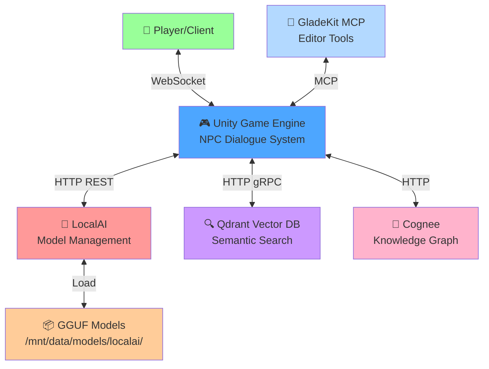
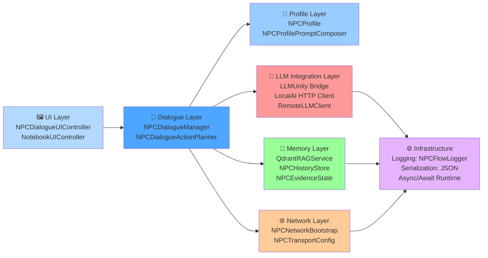
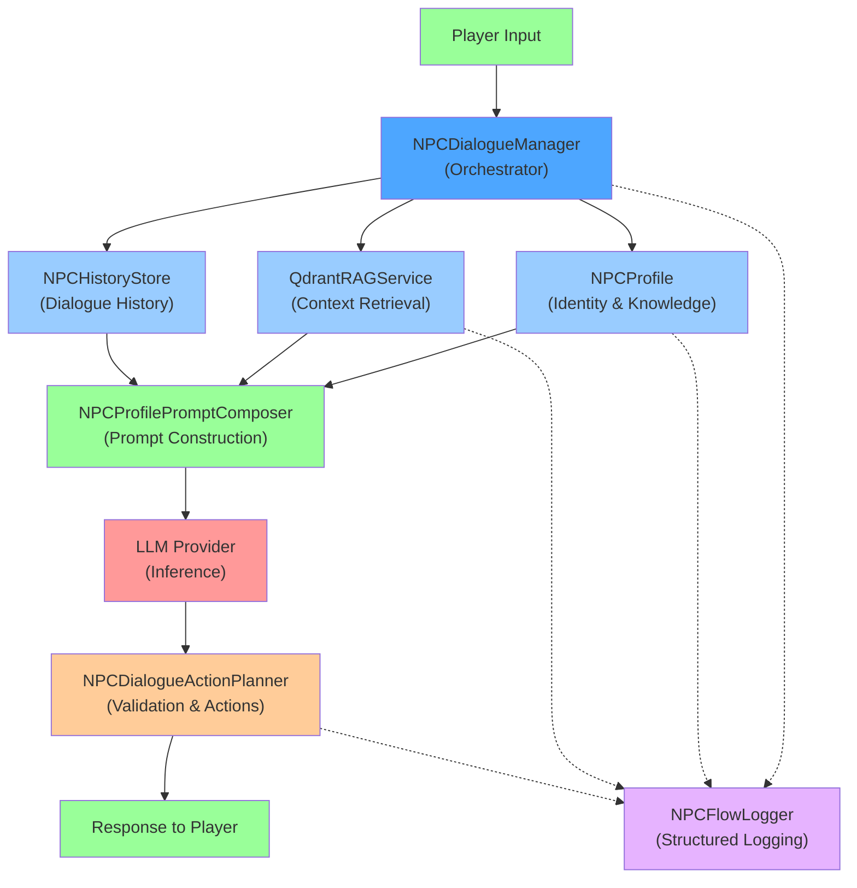
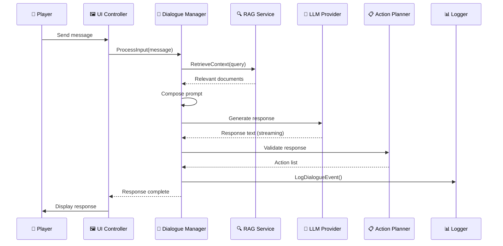
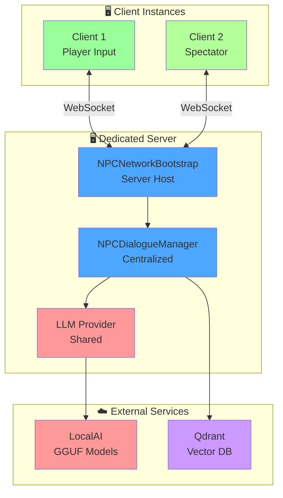
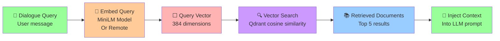
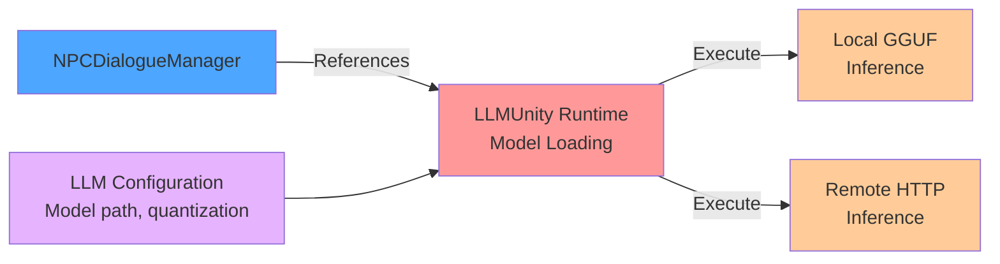
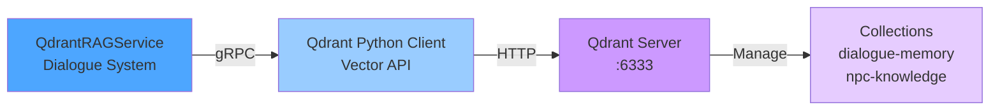
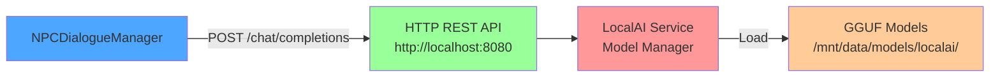

# System Architecture Overview

**Table of Contents**
- [High-Level System Context](#high-level-system-context)
- [Layer Architecture](#layer-architecture)
- [Component Interactions](#component-interactions)
- [Data Flow Patterns](#data-flow-patterns)
- [Integration Points](#integration-points)

## High-Level System Context



**Key Integration Points:**
- **LocalAI**: Hosts GGUF models; NPC requests inference via HTTP
- **Qdrant**: Vector database for semantic memory retrieval
- **Cognee**: Optional long-term memory system (experimental)
- **GladeKit**: Editor-time inspection and automation
- **Player**: Communicates via WebSocket or direct C# calls

## Layer Architecture



**Layer Descriptions:**

| Layer | Responsibility | Key Classes |
|-------|-----------------|------------|
| **UI** | User interaction, response display | `NPCDialogueUIController`, `NotebookUIController` |
| **Dialogue** | Orchestration, response generation, dialogue flow | `NPCDialogueManager`, `NPCDialogueActionPlanner` |
| **Profile** | NPC identity, persona, knowledge base | `NPCProfile`, `NPCProfilePromptComposer` |
| **Memory** | Context retrieval, history tracking, evidence | `QdrantRAGService`, `NPCHistoryStore`, `NPCEvidenceState` |
| **Network** | Transport, WebSocket, multiplayer | `NPCNetworkBootstrap`, `NPCTransportConfig` |
| **LLM Integration** | Model execution, API bridges | LLMUnity, LocalAI HTTP client |
| **Infrastructure** | Logging, serialization, async utilities | `NPCFlowLogger`, JSON |

## Component Interactions

### Primary Dialogue Flow Architecture



### Key Component Classes

**NPCDialogueManager**
```csharp
public class NPCDialogueManager : MonoBehaviour
{
    // Configuration
    public LLM llm;                           // Local or remote LLM
    public LLMAgent llmAgent;                 // Alternative agent-based LLM
    public QdrantRAGService qdrantRag;        // Vector search
    public NPCProfile[] profiles;             // Available NPCs
    public bool useRemoteServer;              // Remote vs local inference
    
    // Core Methods
    public Task InitializeAsync();            // Initialize all subsystems
    public Task<string> GetResponseAsync(     // Get dialogue response
        string userInput, NPCProfile profile);
    
    // Events
    public UnityEvent<string> onResponseStart;
    public UnityEvent<string> onResponseUpdated;
    public UnityEvent<string, string> onResponseComplete;
    public UnityEvent<string> onError;
}
```

**NPCProfile**
```csharp
public class NPCProfile : ScriptableObject
{
    public string slug;                       // Unique identifier
    public string displayName;                // Human-readable name
    public string systemPrompt;               // Persona instruction
    public TextAsset[] knowledgeDocuments;    // RAG knowledge base
    public bool enableMemoryEncoding;         // Record interaction
    public string[] actionTypes;              // Possible NPC actions
}
```

**QdrantRAGService**
```csharp
public class QdrantRAGService : MonoBehaviour
{
    public string host = "localhost";
    public int port = 6333;
    
    public Task InitializeAsync();
    public Task<List<string>> RetrieveAsync(
        string query, int topK = 5);
    public Task IndexDocumentsAsync(
        string collectionName, 
        List<string> documents);
}
```

## Data Flow Patterns

### Pattern 1: Complete Dialogue Exchange



### Pattern 2: Network Multiplayer Dialogue



### Pattern 3: RAG Context Retrieval



## Integration Points

### Integration with LLMUnity



### Integration with Qdrant



### Integration with LocalAI



## Configuration & Settings

### NPCTransportConfig Structure

```csharp
[Serializable]
public struct NPCTransportConfig
{
    public string connectAddress;              // "127.0.0.1"
    public string listenAddress;               // "0.0.0.0"
    public ushort port;                        // 7777
    public bool useWebSockets;                 // true
    public string webSocketPath;               // "/npc-dialogue"
    public NPCNetworkAutoStartMode autoStartMode; // Manual|Client|Host|Server
}
```

### NPCDialogueManager Configuration

Key settings in the Inspector:

| Setting | Type | Purpose |
|---------|------|---------|
| `useRemoteServer` | bool | Use remote LLM server vs local |
| `remoteHost` | string | LocalAI server address |
| `remotePort` | int | LocalAI server port |
| `remoteModel` | string | Model identifier in LocalAI |
| `useQdrantRag` | bool | Enable vector search |
| `useCogneeMemory` | bool | Enable knowledge graph memory |
| `enableRAG` | bool | Enable all RAG features |
| `maxHistoryPerNPC` | int | Dialogue history limit |
| `persistHistory` | bool | Save history to disk |

---

**Next**: [Understand Individual Systems](../3_Core_Systems/README.md)
