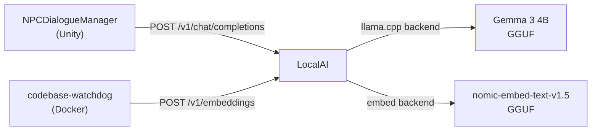
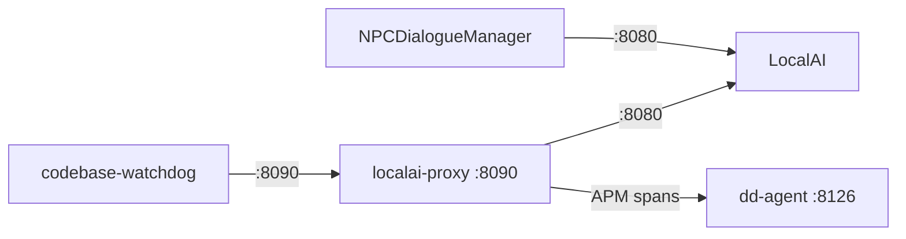

# Part IV — Backend Services

# Chapter 9: LocalAI — Your NPC Brain

**Audience:** Developers who need to understand the LLM inference server powering NPC dialogue — no AI/ML background required.

**What you'll learn:** What LocalAI is, why it beats cloud APIs for real-time dialogue, how Docker runs it, how models are managed, and how Unity talks to it for chat completions and embeddings.

---

## 1. What Is LocalAI?

**LocalAI** is an open-source, self-hosted LLM inference server that exposes an **OpenAI-compatible REST API**. It wraps multiple backends — primarily `llama.cpp` for GGUF-quantized models — so you can run large language models on your own hardware without sending data to a third party.

> 🧑‍💻 **Dev NPC:** "Think of LocalAI as the 'localhost' version of ChatGPT. Same API shape, same JSON payloads, same streaming. But instead of paying per token, you pay in GPU fan noise. And electricity. Mostly fan noise."

In our stack, LocalAI serves two critical roles:

1. **NPC Dialogue Generation** — The `NPCDialogueManager` sends player messages to `/v1/chat/completions`, receives a coherent NPC response, and displays it in the WebGL UI.
2. **Embeddings for RAG** — The codebase-embedder pipeline calls `/v1/embeddings` to turn code snippets into 768-dimensional vectors, which get stored in Qdrant for later retrieval.



---

## 2. Why LocalAI Over OpenAI / Anthropic?

### Cost

Cloud LLM APIs charge per token. A single dialogue turn with a 2K-token prompt + 256-token response costs fractions of a cent — but multiply that by hundreds of simultaneous WebGL players and the bill adds up fast.

Self-hosting LocalAI on a decent GPU means **zero per-token cost**. You pay for the hardware once and the electricity to run it.

> 🧑‍💻 **Dev NPC:** "With OpenAI, every player saying 'hello' costs you money. With LocalAI, every player saying 'hello' costs you a millisecond of GPU time. Which one scales better for a game where NPCs are *supposed* to be chatty?"

### Privacy

When your NPC dialogue goes through `api.openai.com`, the player's message, the retrieved codebase context, and the generated response all leave your network. For a game that uses its own codebase as RAG context — as ours does — that's a **hard no**. LocalAI keeps everything on your machine.

### Latency Control

Cloud APIs add 50–200 ms of network overhead just for the round trip. LocalAI on a local GPU adds ~2 ms network latency. For real-time NPC dialogue where a 3-second generation feels like the NPC is "thinking," every millisecond counts.

Cloud API latency:
```
[Player] → [WebGL] → [Nginx] → [Internet] → [OpenAI] → [Internet] → [Server]
   ~150 ms                                                          ~150 ms
```

LocalAI latency:
```
[Player] → [WebGL] → [Nginx] → [LocalAI :8080]
                     ~2 ms
```

---

## 3. Installation via Docker

LocalAI runs in a Docker container on the host machine. Our configuration lives in a separate Compose project at `/mnt/data/Projects_SSD/LocalAI/docker-compose.yaml`.

```yaml
# /mnt/data/Projects_SSD/LocalAI/docker-compose.yaml (simplified)
services:
  localai-orchestrator:
    image: localai/localai:latest-gpu-nvidia-cuda-13
    ports:
      - "8080:8080"
    volumes:
      - ./models:/build/models
    environment:
      - DEBUG=true
      - MODELS_PATH=/build/models
    deploy:
      resources:
        reservations:
          devices:
            - driver: nvidia
              count: all
              capabilities: [gpu]
```

To start LocalAI:

```bash
# From /mnt/data/Projects_SSD/LocalAI/
docker compose up -d
```

Verify it's running:

```bash
docker ps --filter name=localai-orchestrator
# CONTAINER ID   IMAGE                                      STATUS         PORTS
# abc12345       localai/localai:latest-gpu-nvidia-cuda-13   Up 2 hours     0.0.0.0:8080->8080/tcp
```

> 🧑‍💻 **Dev NPC:** "Notice `latest-gpu-nvidia-cuda-13`. That's the CUDA 13 build. If you have an AMD card, there's a Vulkan build too. If you have no GPU... well, the CPU build exists but your NPC will be the 'thinking' type — for 30 seconds per response."

---

## 4. Model Management (Gemma 3 4B)

LocalAI loads models from the `models/` directory. Each model is defined by a YAML config file that tells LocalAI how to load and serve it.

### Our primary model: Gemma 3 4B

```
/mnt/data/Projects_SSD/LocalAI/models/
├── gemma-3-4b-it-Q4_K_M.gguf          # The model weights
├── gemma-3-4b-it.yaml                  # Model config
├── nomic-embed-text-v1.5-gguf/        # Embedding model
│   └── nomic-embed-text-v1.5.Q4_K_M.gguf
```

The `gemma-3-4b-it.yaml` config:

```yaml
name: gemma-3-4b-it
backend: llama.cpp
parameters:
  model: gemma-3-4b-it-Q4_K_M.gguf
  context_size: 8192
  f16: true
  n_gpu_layers: 35
  n_batch: 512
  use_mmap: true
  use_mlock: false
template:
  chat_template: |
    <start_of_turn>user
    {{.Input}}<end_of_turn>
    <start_of_turn>model
```

Key parameters:

| Parameter | Value | Why |
|-----------|-------|-----|
| `context_size` | 8192 | Enough for prompt + RAG context + conversation history |
| `n_gpu_layers` | 35 | Offloads 35 layers to GPU (all of them for a 4B model) |
| `n_batch` | 512 | Batch prompt processing for faster generation |
| `f16` | true | Half-precision — cuts VRAM use in half with negligible quality loss |

Gemma 3 4B was chosen because:
- **Small enough** to run on a single consumer GPU (~4 GB VRAM at Q4)
- **Large enough** for coherent, contextual NPC dialogue
- **Multilingual** — handles mixed-language game dialogue gracefully
- **Instruction-tuned** — responds well to system prompts that define NPC personality

### Checking loaded models

```bash
curl http://localhost:8080/v1/models
```

Response:

```json
{
  "object": "list",
  "data": [
    {
      "id": "gemma-3-4b-it",
      "object": "model",
      "created": 1721324902,
      "owned_by": "localai"
    }
  ]
}
```

This is also our primary **health check endpoint** — if `/v1/models` returns a 200, LocalAI is alive and model is ready.

---

## 5. Health Check — Is LocalAI Actually Running?

Before Unity sends any dialogue request, the `NPCBackendReadinessService` checks all backend services. For LocalAI, that's a simple GET:

```csharp
// Inside NPCBackendReadinessService
private async Task<bool> CheckLocalAIHealthAsync()
{
    string url = $"http://localhost:{NPCLocalAIConfig.LocalAIDirectPort}/v1/models";

    using var req = UnityWebRequest.Get(url);
    req.timeout = 5;

    var op = req.SendWebRequest();
    while (!op.isDone) await Task.Yield();

    return req.result == UnityWebRequest.Result.Success;
}
```

The readiness service polls this endpoint during scene initialization and won't allow dialogue until it returns success. If LocalAI is down, the NPC system enters a **degraded mode** — the NPC can still animate and display canned responses, but won't generate live dialogue.

---

## 6. Chat Completions Endpoint

This is the heart of NPC dialogue. The `NPCDialogueManager` sends a POST to:

```
POST http://localhost:8080/v1/chat/completions
Content-Type: application/json

{
  "model": "gemma-3-4b-it",
  "messages": [
    {
      "role": "system",
      "content": "You are Butler, a witty NPC bartender in a sci-fi tavern..."
    },
    {
      "role": "user",
      "content": "What do you know about the reactor leak?"
    }
  ],
  "max_tokens": 256,
  "temperature": 0.7,
  "top_p": 0.9,
  "stream": false
}
```

Response:

```json
{
  "id": "chatcmpl-abc123",
  "object": "chat.completion",
  "created": 1721324902,
  "model": "gemma-3-4b-it",
  "choices": [
    {
      "index": 0,
      "message": {
        "role": "assistant",
        "content": "Ah, the reactor leak! That old thing. *polishes a glass* Let me tell you..."
      },
      "finish_reason": "stop"
    }
  ],
  "usage": {
    "prompt_tokens": 342,
    "completion_tokens": 89,
    "total_tokens": 431
  }
}
```

The `NPCDialogueManager` constructs this request, including:
- **System prompt** — defines NPC personality, knowledge boundaries, and response format
- **RAG context** — codebase snippets retrieved from Qdrant, injected as additional context
- **Conversation history** — last N turns for coherence
- **Player message** — the current input

The `NPCLocalAIConfig` class holds the port constants used to build the URL:

```csharp
// Assets/Scripts/Runtime/LocalAI/NPCLocalAIConfig.cs
namespace NPCSystem.LocalAI
{
    public static class NPCLocalAIConfig
    {
        public const int LocalAIDirectPort = 8080;
        public const int LocalAIProxyPort = 8090;
        public const string DefaultHost = "localhost";
    }
}
```

> 🧑‍💻 **Dev NPC:** "Yes, those are `const int` fields in a `static class`. No, I'm not proud of it. But config that never changes at runtime doesn't need ScriptableObject ceremony. Fight me."

---

## 7. Embeddings Endpoint (Codebase RAG)

LocalAI also serves embeddings via the same OpenAI-compatible API. This is how the codebase-embedder pipeline turns code into vectors:

```
POST http://localhost:8080/v1/embeddings
Content-Type: application/json

{
  "model": "nomic-embed-text-v1.5",
  "input": "public class NPCDialogueManager : MonoBehaviour\n{"
}
```

Response:

```json
{
  "object": "list",
  "data": [
    {
      "object": "embedding",
      "index": 0,
      "embedding": [0.0123, -0.0456, 0.0789, ...]  // 768 floats
    }
  ],
  "model": "nomic-embed-text-v1.5",
  "usage": {
    "prompt_tokens": 12,
    "total_tokens": 12
  }
}
```

The model `nomic-embed-text-v1.5` produces **768-dimensional vectors** that are stored in Qdrant's `unity_linux_llm_codebase_v2` collection. We chose nomic-embed over alternatives because:

| Model | Dimensions | Quality on code | Size |
|-------|-----------|----------------|------|
| `nomic-embed-text-v1.5` | 768 | Excellent | ~274 MB (Q4) |
| `text-embedding-ada-002` | 1536 | Good | API-only |
| `all-MiniLM-L6-v2` | 384 | Decent | ~90 MB |

The embedder (in `Tools/CodebaseEmbedder/`) uses this endpoint during the `index` command:

```bash
uv run codebase-embedder index --root ../..
```

This scans the source tree, chunks the code into meaningful segments, calls LocalAI's `/v1/embeddings` for each chunk, and upserts the vectors to Qdrant.

---

## 8. Port Configuration (8080 vs 8090)

We have two ports for LocalAI traffic:

| Port | Service | Purpose | In Gameplay Path? |
|------|---------|---------|-------------------|
| **8080** | LocalAI (direct) | All dialogue requests, health checks, embeddings | **Yes** — this is what `NPCDialogueManager` calls |
| **8090** | localai-proxy | LLM Observability proxy: token counting, latency tracking, Datadog spans | **No** — CLI tools, codebase-watchdog, debugging only |

The two-port architecture exists because:
- **Port 8080** is the raw LocalAI — fast, direct, no overhead
- **Port 8090** is an observability wrapper (`Backend/localai-proxy/`) that adds Datadog APM spans, token counting, and request logging before forwarding to 8080



The `NPCLocalAIConfig` class keeps both port definitions in one place so nothing gets out of sync.

> 🧑‍💻 **Dev NPC:** "Why not route gameplay through the proxy for richer telemetry? Because the proxy adds ~5ms of Python overhead per request — invisible for a CLI tool, not invisible when you're generating 60 NPC responses per second. We designed for the proxy to *optionally* become the gameplay path later, but today direct = better."

---

## 9. Dual Backend (CUDA + Vulkan)

LocalAI's GPU image comes in two flavors:

| Image Tag | Backend | GPU Hardware |
|-----------|---------|-------------|
| `localai/localai:latest-gpu-nvidia-cuda-13` | CUDA 13 | NVIDIA GPUs (RTX 3000+, A-series, etc.) |
| `localai/localai:latest-gpu-nvidia-vulkan` | Vulkan | AMD GPUs, older NVIDIA cards |

Our stack runs **CUDA 13** because the host has an NVIDIA RTX GPU. The Vulkan build exists for environments where CUDA isn't available — LocalAI uses Vulkan as a GPU compute layer that works across vendors.

**Why both exist in the same stack?** In theory, you could run two LocalAI instances — one CUDA, one Vulkan — and split workloads. For example:
- CUDA backend handles the heavy Gemma 3 4B dialogue model (needs raw compute)
- Vulkan backend handles lightweight embedding requests (nomic-embed-text)

In practice, our single LocalAI instance handles both roles via model-specific backend switching. The `gemma-3-4b-it.yaml` config selects `llama.cpp` (CUDA-accelerated) while the embedding model uses LocalAI's built-in embed backend. One container, two models, no conflicts.

---

## 10. NPCLocalAIConfig Class Reference

Here's the full config class — small but critical:

```csharp
namespace NPCSystem.LocalAI
{
    /// <summary>
    /// Central configuration constants for LocalAI connectivity.
    ///
    /// ── Layout ──
    ///   LocalAI (upstream)                → port 8080  (direct, no proxy)
    ///   localai-proxy (observability)     → port 8090  (token/latency tracking)
    ///
    /// All gameplay dialogue goes directly to port LocalAIDirectPort.
    /// The proxy on port LocalAIProxyPort exists for CLI tools,
    /// codebase-watchdog, and ad-hoc debugging — it is NOT in the runtime path.
    /// </summary>
    public static class NPCLocalAIConfig
    {
        public const int LocalAIDirectPort = 8080;
        public const int LocalAIProxyPort = 8090;
        public const string DefaultHost = "localhost";
    }
}
```

Any code that needs to reach LocalAI — the dialogue manager, the embedder, the readiness checker — references these constants instead of hardcoding port numbers. This means:
- **One change** if ports ever shift
- **No magic numbers** scattered across the codebase
- **Clear intent** — `DirectPort` vs `ProxyPort` tells you which traffic path you're using

> 🧑‍💻 **Dev NPC:** "25 lines of code. That's the entire config class. No DI container, no ScriptableObject, no JSON deserialization. Just four public `const` fields. Sometimes the right amount of abstraction is *none at all*."

---

## 11. Verification

After setting up LocalAI, verify the stack:

```bash
# 1. Is the container running?
docker ps --filter name=localai-orchestrator

# 2. Is the model loaded?
curl http://localhost:8080/v1/models

# 3. Can it generate text?
curl -X POST http://localhost:8080/v1/chat/completions \
  -H "Content-Type: application/json" \
  -d '{
    "model": "gemma-3-4b-it",
    "messages": [{"role": "user", "content": "Say hello"}],
    "max_tokens": 50
  }'

# 4. Can it generate embeddings?
curl -X POST http://localhost:8080/v1/embeddings \
  -H "Content-Type: application/json" \
  -d '{
    "model": "nomic-embed-text-v1.5",
    "input": "test"
  }'

# 5. Is the proxy healthy (if using)?
curl http://localhost:8090/health
```

Expected output from step 5: `{"status":"ok","proxy_to":"http://localhost:8080"}`

---

## 12. Troubleshooting

| Symptom | Likely Cause | Fix |
|---------|-------------|-----|
| `/v1/models` returns empty list | Model YAML misconfigured or GGUF not in `models/` | Check model file path in YAML, verify GGUF exists |
| Container exits immediately | GPU not available or CUDA mismatch | Check `docker logs localai-orchestrator` for driver errors |
| Chat completions return 500 | Model not loaded, OOM, or context size exceeded | Check logs, reduce `context_size` or `n_batch` |
| Embeddings return garbage | Wrong model name in request | Must use exact model name from YAML `name:` field |
| Slow generation | CPU fallback (GPU layers not offloaded) | Verify `n_gpu_layers` in YAML matches GPU capacity |
| 8080 works, 8090 fails | localai-proxy not started or has Python error | `docker compose -f Backend/localai-proxy/docker-compose.yml up -d` |

---

**Key takeaway:** LocalAI is the single most important backend service — without it, the NPC can't talk. But with it, you get a fully private, zero-cost-per-turn LLM that runs on your GPU and speaks OpenAI-compatible API. Treat the `NPCLocalAIConfig` as your source of truth for connectivity, and keep the health check in your bootstrap sequence.
