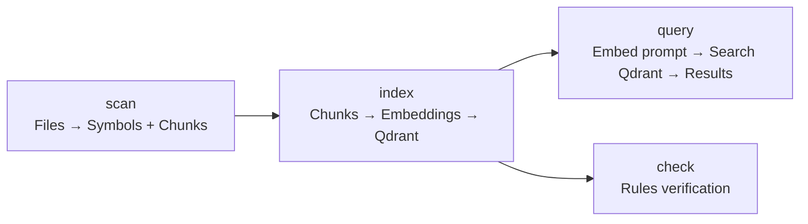
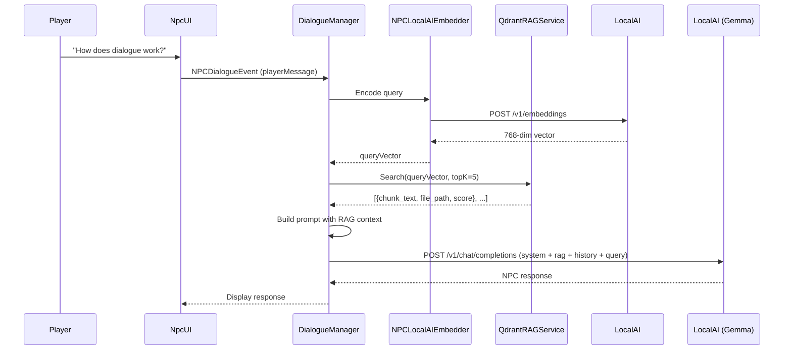

# Part IV — Backend Services

# Chapter 10: Qdrant — Codebase Memory

**Audience:** Developers who want to understand how the NPC knows things about the project's own codebase — without being told explicitly.

**What you'll learn:** What a vector database is, why we use Qdrant for NPC RAG, how the codebase-embedder pipeline works, and how Unity queries Qdrant during dialogue.

---

## 1. What Is Qdrant?

**Qdrant** is an open-source vector database written in Rust. It stores high-dimensional vectors (arrays of floating-point numbers) alongside metadata (payload), and lets you search for the *nearest neighbors* of any query vector.

Think of it as a search engine that understands *meaning* instead of keywords:

| Traditional search | Vector search |
|---|---|
| Find documents containing "monobehaviour awake" | Find documents *about* Unity initialization patterns |
| Returns exact word matches | Returns semantically similar texts |
| Misses "Start()" when you search "Awake()" | Returns both because they're conceptually related |

> 🧑‍💻 **Dev NPC:** "Keyword search is like asking a librarian for 'red book' and getting only things with 'red' in the title. Vector search hands the librarian an actual red object and says 'find me things like this.' It's witchcraft. Beautiful, open-source witchcraft."

---

## 2. Why Vector Search for NPC Dialogue?

Our game has a single NPC — a Developer character — that answers questions about the project's own Unity codebase. The NPC doesn't have all the code hardcoded. Instead, for each player question:

1. **Embed the question** into a vector (768 dimensions via nomic-embed-text-v1.5)
2. **Search Qdrant** for code chunks most similar to that vector
3. **Return the top-K matches** as context
4. **Inject that context** into the LLM prompt
5. **The LLM generates** a response grounded in the actual code

This is **Retrieval-Augmented Generation (RAG)**, and Qdrant is the retrieval half.

Without Qdrant:

```
Player: "How does the dialogue manager work?"
NPC Butler: *_sweats in generic_* "It... manages dialogue? With code?"
```

With Qdrant:

```
Player: "How does the dialogue manager work?"
NPC Butler: *retrieves NPCDialogueManager.cs, QdrantRAGService.cs chunks*
"Well, it starts by listening for the NPCDialogueSystem event..."
```

> 🧑‍💻 **Dev NPC:** "Without vector search, the NPC is that guy at a party who pretends to know what you're talking about. With it, they've actually read the code. They might still be wrong, but at least they're confidently wrong with *evidence*."

---

## 3. Collections

Qdrant organizes vectors into **collections**. We have two:

### `unity_linux_llm_codebase_v2` (Codebase)

| Property | Value |
|----------|-------|
| **Vector size** | 768 |
| **Distance metric** | Cosine |
| **Primary content** | Code chunks from the Unity project |
| **Payload fields** | `file_path`, `symbol_type`, `symbol_name`, `line_range`, `namespace`, `chunk_text` |
| **Estimated size** | ~15,000 vectors (grows with the codebase) |

This collection is created and populated by the codebase-embedder pipeline (see §4). Each vector represents a meaningful chunk of code: a class, a method, a serialized field, or a block of related lines.

### `npc_knowledge` (NPC World Knowledge)

| Property | Value |
|----------|-------|
| **Vector size** | 768 ✅ (matches `nomic-embed-text-v1.5`) |
| **Distance metric** | Cosine |
| **Quantization** | int8 scalar (always_ram) |
| **HNSW** | m=16, ef_construct=200 |
| **Primary content** | NPC background lore, game world facts, item descriptions |
| **Payload fields** | `topic`, `fact_text`, `category`, `npc_context` |
| **Estimated size** | ~500 vectors (manually curated) |

> ⚠️ **Historical note:** This collection was originally created at 384 dimensions — a mismatch with the `nomic-embed-text-v1.5` model (768-dim). The collection was recreated with the correct dimension. If you ever see `rag.dimension.invalid` appear in Datadog, that's the canary — check this first.

This collection stores the NPC's "world knowledge" — things about the game universe that *aren't* in the code. The bartender NPC knows the tavern's name, the regular customers, and the secret ingredient in the house ale, all from this collection.

```bash
# List all collections
curl http://localhost:6333/collections

# Collection info for codebase (should show Dense(768))
curl http://localhost:6333/collections/unity_linux_llm_codebase_v2

# Collection info for npc knowledge (should show Dense(768))
curl http://localhost:6333/collections/npc_knowledge
```


---

## 4. Codebase-Embedder Pipeline

The pipeline that populates `unity_linux_llm_codebase_v2` lives in `Tools/CodebaseEmbedder/`. It's a Python toolchain with four commands:



### `scan` — Discover and Parse

```
uv run codebase-embedder scan --root ../..
```

This uses a custom **Roslyn parser** (`Tools/CodebaseEmbedder/roslyn_parser/`) — a C# .NET 10 console app using Microsoft.CodeAnalysis.CSharp 4.9.2 — to:

1. Discover all `.cs` files (skipping generated and third-party code)
2. Parse each file into **symbols** (10 types):
   - `file_overview`, `namespace`, `type`, `member`, `field`, `serialized_field`
   - `constructor`, `property`, `event`, `using_directive`
3. Extract **relations** (5 kinds):
   - `inherits`, `implements`, `calls`, `namespace-contains-type`, `type-contains-member`
4. Write artifacts to `.codebase-index/`:
   - `manifest.json` — collection metadata
   - `symbols.jsonl` — all extracted symbols
   - `relations.jsonl` — relation graph
   - `chunks.jsonl` — embedding-ready text chunks
   - `asmdefs.json` — assembly definition metadata

Each chunk in `chunks.jsonl` looks like:

```json
{
  "id": "NPCDialogueManager-Init-42",
  "text": "public class NPCDialogueManager : MonoBehaviour\n{\n    [SerializeField]\n    private NPCDialogueConfig _config;\n\n    private void Awake()\n    {\n        InitializeServices();\n    }\n}",
  "metadata": {
    "file_path": "Assets/Scripts/Runtime/Dialogue/Core/NPCDialogueManager.cs",
    "symbol_type": "type",
    "symbol_name": "NPCDialogueManager",
    "line_range": "14-28",
    "namespace": "NPCSystem.Dialogue.Core"
  }
}
```

> 🧑‍💻 **Dev NPC:** "The Roslyn parser does what Unity's own compiler does — but instead of producing IL, it produces JSON you can search. It's the difference between photographing a building and 3D-scanning it. One is a picture, the other is a model you can walk through."

### `index` — Embed and Upsert

```
uv run codebase-embedder index --root ../..
```

For each chunk:

1. Send the text to **LocalAI's `/v1/embeddings`** using `nomic-embed-text-v1.5`
2. Receive a **768-dimensional vector**
3. **Upsert** to Qdrant's `unity_linux_llm_codebase_v2` collection

To re-index from scratch (e.g., after major refactoring):

```
uv run codebase-embedder index --root ../.. --clear
```

This deletes all existing points in the collection before re-indexing.

### `query` — Search the Index

```
uv run codebase-embedder query --root ../.. --local "How does the dialogue manager handle player input?"
```

Or semantic search against Qdrant:

```
uv run codebase-embedder query --root ../.. "NPCDialogueManager Awake initialization"
```

### `check` — Rule Verification

```
uv run codebase-embedder check --root ../..
```

Runs 21 rules from `.codebaserules.yaml` against the codebase using the index for context-aware checks.

### Complete pipeline example

```bash
# Full refresh pipeline
cd /mnt/data/Projects_SSD/Unity_Projects/Unity_Linux_LLM
uv run codebase-embedder scan --root ../..
uv run codebase-embedder index --root ../..
uv run codebase-embedder check --root ../..
```

---

## 5. Vector Schema (768-Dim Embeddings)

The embedding model `nomic-embed-text-v1.5` produces vectors with specific characteristics:

| Property | Value | Why |
|----------|-------|-----|
| **Dimensions** | 768 | Balances precision vs storage cost |
| **Distance** | Cosine | Best for semantic similarity on normalized vectors |
| **Normalization** | L2-normalized | Unit vectors — cosine = dot product |
| **Quantization** | Q4_K_M (GGUF) | 4-bit quantization, good quality-to-size ratio |

The Qdrant schema for `unity_linux_llm_codebase_v2` expects exactly this vector shape:

```json
{
  "vectors": {
    "size": 768,
    "distance": "Cosine"
  },
  "payload_schema": {
    "file_path": "keyword",
    "symbol_type": "keyword",
    "symbol_name": "text",
    "namespace": "keyword",
    "line_range": "text",
    "chunk_text": "text"
  }
}
```

A sample stored point:

```json
{
  "id": "NPCDialogueManager-Init-42",
  "vector": [0.0123, -0.0456, 0.0789, ...],
  "payload": {
    "file_path": "Assets/Scripts/Runtime/Dialogue/Core/NPCDialogueManager.cs",
    "symbol_type": "type",
    "symbol_name": "NPCDialogueManager",
    "namespace": "NPCSystem.Dialogue.Core",
    "line_range": "14-28",
    "chunk_text": "public class NPCDialogueManager..."
  }
}
```

> 🧑‍💻 **Dev NPC:** "768 floats. That's what a 'concept' looks like in computer-brain-space. Each float is a dial on a mixer board — turn this one up for 'contains MonoBehaviour,' turn that one down for 'contains LINQ.' Put enough dials together and you get 'this looks like the dialogue manager.' Scary? Yes. Effective? Also yes."

---

## 6. Search Flow: How Unity Talks to Qdrant

When a player asks a question, here's the full retrieval flow:



The `QdrantRAGService` class (in `Assets/Scripts/Runtime/Dialogue/RAG/`) handles the search:

```csharp
public class QdrantRAGService : MonoBehaviour
{
    [SerializeField] string _qdrantUrl = "http://localhost:6333";
    [SerializeField] string _collectionName = "unity_linux_llm_codebase_v2";
    [SerializeField] int _expectedDenseDimension = 768;

    public async Task<List<QdrantSearchResult>> SearchAsync(
        float[] queryVector,
        int topK = 5,
        float scoreThreshold = 0.5f,
        Dictionary<string, string> filterPayload = null
    )
    {
        // 1. Build Qdrant search request with vector + optional filter
        // 2. POST to http://localhost:6333/collections/{name}/points/search
        // 3. Parse results, apply score threshold
        // 4. Return topK matches with chunk_text and metadata
    }
}
```

The search request to Qdrant looks like:

```json
POST /collections/unity_linux_llm_codebase_v2/points/search
Content-Type: application/json

{
  "vector": [0.0123, -0.0456, 0.0789, ...],
  "limit": 5,
  "with_payload": ["file_path", "symbol_type", "chunk_text"],
  "score_threshold": 0.5
}
```

Response:

```json
{
  "result": [
    {
      "id": "NPCDialogueManager-Init-42",
      "score": 0.89,
      "payload": {
        "file_path": "Assets/Scripts/Runtime/Dialogue/Core/NPCDialogueManager.cs",
        "symbol_type": "type",
        "chunk_text": "public class NPCDialogueManager..."
      }
    },
    {
      "id": "QdrantRAGService-SearchAsync-17",
      "score": 0.76,
      "payload": {
        "file_path": "Assets/Scripts/Runtime/Dialogue/RAG/QdrantRAGService.cs",
        "symbol_type": "method",
        "chunk_text": "public async Task<List<QdrantSearchResult>> SearchAsync..."
      }
    }
  ]
}
```

The dialogue manager then assembles:

```
[System]
You are a codebase-aware NPC developer. Use the following code context to answer:

Context 1 (score 0.89 — NPCDialogueManager.cs):
  public class NPCDialogueManager...

Context 2 (score 0.76 — QdrantRAGService.cs):
  public async Task<List<QdrantSearchResult>> SearchAsync...

[User]
How does dialogue work?

[Expected]
The dialogue system centers on NPCDialogueManager, which...
```

---

## 7. Docker Setup and Storage Location

Qdrant runs in a Docker container. The Compose file lives at `Backend/qdrant/docker-compose.yml`:

```yaml
services:
  qdrant:
    image: qdrant/qdrant:latest
    ports:
      - "6333:6333"  # REST API + gRPC HTTP
      - "6334:6334"  # Internal gRPC
    volumes:
      - /mnt/data/Projects_SSD/qdrant_storage:/qdrant/storage
    environment:
      - QDRANT__SERVICE__GRPC_PORT=6334
```

To start:

```bash
docker compose -f Backend/qdrant/docker-compose.yml up -d
```

### Storage Location

All vector data persists at:

```
/mnt/data/Projects_SSD/qdrant_storage/
```

This path is mounted from the host into the container at `/qdrant/storage`. Inside, Qdrant stores:

| Directory | Contents |
|-----------|----------|
| `collections/` | Per-collection data: segment files, vector indexes, payload indexes |
| `storage/` | WAL (write-ahead log) for crash recovery |
| `raft_state/` | Raft consensus state (for distributed deployments) |

Storage on disk for our collections:

```bash
du -sh /mnt/data/Projects_SSD/qdrant_storage/
# ~500 MB  (grows with codebase)

du -sh /mnt/data/Projects_SSD/qdrant_storage/collections/
# ~450 MB  (mostly vector indexes)
```

### Health Check

```bash
curl http://localhost:6333/collections
# Should return JSON with collection names

# More detailed
curl http://localhost:6333/healthz
# Should return "OK" with 200 status
```

> 🧑‍💻 **Dev NPC:** "Storage lives on an SSD, not the system drive. Why? Because vector search is I/O-bound during indexing. Every chunk gets embedded, written to Qdrant, and indexed — all on disk. NVMe or GTFO."

---

## 8. The Qdrant Client Directory

There's also a Qdrant client workspace at `/mnt/data/Projects_SSD/qdrant-client/`. This is a standalone Python environment with the `qdrant-client` library for ad-hoc operations:

```bash
cd /mnt/data/Projects_SSD/qdrant-client
# Python scripts for bulk operations, migrations, and diagnostics
```

Typical usage:

```python
from qdrant_client import QdrantClient

client = QdrantClient("localhost", port=6333)

# Count points
count = client.count("unity_linux_llm_codebase_v2")
print(f"Collection has {count} vectors")

# Scroll through all points
records = client.scroll(
    "unity_linux_llm_codebase_v2",
    limit=100,
    with_payload=["file_path", "symbol_name"]
)
```

---

## 9. Verification

After setting up Qdrant, verify:

```bash
# 1. Is the container running?
docker ps --filter name=qdrant

# 2. Are collections present?
curl -s http://localhost:6333/collections | python3 -m json.tool

# 3. Does our codebase collection have vectors?
curl -s http://localhost:6333/collections/unity_linux_llm_codebase_v2 | \
  python3 -c "import sys,json; d=json.load(sys.stdin); print(f'Vectors: {d[\"result\"][\"vectors_count\"]}')"

# 4. Can we search?
curl -s -X POST http://localhost:6333/collections/unity_linux_llm_codebase_v2/points/search \
  -H "Content-Type: application/json" \
  -d '{
    "vector": [0.0] * 768,
    "limit": 3,
    "with_payload": ["file_path"]
  }' | python3 -m json.tool

# 5. Can the codebase-embedder query it?
uv run codebase-embedder status --root ../..
```

---

## 10. Troubleshooting

| Symptom | Likely Cause | Fix |
|---------|-------------|-----|
| `Connection refused` on :6333 | Qdrant container not running | `docker compose -f Backend/qdrant/docker-compose.yml up -d` |
| `404 Not Found` on search | Collection name is wrong | Verify with `curl :6333/collections` |
| Empty search results | No vectors in collection | Run `uv run codebase-embedder index --root ../..` |
| Low-quality search results | Embedding model mismatch | Verify `_expectedDenseDimension` matches Qdrant vector size (768) |
| `503 Service Unavailable` | Qdrant still loading | Wait 5 seconds and retry (cold start loads segments from disk) |
| Storage growing too large | No optimization run | Qdrant auto-optimizes, but manual `POST /collections/{name}/optimize` can force it |

---

**Key takeaway:** Qdrant is what makes the NPC *know things* — specifically, know things about your codebase. Without it, the NPC is a generic chatbot. With it, the NPC is a developer who has read every line of code and can answer questions about any part of the project. The codebase-embedder pipeline keeps it fresh, and the `QdrantRAGService` makes it accessible from Unity.
