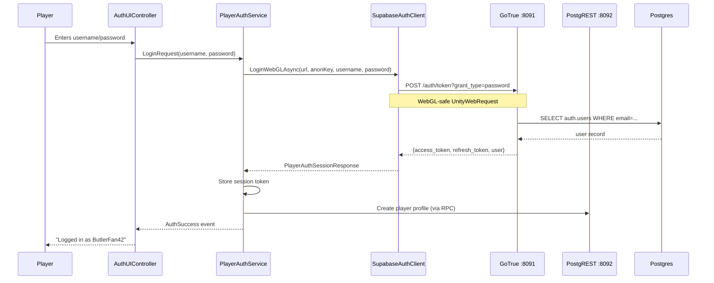
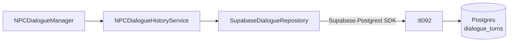

# Part IV — Backend Services

# Chapter 11: Supabase — Auth & Persistence

**Audience:** Developers who need to handle player authentication and dialogue persistence in a WebGL multiplayer game.

**What you'll learn:** How Supabase provides authentication via GoTrue, how PostgREST stores dialogue history, the C# service layer connecting Unity to Supabase, and how to fix the notorious PGRST202 schema cache error.

---

## 1. What Is Supabase?

**Supabase** is an open-source Firebase alternative. It bundles multiple backend services under one stack:

| Service | Container | Port | Purpose |
|---------|-----------|------|---------|
| **GoTrue** | `supabase-stack-auth` | :8091 | Player authentication (signup, login, JWT tokens) |
| **PostgREST** | `supabase-stack-rest` | :8092 | Auto-generated REST API over PostgreSQL |
| **Postgres** | `supabase-stack-db` | :55432→:5432 | Primary database with pgvector extension |
| **Realtime** | `supabase-stack-realtime` | :8093 | WebSocket channels for live updates |
| **Storage** | `supabase-stack-storage` | :8094 | File storage (images, assets) |
| **Studio** | `supabase-stack-studio` | :8097 | Web-based admin dashboard |

In our NPC system, Supabase fills two specific roles:

1. **Auth (GoTrue)** — Player accounts, session tokens, and JWT-based authentication
2. **Persistence (PostgREST)** — Dialogue history storage and retrieval

> 🧑‍💻 **Dev NPC:** "Supabase is like a Swiss Army knife for backend services — but instead of a knife, every tool is a whole different container. You want auth? That's GoTrue. You want a REST API? That's PostgREST. You want a database browser? That's Studio. They're all running at the same time, and they all talk to the same Postgres."

---

## 2. Supabase as Auth Provider (GoTrue)

### Why GoTrue?

GoTrue is Supabase's authentication service. It's a standalone API for:

- **Email/password signup and login**
- **JWT token generation** (access token + refresh token)
- **Session management** (token refresh, logout)
- **User profile storage** (tied to Postgres `auth.users` table)

In a WebGL build, we can't use the full Supabase C# SDK (it relies on `HttpClient` and features not available in the browser's web sandbox). Instead, we use a **WebGL-safe HTTP transport** via `UnityWebRequest`.

### The Auth Flow



### Auth Service Architecture

The auth system consists of four components working together:

#### `PlayerAuthService` — The Orchestrator

Location: `Assets/Scripts/Runtime/Auth/PlayerAuthService.cs`

This is a `MonoBehaviour` with `DefaultExecutionOrder(-350)` — it initializes **before** most other services. It:

1. Holds configuration: `supabaseUrl` (Gotrue), `restApiUrl` (PostgREST), `supabaseAnonKey`
2. Creates the Supabase SDK client for **non-WebGL** platforms (editor, dedicated server)
3. Delegates to `SupabaseAuthClient` for **WebGL** platforms
4. Exposes events: `OnAuthStateChanged`, `OnLoginSuccess`, `OnLoginFailed`
5. Tracks authentication state: `IsAuthenticated`, `CurrentSession`

```csharp
// Simplified structure
public class PlayerAuthService : MonoBehaviour
{
    [SerializeField] string supabaseUrl = "http://localhost:8091";
    [SerializeField] string supabaseAnonKey = "dev-local-anon-key";
    [SerializeField] string restApiUrl = "http://localhost:8092";

    public bool IsAuthenticated { get; private set; }
    public PlayerAuthSessionResponse CurrentSession { get; private set; }
    public Supabase.Client SupabaseClient { get; private set; }

    public async Task LoginAsync(string username, string password, bool rememberMe)
    {
#if UNITY_WEBGL && !UNITY_EDITOR
        var result = await SupabaseAuthClient.LoginWebGLAsync(
            supabaseUrl, supabaseAnonKey, username, password,
            rememberMe, requestTimeoutSeconds);
#else
        // SDK-based login for editor/dedicated server
        var session = await SupabaseClient.Auth.SignIn(email, password);
#endif
        CurrentSession = result;
        IsAuthenticated = true;
    }
}
```

#### `SupabaseAuthClient` — The WebGL HTTP Transport

Location: `Assets/Scripts/Runtime/Auth/SupabaseAuthClient.cs`

This is a **static class** with `UnityWebRequest`-based HTTP methods. It handles:

| Method | GoTrue Endpoint | Purpose |
|--------|----------------|---------|
| `RegisterWebGLAsync` | `POST /auth/signup` | Create new account |
| `LoginWebGLAsync` | `POST /auth/token?grant_type=password` | Authenticate |
| `RefreshSessionWebGLAsync` | `POST /auth/token?grant_type=refresh_token` | Renew session |
| `LogoutWebGLAsync` | `POST /auth/logout` | End session |
| `CreatePlayerProfileWebGLAsync` | `RPC create_or_update_player_profile` | Set display name |

Key detail — `ResolveWebGLProxyUrl` dynamically rewrites URLs when running behind Nginx:

```csharp
public static string ResolveWebGLProxyUrl(string originalUrl, string path)
{
    // On WebGL, the game runs behind Nginx on port 8085
    // Auth requests go through Nginx which proxies to GoTrue
    return $"http://{host}:8085{path}";
    // e.g., "http://game-server:8085/auth/token?grant_type=password"
}
```

> 🧑‍💻 **Dev NPC:** "Notice how `SupabaseAuthClient` converts a username to an email by appending `@npc-game.local`? That's because GoTrue's signup endpoint requires an email, but our players don't want to type one. So we fake it. Is it elegant? No. Does the player care? Also no."

#### `AuthUIController` — The Login Screen

This handles the Unity UI for login/register: input fields for username/password, submit buttons, error messages, and loading states. It calls `PlayerAuthService` methods and reacts to auth state changes.

#### `AuthNetworkBridge` — The Multiplayer Connection

Once authenticated, the `AuthNetworkBridge` attaches the JWT session token to the Netcode transport connection, ensuring the dedicated server can verify the player's identity before accepting gameplay messages.

---

## 3. Supabase as Persistence Layer (PostgREST)

Dialogue history — every conversation a player has with the NPC — is stored in Postgres via PostgREST.

### Dialogue History: `SupabaseDialogueRepository` → `NPCDialogueHistoryService`



**`SupabaseDialogueRepository`** — `Assets/Scripts/Runtime/Dialogue/Persistence/SupabaseDialogueRepository.cs`

This `MonoBehaviour` uses the `Supabase.Postgrest` SDK to interact with the `dialogue_turns` table:

```csharp
public class SupabaseDialogueRepository : MonoBehaviour
{
    [SerializeField] PlayerAuthService _authService;
    [SerializeField] float requestTimeoutSeconds = 10f;

    public async Task SaveTurnAsync(DialogueTurn turn)
    {
        var client = _authService.SupabaseClient;
        await client.From<DialogueTurnRecord>().Insert(new DialogueTurnRecord
        {
            session_id = turn.SessionId,
            player_id = turn.PlayerId,
            npc_slug = turn.NpcSlug,
            player_message = turn.PlayerMessage,
            npc_response = turn.NpcResponse,
            rag_context = JsonConvert.SerializeObject(turn.RagContext),
            created_at = DateTime.UtcNow
        });
    }

    public async Task<List<DialogueTurn>> GetHistoryAsync(
        string playerId, string npcSlug, int limit = 50)
    {
        var client = _authService.SupabaseClient;
        var response = await client.From<DialogueTurnRecord>()
            .Where(t => t.player_id == playerId)
            .Where(t => t.npc_slug == npcSlug)
            .Order(t => t.created_at, Order.Descending)
            .Limit(limit)
            .Get();

        return response.Models.Select(MapToDomain).ToList();
    }
}
```

**`NPCDialogueHistoryService`** wraps the repository with:
- **Caching** — recently used dialogue turns cached in memory (LRU, configurable size)
- **Batching** — multiple turns saved in one batch call
- **Retry logic** — exponential backoff on PostgREST failures
- **Data trimming** — limits history context sent to LLM to prevent token overflow

### Database Schema

```sql
-- Core dialogue turns table
CREATE TABLE dialogue_turns (
    id BIGSERIAL PRIMARY KEY,
    session_id UUID NOT NULL,
    player_id UUID NOT NULL REFERENCES auth.users(id),
    npc_slug TEXT NOT NULL,
    player_message TEXT NOT NULL,
    npc_response TEXT NOT NULL,
    rag_context JSONB,
    prompt_tokens INTEGER,
    completion_tokens INTEGER,
    latency_ms INTEGER,
    created_at TIMESTAMPTZ NOT NULL DEFAULT NOW()
);

CREATE INDEX idx_dialogue_turns_player_npc
    ON dialogue_turns (player_id, npc_slug, created_at DESC);
```

---

## 4. Ports: GoTrue :8091, PostgREST :8092

The ports are defined in `Backend/supabase-stack/docker-compose.yml`:

```yaml
services:
  auth:
    image: supabase/gotrue:v2.189.0
    ports:
      - "8091:9999"  # Host:8091 → Container:9999
    environment:
      - GOTRUE_SITE_URL=http://localhost:8085
      - GOTRUE_JWT_SECRET=${JWT_SECRET}
      - GOTRUE_DB_DRIVER=postgres
      - GOTRUE_DB_DATABASE_URL=postgres://supabase_auth_admin:${POSTGRES_PASSWORD}@db:5432/supabase

  rest:
    image: postgrest/postgrest:v14.12
    ports:
      - "8092:3000"  # Host:8092 → Container:3000
    environment:
      - PGRST_DB_URI=postgres://authenticator:${POSTGRES_PASSWORD}@db:5432/postgres
      - PGRST_DB_SCHEMA=public
      - PGRST_DB_ANON_ROLE=anon
      - PGRST_DB_ROOT_SPEC=root
      - PGRST_OPENAPI_SERVER_PROXY_URI=http://localhost:8092
    depends_on:
      db:
        condition: service_healthy
```

| Port | Internal | Exposed | Use |
|------|----------|---------|-----|
| `:8091` | GoTrue `:9999` | Host `:8091` | Auth API (login, signup, token refresh) |
| `:8092` | PostgREST `:3000` | Host `:8092` | Auto-REST API (dialogue CRUD, RPC calls) |

The Nginx proxy at `:8085` routes `/auth/*` to `:8091` and `/rest/*` to `:8092`, providing a unified entry point for WebGL clients.

---

## 5. The PostgREST Schema Cache Issue (PGRST202)

### What is PGRST202?

If you modify the database schema (add a table, alter a column, create a new RPC function) while PostgREST is running, you'll see:

```json
{
  "code": "PGRST202",
  "message": "Could not find the function public.create_or_update_player_profile(text) in the schema cache",
  "details": "The function may have been created or dropped while the schema cache was stale"
}
```

Or similarly:

```json
{
  "code": "PGRST202",
  "message": "Could not find the relation public.dialogue_turns between the schema cache and the database",
  "details": "Run ALTER API to reload schema cache"
}
```

### Why It Happens

PostgREST loads the database schema **once at startup** and caches it in memory. It doesn't automatically detect schema changes. If you:

1. Start the Supabase stack
2. Run a migration (add table, add function, alter column)
3. Try to access the new schema via PostgREST

...you get PGRST202, because PostgREST's schema cache still reflects the pre-migration state.

> 🧑‍💻 **Dev NPC:** "PostgREST loads your schema like a 90s web page — once on page load, never refreshes. You wouldn't build a website that caches HTML forever. PostgREST caches schema forever. It's the worst of both worlds: dynamic enough to be an API, static enough to confuse everyone who uses it."

### The Fix

PostgREST exposes a notification channel to reload the schema cache:

```sql
NOTIFY pgrst, 'reload schema';
```

Or via HTTP POST to the PostgREST endpoint:

```bash
# The simplest fix — send a reload signal
curl -X POST http://localhost:8092/rpc/ \
  -H "Content-Type: application/json" \
  -H "Accept: application/json"

# But wait — that only works if the RPC endpoint exists.
# The real fix is a direct SQL notification:

# 1. Connect to Postgres directly
psql -h localhost -p 55432 -U postgres -d postgres

# 2. Send the reload signal
NOTIFY pgrst, 'reload schema';
```

**Alternative — restart PostgREST:**

```bash
docker restart supabase-stack-rest
```

This forces a full schema reload because PostgREST re-reads the database on startup.

### Prevention

Add a schema reload step to your migration workflow:

```bash
#!/bin/bash
# After every migration:
# 1. Apply migration
psql -h localhost -p 55432 -U postgres -d postgres -f migration.sql

# 2. Reload PostgREST schema cache
psql -h localhost -p 55432 -U postgres -d postgres -c "NOTIFY pgrst, 'reload schema';"

# 3. Verify the new schema is visible
curl -s http://localhost:8092/ | grep -i "dialogue_turns"
```

---

## 6. How to Restart the Supabase Stack

Sometimes you need a full restart — after configuration changes, migration issues, or when the schema cache is thoroughly confused.

### Graceful Restart

```bash
cd /mnt/data/Projects_SSD/Unity_Projects/Unity_Linux_LLM/Backend/supabase-stack

# Stop all services
docker compose down

# Check nothing is left
docker ps --filter name=supabase-stack

# Start all services
docker compose up -d

# Wait for health
docker compose ps

# Verify auth is up
curl http://localhost:8091/health

# Verify PostgREST is up
curl http://localhost:8092/
# Should return OpenAPI JSON
```

### Restart Individual Service

```bash
# Just PostgREST (fixes schema cache without blowing away others)
docker compose restart rest

# Just GoTrue
docker compose restart auth
```

### Full Reset (destroys data!)

```bash
# WARNING: This deletes all data in Postgres
docker compose down -v
# Remove volumes
docker volume rm supabase-stack_db-data
# Start fresh
docker compose up -d
# Apply migrations
# ...run your migration scripts...
```

> 🧑‍💻 **Dev NPC:** "`docker compose down -v` is the nuclear option. Use it when you've corrupted your local database beyond repair, or when you just want to feel the thrill of starting from zero. Don't run it on prod. Actually, don't even think about running it on prod."

---

## 7. Supabase Stack Health Check

```bash
# Quick health — are all containers up?
docker compose -f Backend/supabase-stack/docker-compose.yml ps

# Expected output:
#     Name                      Command                  State                 Ports
# ---------------------------------------------------------------------------------------------
# supabase-stack-auth       gotrue              ...      Up (healthy)   0.0.0.0:8091->9999/tcp
# supabase-stack-db         postgres -D /var/...         Up (healthy)   0.0.0.0:55432->5432/tcp
# supabase-stack-rest       postgrest           ...      Up (healthy)   0.0.0.0:8092->3000/tcp
# supabase-stack-realtime   ...                           Up (healthy)   0.0.0.0:8093->4000/tcp
# supabase-stack-storage    ...                           Up (healthy)   0.0.0.0:8094->5000/tcp
# supabase-stack-studio     ...                           Up (healthy)   0.0.0.0:8097->3000/tcp
# supabase-stack-functions  ...                           Up (healthy)   0.0.0.0:8098->9000/tcp

# Individual endpoints
curl http://localhost:8091/health     # GoTrue → {"status":"healthy"}
curl http://localhost:8092/           # PostgREST → OpenAPI JSON
```

---

## 8. Troubleshooting

| Symptom | Likely Cause | Fix |
|---------|-------------|-----|
| `401 Unauthorized` on GoTrue | Anon key mismatch | Verify `supabaseAnonKey` in `PlayerAuthService` matches `.env` value |
| `PGRST202` on new table/function | Stale schema cache | `NOTIFY pgrst, 'reload schema';` or restart PostgREST |
| `Cannot connect to :8091` | GoTrue container not running | `docker compose up -d auth` |
| Auth works in Editor but not WebGL | URL resolution bug in `SupabaseAuthClient.ResolveWebGLProxyUrl` | Check Nginx routing; verify `:8085` is reachable |
| Login returns "User not found" | User registered with different `@npc-game.local` email variant | GoTrue uses email internally; username → email mapping must be consistent |
| `SupabaseClient` null in Editor | Supabase SDK not initialized | Check `PlayerAuthService` startup order (`DefaultExecutionOrder(-350)`) |
| Dialogue turns not persisting | PostgREST schema cache or missing JWT permissions | Check `dialogue_turns` table exists and RLS policy allows INSERT |
| PostgREST returns empty array | Table exists but no `SELECT` permission for `anon` role | Check RLS policies in Supabase Studio |

---

**Key takeaway:** Supabase is two services in one trench coat — GoTrue for auth and PostgREST for persistence. The WebGL constraint forces us to use raw `UnityWebRequest` calls through `SupabaseAuthClient` instead of the SDK, but the architecture is the same: login → get JWT → use JWT for authenticated requests. And whatever you do, remember to reload the PostgREST schema cache after every migration.
