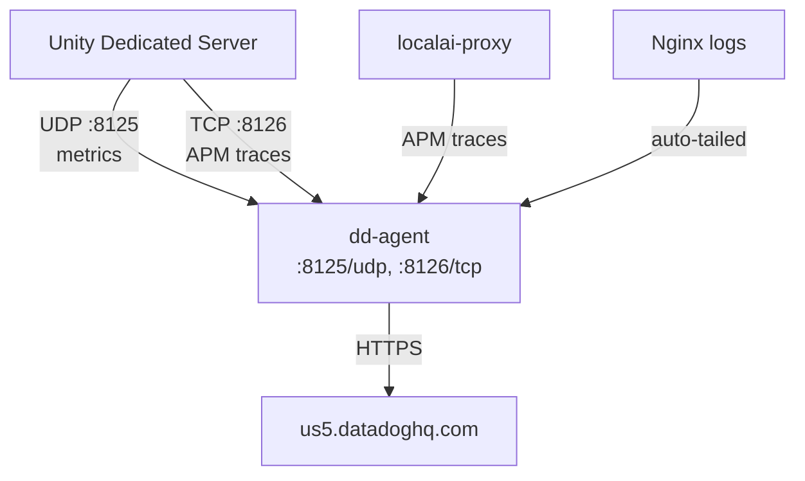
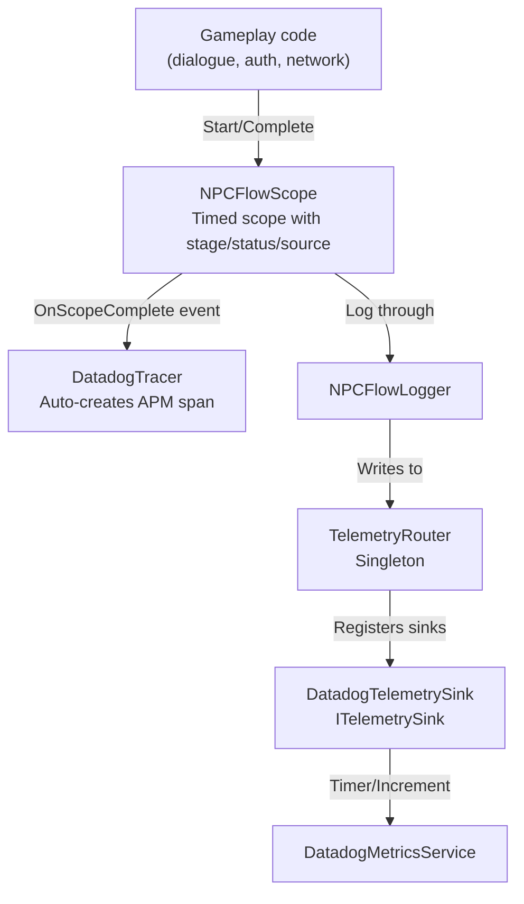

# Part IV — Backend Services

# Chapter 12: Datadog — Watching Everything

**Audience:** Developers who want visibility into what their game is doing — especially when WebGL users start reporting crashes you can't reproduce locally.

**What you'll learn:** Why monitoring is critical for WebGL, how the Datadog agent collects metrics and traces from Unity, the custom metrics and spans emitted by the NPC system, and how to interpret the dashboard.

---

## 1. Why Monitoring Matters for WebGL

WebGL is the hardest platform to debug. Consider:

- **No console.** You can't open DevTools on a player's machine.
- **No file system.** No log files on the browser's disk.
- **No stack traces.** WASM crashes silently — the tab just goes grey.
- **Memory hard limit.** The browser heap (~2 GB) is an invisible ceiling.
- **You can't reproduce player environments.** Every browser, OS version, and GPU driver combination behaves differently.

> 🧑‍💻 **Dev NPC:** "Debugging a WebGL crash without monitoring is like fixing a car engine with a blindfold, oven mitts, and a crayon. You know something's wrong, but all you get back is 'A problem occurred with this webpage so it was reloaded.' Thanks, browser. Very helpful."

Monitoring solves this by emitting telemetry *while the game runs* — before it crashes, before memory runs out, before the tab goes grey. With Datadog, we can answer:

- **Is memory growing over time?** → Detects memory leaks before they crash the tab
- **Are LLM requests getting slower?** → Detects LocalAI degradation
- **Are players experiencing errors?** → Counts dialogue failures, auth failures, network timeouts
- **Is the game maintaining 30 FPS?** → Tracks frame rate across sessions

---

## 2. Single Host-Level Agent (dd-agent)

Datadog's standard deployment pattern for containerized environments is a **sidecar** — one agent per container — but that doesn't work for Unity because:

1. A sidecar can't instrument Unity's process (Unity uses Mono/IL2CPP, not the standard .NET runtime)
2. Unity communicates over UDP (DogStatsD) and TCP (APM), which don't need process-level hooks
3. Multiple sidecars would duplicate log collection

So we use a **single host-level agent** running in Docker with `network_mode: host`:

```yaml
# Backend/datadog-host/docker-compose.yml
services:
  dd-agent:
    image: registry.datadoghq.com/agent:7
    network_mode: host  # <-- sees host network stack directly
    pid: host           # <-- can see host processes for container log tailing
    env_file:
      - .env
    volumes:
      - /var/run/docker.sock:/var/run/docker.sock:ro
      - /proc/:/host/proc/:ro
      - /sys/fs/cgroup/:/host/sys/fs/cgroup:ro
      - ./conf.d:/etc/datadog-agent/conf.d:ro
    environment:
      - DD_API_KEY=${DD_API_KEY}
      - DD_SITE=us5.datadoghq.com
      - DD_ENV=development
      - DD_LOGS_CONFIG_CONTAINER_COLLECT_ALL=true
      - DD_DOGSTATSD_NON_LOCAL_TRAFFIC=true
      - DD_APM_NON_LOCAL_TRAFFIC=true
```

| Setting | Why |
|---------|-----|
| `network_mode: host` | Agent shares host network — DogStatsD `:8125` and APM `:8126` are accessible as `localhost` from Unity |
| `pid: host` | Agent can discover and tail logs from other running containers |
| `DD_DOGSTATSD_NON_LOCAL_TRAFFIC=true` | Accept DogStatsD packets from other network namespaces |
| `DD_APM_NON_LOCAL_TRAFFIC=true` | Accept APM spans from other network namespaces |
| `DD_LOGS_CONFIG_CONTAINER_COLLECT_ALL=true` | Auto-tail all Docker container logs |

---

## 3. Ports: DogStatsD and APM

The agent listens on two ports that our Unity game sends data to:

| Port | Protocol | Used By | Purpose |
|------|----------|---------|---------|
| **8125** | UDP | `DatadogMetricsService` | Custom metrics (counter, gauge, timer, histogram) |
| **8126** | TCP | `DatadogTracer`, `localai-proxy` | APM traces (span data in MessagePack format) |



> 🧑‍💻 **Dev NPC:** "8125 is UDP — fire and forget. 8126 is TCP — reliable but slower. Metrics you can afford to lose (you're sampling anyway). Traces you want delivered. Datadog picked the right protocols for the job. Don't confuse them."

---

## 4. Custom Metrics from Unity

Our Unity code emits custom metrics via the `DatadogMetricsService` — a lightweight DogStatsD client that sends UDP packets to the Datadog agent.

### Metric Naming Convention

All custom metrics follow the pattern: `npc.{category}.{source}`

| Metric Name | Type | Description | Tags | Source |
|-------------|------|-------------|------|--------|
| `dialogue.session.turn.duration` | Timer | Full dialogue turn (question→response) latency | `npc_slug`, `status` | `NPCDialogueSessionService` |
| `dialogue.session.turn.count` | Counter | Completed dialogue turns | `npc_slug`, `status` | `NPCDialogueSessionService` |
| `dialogue.session.error` | Counter | Dialogue turn errors | `npc_slug`, `error_type` | `NPCDialogueSessionService` |
| `dialogue.localai.request.duration` | Timer | LocalAI HTTP call duration | `npc_slug`, `model` | `NPCDialogueSessionService` |
| `dialogue.localai.request.count` | Counter | LocalAI requests sent | `npc_slug` | `NPCDialogueSessionService` |
| `qdrant.search.duration` | Timer | Qdrant hybrid search duration | `mode:hybrid` | `QdrantRAGService` |
| `rag.dimension.check` | Gauge | Live dimension of Qdrant collection | `collection` | `QdrantRAGService` |
| `rag.dimension.valid` | Counter | Dimension matched expected (768) | `collection`, `dim` | `QdrantRAGService` |
| `rag.dimension.invalid` | Counter | ⚠️ Dimension mismatch detected | `collection`, `dim` | `QdrantRAGService` |
| `animation.sync.count` | Counter | Animator snapshots received from owner clients | `npc_client` | `NPCNetworkAnimatorState` |
| `animation.sync.speed` | Gauge | Speed ratio at time of sync (0.0–1.0) | `npc_client` | `NPCNetworkAnimatorState` |
| `animation.fallback.activation` | Counter | Server fallback activations (owner RPC late) | `netid` | `NPCNetworkAnimatorState` |
| `input.mode_switch` | Counter | Player toggled Gameplay ↔ UI/Dialogue mode | `mode:ui\|gameplay` | `NPCPlayerCharacterController` |
| `network.server.started` | Counter | Dedicated server session started | — | `NPCNetworkBootstrap` |
| `network.client.connected` | Counter | Client connected to server | `client_id` | `NPCNetworkBootstrap` |
| `network.client.disconnected` | Counter | Client disconnected from server | `client_id` | `NPCNetworkBootstrap` |
| `auth.login.success` | Counter | Successful auth logins | — | `AuthNetworkBridge` |

### DatadogMetricsService API

```csharp
// Assets/Scripts/Runtime/Monitoring/Datadog/DatadogMetricsService.cs

public static class DatadogMetricsService
{
    // Initialize once at server startup
    public static void Initialize(string host = "127.0.0.1", int port = 8125);

    // Shutdown — flush and release
    public static void Shutdown();

    // Increment a counter (default increment by 1)
    public static void Increment(string metricName, double value = 1.0,
        double sampleRate = 1.0, string[] tags = null);

    // Record a gauge (snapshot value)
    public static void Gauge(string metricName, double value,
        double sampleRate = 1.0, string[] tags = null);

    // Record a timing (milliseconds)
    public static void Timer(string metricName, double milliseconds,
        double sampleRate = 1.0, string[] tags = null);

    // Record a histogram value
    public static void Histogram(string metricName, double value,
        double sampleRate = 1.0, string[] tags = null);
}
```

### Usage in Dialogue Flow

```csharp
// Inside NPCDialogueManager, when processing a player message:

// 1. Start timing LLM request
var sw = Stopwatch.StartNew();

// 2. Call LocalAI
string response = await CallLocalAIAsync(playerMessage, ragContext);

// 3. Record LLM latency
DatadogMetricsService.Timer(
    "npc.llm.request.latency",
    sw.ElapsedMilliseconds,
    tags: new[] { $"npc_slug:{CurrentNpcSlug}", "model:gemma-3-4b-it", "status:success" }
);

// 4. Record token usage
DatadogMetricsService.Gauge(
    "npc.llm.request.tokens",
    promptTokens,
    tags: new[] { "direction:prompt" }
);
DatadogMetricsService.Gauge(
    "npc.llm.request.tokens",
    completionTokens,
    tags: new[] { "direction:completion" }
);

// 5. Increment turn counter
DatadogMetricsService.Increment(
    "npc.dialogue.turn.count",
    tags: new[] { $"npc_slug:{CurrentNpcSlug}", "status:success" }
);
```

---

## 5. DatadogTracer — Custom APM Spans

While `DatadogMetricsService` handles metrics, `DatadogTracer` handles **distributed tracing** — linking events across services to see the full picture of a dialogue turn.

### Why Manual Instrumentation?

Unity uses Mono/IL2CPP, not the standard .NET Core runtime. The automatic Datadog .NET Tracer can't hook into Unity's runtime. So we have a **manual tracer** that:

1. Creates spans with `StartSpan()`
2. Records duration automatically when the span is disposed
3. Batches spans and sends them via HTTP to the Trace Agent (port 8126) as MessagePack

### DatadogTracer API

```csharp
// Assets/Scripts/Runtime/Monitoring/Datadog/DatadogTraceService.cs

public static class DatadogTracer
{
    // Initialize once at server startup
    public static void Initialize(string agentHost = "127.0.0.1", int tracePort = 8126);

    // Shutdown — flushes pending spans
    public static void Shutdown();

    // Start a new span. Wrap in 'using' for auto-finish.
    public static Span StartSpan(
        string operationName,
        string service = "unity-dedicated-server",
        string resource = null,
        string type = "custom",
        Span parent = null,
        string[] tags = null
    );
}
```

### Usage

```csharp
// Wrapping an LLM call in a span
using (var span = DatadogTracer.StartSpan(
    "llm.request",
    resource: "gemma-3-4b-it",
    tags: new[] { "npc_slug:butler", "type:chat_completion" }
))
{
    var response = await CallLocalAIAsync(message);

    // Add tags after the fact
    span.SetTag("prompt_tokens", response.Usage.PromptTokens.ToString());
    span.SetTag("completion_tokens", response.Usage.CompletionTokens.ToString());
    span.SetTag("total_tokens", response.Usage.TotalTokens.ToString());

    // Mark as error if needed
    // span.SetError("LLM returned empty response");
}
```

Spans are automatically batched (max 50) and flushed every 5 seconds to:

```
POST http://127.0.0.1:8126/v0.5/traces
Content-Type: application/msgpack
```

The Trace Agent (embedded in `dd-agent`) then forwards these to Datadog's backend where they appear in **APM → Traces**.

---

## 6. Telemetry Pipeline: NPCFlowScope → TelemetryRouter → DatadogTelemetrySink

The NPC system has a structured telemetry pipeline that separates data collection from data emission. Here's how it connects to Datadog:



### NPCFlowScope

`NPCFlowScope` (in `Assets/Scripts/Runtime/Monitoring/Core/NPCFlowScope.cs`) is a disposable scope that wraps any operation with timing:

```csharp
// Example: tracking a dialogue turn
using (var scope = NPCFlowScope.Start(
    logger,
    NPCFlowStage.DialogueTurn,
    source: nameof(NPCDialogueManager),
    requestId: Guid.NewGuid().ToString(),
    npcSlug: "butler"
))
{
    // ... do the dialogue turn ...

    if (success)
        scope.Success();
    else
        scope.Fallback("LLM returned empty response");
}
```

When the scope completes, it fires `OnScopeComplete` — and `DatadogTracer` subscribes to that event to auto-create a corresponding APM span. This eliminates manual dual-instrumentation: you write one `using` block and get both structured logs and Datadog traces.

### TelemetryRouter

`TelemetryRouter` is a singleton that collects telemetry events and broadcasts them to registered sinks:

```csharp
// Registration during scene initialization
TelemetryRouter.Instance.Register(new DatadogTelemetrySink("npc"));

// TelemetryRouter receives events from NPCFlowLogger
// and forwards them to all registered ITelemetrySink implementations
```

### DatadogTelemetrySink

`DatadogTelemetrySink` (in `Assets/Scripts/Runtime/Monitoring/Telemetry/DatadogTelemetrySink.cs`) bridges telemetry events into Datadog metrics:

```csharp
public sealed class DatadogTelemetrySink : ITelemetrySink
{
    readonly string _metricPrefix;

    public DatadogTelemetrySink(string metricPrefix = "npc")
    {
        _metricPrefix = metricPrefix;
    }

    public void Emit(in TelemetryEvent evt)
    {
        string metricName = $"{_metricPrefix}.{evt.Category}.{evt.Source}";

        // Build tags
        var tags = new List<string>();
        if (!string.IsNullOrEmpty(evt.Status))
            tags.Add($"status:{evt.Status}");
        if (!string.IsNullOrEmpty(evt.RequestId))
            tags.Add($"request:{evt.RequestId}");
        // ... forward evt.Tags dictionary ...

        // Timed events → Datadog timer metric
        if (evt.DurationMs > 0)
            DatadogMetricsService.Timer(metricName, evt.DurationMs, tags: tagArray);

        // Error/fallback events → increment error counter
        if (evt.Status is "error" or "fallback")
            DatadogMetricsService.Increment($"{metricName}.count", tags: tagArray);
    }
}
```

The beauty of this pipeline: **gameplay code only interacts with `NPCFlowScope` and `NPCFlowLogger`**. It never calls Datadog directly. The `TelemetryRouter` and `DatadogTelemetrySink` handle the mapping. You could swap Datadog for any other backend without touching gameplay code.

---

## 7. Dashboard JSON

The Datadog dashboard for our project lives at `Backend/datadog-host/dashboard.json`. It's a JSON export that can be imported into any Datadog account.

The dashboard is organized into these sections:

```json
{
  "title": "NPC Platform — Unity Linux LLM",
  "description": "Comprehensive monitoring dashboard for the NPC Platform...",
  "layout_type": "free",
  "template_variables": [
    { "name": "env", "prefix": "env", "default": "production" },
    { "name": "service", "prefix": "service", "default": "unity-dedicated-server" }
  ],
  "widgets": [
    // 1. Service Overview — top containers by memory/CPU, health checks
    // 2. Unity Performance — FPS, memory, GC collections
    // 3. LLM Inference — request latency, token counts, error rates
    // 4. Vector Search — Qdrant query latency, hit counts
    // 5. Auth — login/register latency, error rates
    // 6. Network — dialogue turn latency, network errors
    // 7. Host Resources — CPU, memory, disk, network I/O
  ]
}
```

### Key Dashboard Widgets

| Widget | Metric Query | What It Shows |
|--------|-------------|---------------|
| **FPS Over Time** | `avg:unity.fps{$env,$service}` | Frame rate — dips indicate performance issues |
| **Memory Usage** | `avg:docker.container.mem.usage{$env} by {container_name}` | Per-container memory consumption |
| **LLM Latency (p99)** | `p99:npc.llm.request.latency{$env,$service}` | Worst-case LLM response time |
| **LLM Token Count** | `avg:npc.llm.request.tokens{$env,$service} by {direction}` | Prompt vs completion token counts |
| **Dialogue Turn Rate** | `per_second(npc.dialogue.turn.count{$env,$service})` | Dialogue turns per second |
| **Error Rate** | `npc.llm.request.latency.count{$env,$service,status:error}` | Failed LLM requests |
| **Qdrant Search Latency** | `avg:npc.qdrant.search.latency{$env,$service}` | Vector search performance |
| **Auth Success Rate** | `(npc.auth.errors{$env} / npc.auth.latency.count{$env}) * 100` | Percentage of failed auth attempts |

> 🧑‍💻 **Dev NPC:** "The dashboard is the first thing you open when a player says 'the game crashed.' If you see memory growing linearly over minutes, that's a leak. If you see LLM latency spiking, that's LocalAI. If you see nothing at all... either the player's ad blocker killed Datadog's browser RUM, or dd-agent isn't running, or your WebGL conditional compilation is wrong. Fix those first."

---

## 8. WebGL-Safe: Conditional Compilation

Not all Datadog features work in WebGL. The browser sandbox prevents:
- Direct UDP socket access (no `System.Net.Sockets.UdpClient`)
- HTTP access to `localhost:8126` (different origin)
- File system access for the Datadog .NET Tracer

So our monitoring code uses **conditional compilation** to only activate on platforms where it works:

```csharp
#if !UNITY_WEBGL || UNITY_EDITOR
    // Datadog metrics and traces work here
    DatadogMetricsService.Initialize();
    DatadogTracer.Initialize();
#else
    // WebGL build — these are no-ops or use browser-specific paths
    // For browser RUM, use DatadogConsent and the browser SDK (via jslib)
#endif
```

### What Works Where

| Feature | Editor | Dedicated Server | WebGL Build |
|---------|--------|-----------------|-------------|
| `DatadogMetricsService` (UDP) | ✅ | ✅ | ❌ (no UDP sockets) |
| `DatadogTracer` (TCP spans) | ✅ | ✅ | ❌ (no TCP to localhost) |
| `DatadogConsent` (RUM) | N/A | N/A | ✅ (calls browser JS via `DllImport`) |
| Datadog Browser RUM SDK | N/A | N/A | ✅ (injected via index.html) |

### DatadogConsent — WebGL RUM

For WebGL, we use the browser's Datadog RUM SDK directly via JavaScript interop:

```csharp
public static class DatadogConsent
{
#if UNITY_WEBGL && !UNITY_EDITOR
    [DllImport("__Internal")]
    private static extern void DDGrantTrackingConsent();

    [DllImport("__Internal")]
    private static extern void DDRevokeTrackingConsent();
#else
    private static void DDGrantTrackingConsent() { }
    private static void DDRevokeTrackingConsent() { }
#endif

    public static void Grant()
    {
        DDGrantTrackingConsent();
        // Browser RUM starts collecting sessions
    }

    public static void Revoke()
    {
        DDRevokeTrackingConsent();
        // Browser RUM stops
    }
}
```

The `DllImport("__Internal")` attribute tells Unity's WebGL build to call a JavaScript function defined in a `.jslib` plugin file. This is how we bridge Unity C# → Browser JS for RUM tracking.

> 🧑‍💻 **Dev NPC:** "The `#if !UNITY_WEBGL || UNITY_EDITOR` guard is essential. If you forget it on WebGL, your game will try to open a UDP socket in the browser — and the browser will throw a security error so hard your tab will close before you can read it. Always guard your socket code."

---

## 9. Verification

```bash
# 1. Is the Datadog agent running?
docker ps --filter name=dd-agent

# 2. Is DogStatsD listening?
docker exec dd-agent bash -c "ss -tuln | grep 8125"

# 3. Is APM listening?
docker exec dd-agent bash -c "ss -tuln | grep 8126"

# 4. Agent status check
docker exec dd-agent agent status

# 5. Check DogStatsD metrics are flowing
docker exec dd-agent agent check dogstatsd

# 6. Check APM trace intake
curl -v http://127.0.0.1:8126/v0.5/traces \
  -X POST \
  -H "Content-Type: application/msgpack" \
  --data-binary @- <<< ""
# Expected: HTTP 200 (empty array is OK)

# 7. In Datadog UI:
#    - Metrics Explorer: query "npc.llm.request.latency"
#    - APM → Traces: filter by service "unity-dedicated-server"
#    - Dashboards → "NPC Platform"
```

---

## 10. Troubleshooting

| Symptom | Likely Cause | Fix |
|---------|-------------|-----|
| No metrics in Datadog UI | dd-agent not running or `DD_API_KEY` invalid | Check `docker logs dd-agent` for API key errors |
| `npc.*` metrics missing | Unity not sending UDP packets | Verify `DatadogMetricsService.Initialize()` was called; check `#if !UNITY_WEBGL` guard |
| APM traces show in editor but not server | Trace Agent not accepting non-local traffic | Set `DD_APM_NON_LOCAL_TRAFFIC=true` |
| DogStatsD metrics arriving but empty tags | Tags not being passed correctly | Check `FormatMetric` in `DatadogMetricsService` — tags must be `"key:value"` format |
| FPS counter always 0 | FPS metric not emitted | Add timer callback that records FPS via `DatadogMetricsService.Gauge("unity.fps", ...)` |
| WebGL build throws socket error | Forgot `#if !UNITY_WEBGL` guard | Wrap all `DatadogMetricsService`/`DatadogTracer` calls in conditional compilation |
| Container logs not in Datadog | `DD_LOGS_CONFIG_CONTAINER_COLLECT_ALL` not set | Add to dd-agent environment |
| Dashboard shows no data for past hour | Template variable mismatch | Check `$env` and `$service` template variables match your agent tags |
| PGRST202 error in logs (mixed up!) | Wrong service — this is PostgREST, not Datadog | See Chapter 11 §5 |
| dd-agent logs "Unknown environment variable" for DD_DATA_STREAMS_ENABLED / DD_PROFILING_ENABLED | Agent version doesn't support those vars | Cosmetic warning — can be ignored |

---

**Key takeaway:** Datadog is your window into the production WebGL experience. The `DatadogMetricsService` + `DatadogTracer` pair gives you metrics and traces from the dedicated server, while `DatadogConsent` + the browser RUM SDK covers the WebGL client side. The `NPCFlowScope` → `TelemetryRouter` → `DatadogTelemetrySink` pipeline means you write telemetry once and it flows everywhere. And always, always guard your networking code with `#if !UNITY_WEBGL || UNITY_EDITOR` — or watch your WebGL build crash silently in the browser.
