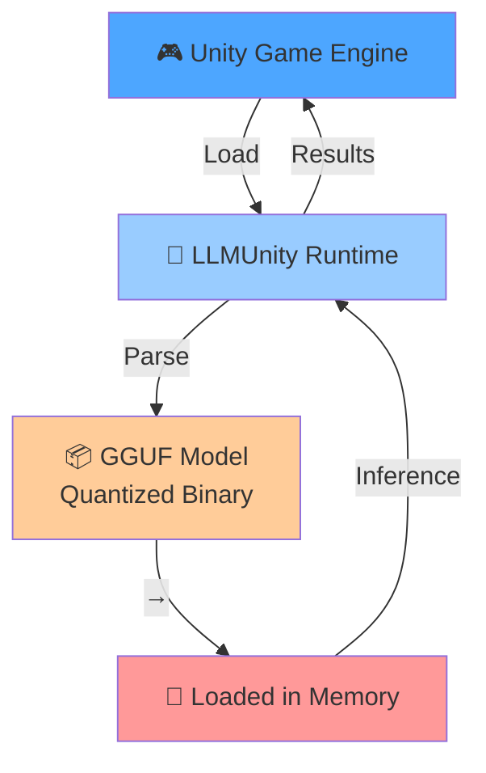
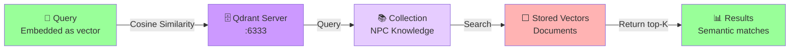
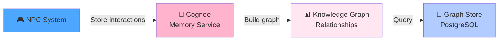

# Integration Guides

Professional integration documentation for working with external systems.

## Quick Navigation

- [LLMUnity Integration](#llmunity-integration) - In-game LLM loading and inference
- [LocalAI Integration](#localai-integration) - Remote GGUF model serving
- [Qdrant Integration](#qdrant-integration) - Vector database for RAG
- [Cognee Integration](#cognee-integration) - Optional long-term memory
- [Networking Integration](#networking-integration) - Multiplayer dialogue setup

---

## LLMUnity Integration

**LLMUnity** is the in-game runtime that loads and executes GGUF models locally in Unity.

### What is LLMUnity?



### LLMUnity Components in NPCDialogueManager

```csharp
public class NPCDialogueManager : MonoBehaviour
{
    // Main LLM for dialogue
    public LLM llm;
    
    // Alternative agent-based LLM
    public LLMAgent llmAgent;
    
    // Embedding-only LLM for RAG
    // Usually configured separately as "LLMRAG"
    public RAG rag;
    
    // Current config
    public bool useRemoteServer = false;  // false = use LLMUnity local
}
```

### Configuration: Local vs Remote

**Local Mode (LLMUnity)**
```
Scene Configuration:
├─ LLM GameObject
│  └─ LLM Component
│     ├─ Model path: "path/to/model.gguf"
│     ├─ GPU layers: 20 (offload to GPU)
│     ├─ Context size: 2048 tokens
│     └─ Quantization: Q4_K_M
└─ useRemoteServer: false
```

**Remote Mode (LocalAI HTTP)**
```csharp
npCDialogueManager.useRemoteServer = true;
npCDialogueManager.remoteHost = "localhost";
npCDialogueManager.remotePort = 11435;  // LocalAI default
npCDialogueManager.remoteModel = "neural-chat";

// Inference goes to HTTP API instead of local LLMUnity
```

### Common Model Configurations

| Model | Purpose | Quantization | Parameters | VRAM | Notes |
|-------|---------|--------------|-----------|------|-------|
| `neural-chat-7b.Q4_K_M.gguf` | Dialogue (default) | Q4_K_M | 7B | 6GB | Recommended |
| `mistral-7b-instruct.Q4_K_M.gguf` | Instruction-following | Q4_K_M | 7B | 6GB | Fast, smart |
| `orca-2-7b.Q4_K_M.gguf` | Complex reasoning | Q4_K_M | 7B | 6GB | Slower, accurate |
| `all-MiniLM-L12-v2.Q4_K_M.gguf` | Embeddings only | Q4_K_M | 22M | <200MB | Used for RAG |
| `dolphin-2.5-mixtral-8x7b.Q4_K_M.gguf` | Advanced dialogue | Q4_K_M | 47B | 32GB | Very powerful |

### LLMUnity API Example

```csharp
// 1. Reference the LLM component
public LLM llm;

// 2. Initialize (usually done in Awake/Start)
if (!llm.ready)
{
    await llm.LoadModel();
}

// 3. Make inference requests
var result = await llm.GenerateAsync(
    prompt: "You are an AI assistant. Answer this question: What is machine learning?",
    maxTokens: 256,
    temperature: 0.7f,
    topP: 0.9f
);

// 4. Handle response
Debug.Log($"Response: {result}");

// 5. For streaming:
await llm.GenerateAsync(
    prompt: "Your prompt here",
    maxTokens: 256,
    onProgressCallback: (chunk) =>
    {
        // Called for each generated token
        Debug.Log($"Chunk: {chunk}");
    }
);
```

### Troubleshooting LLMUnity

**Issue**: Model fails to load
```
Symptoms:
- "Failed to load model at path"
- Unity freezes on startup
- Insufficient memory error

Solutions:
1. Verify model path is correct and file exists
2. Check file is readable (not locked/corrupted)
3. Increase available VRAM or reduce context size
4. Use smaller quantization (Q3_K_M instead of Q6)
5. Check model format is GGUF (not GGML or safetensors)
```

**Issue**: Inference is slow
```
Symptoms:
- Token generation < 5 tokens/sec
- High CPU usage, low GPU usage
- Taking 30+ seconds for short response

Solutions:
1. Check GPU layers setting (should be > 0)
2. Verify GPU is being detected (check logs)
3. Reduce context size (impacts inference speed)
4. Use quantized model (Q4_K_M vs Q6_K)
5. Reduce batch size if available
```

---

## LocalAI Integration

**LocalAI** is a REST API server that manages GGUF models and can serve inference to multiple clients.

### What is LocalAI?

LocalAI provides an OpenAI-compatible REST API for GGUF inference:

```
LocalAI Server (localhost:11435)
├─ /v1/chat/completions      (Chat API)
├─ /v1/embeddings            (Embeddings API)
├─ /v1/models                (List models)
└─ /v1/admin/models          (Manage models)

Each model is a GGUF file loaded on demand
```

### Configuration in NPCDialogueManager

```csharp
public class NPCDialogueManager : MonoBehaviour
{
    // Enable remote mode
    public bool useRemoteServer = true;
    
    // LocalAI connection
    public string remoteHost = "localhost";
    public int remotePort = 11435;          // Default LocalAI port
    public string remoteModel = "neural-chat";
    
    // Optional: separate embedding server
    public bool forceRemoteEmbedder = true;
    public string remoteEmbeddingHost = "localhost";
    public int remoteEmbeddingPort = 8080;  // Often separate embedding service
}
```

### Startup: Running LocalAI

**Option 1: Docker (Recommended)**
```bash
# Pull LocalAI image
docker pull localai/localai

# Run with GGUF models mounted
docker run -d \
  --name localai \
  -p 11435:8080 \
  -v /mnt/data/models/localai/llm:/models/llm:ro \
  -e MODEL_PATH=/models/llm \
  localai/localai:latest
```

**Option 2: Direct Installation**
```bash
# Install LocalAI binary
curl https://localai.io/install.sh | sh

# Run with models directory
localai --models-path /mnt/data/models/localai/llm --listen 127.0.0.1:11435
```

**Option 3: From this project**
```bash
cd /mnt/data/Projects_SSD/LocalAI
docker-compose up -d
```

### Verification: Check LocalAI Health

```bash
# List available models
curl http://localhost:11435/v1/models

# Test chat endpoint
curl http://localhost:11435/v1/chat/completions \
  -H "Content-Type: application/json" \
  -d '{
    "model": "neural-chat",
    "messages": [{"role": "user", "content": "Hello"}],
    "max_tokens": 50
  }'

# Test embeddings endpoint
curl http://localhost:11435/v1/embeddings \
  -H "Content-Type: application/json" \
  -d '{
    "model": "all-MiniLM-L12-v2",
    "input": "Hello world"
  }'
```

### LocalAI API: Chat Completions

```csharp
// Example HTTP request (what NPCDialogueManager does internally)
var request = new UnityWebRequest("http://localhost:11435/v1/chat/completions", "POST");
request.SetRequestHeader("Content-Type", "application/json");

var body = JsonConvert.SerializeObject(new
{
    model = "neural-chat",
    messages = new[]
    {
        new { role = "system", content = "You are a helpful NPC." },
        new { role = "user", content = "What is your name?" }
    },
    max_tokens = 256,
    temperature = 0.7f,
    top_p = 0.9f
});

request.uploadHandler = new UploadHandlerRaw(Encoding.UTF8.GetBytes(body));
request.downloadHandler = new DownloadHandlerBuffer();

await request.SendWebRequest();

var response = JsonConvert.DeserializeObject<ChatResponse>(request.downloadHandler.text);
// response.choices[0].message.content contains the generated text
```

### Troubleshooting LocalAI

**Issue**: Connection refused
```
Error: "Connection to localhost:11435 refused"

Solutions:
1. Verify LocalAI is running: curl http://localhost:11435/health
2. Check port number (default 11435 for LocalAI)
3. If remote machine: use actual IP instead of localhost
4. Check firewall rules allowing connections
5. Verify bind address (LocalAI may listen on 0.0.0.0 or specific IP)
```

**Issue**: Model not found
```
Error: "Model neural-chat not found"

Solutions:
1. List available models: curl http://localhost:11435/v1/models
2. Verify model file exists in /mnt/data/models/localai/llm/
3. Check model filename matches exactly (case-sensitive)
4. Ensure LocalAI has read permissions on model file
5. Model may still be loading—wait a moment and retry
```

**Issue**: Slow responses from LocalAI
```
Symptoms:
- Inference through LocalAI slower than local
- High latency even on same machine

Solutions:
1. Check network overhead (same-machine should be fast)
2. Verify LocalAI isn't using disk swapping (check `free`)
3. Check if other processes are using GPU
4. Reduce model size or increase LocalAI GPU layers
5. Profile with: curl -w "@curl-format.txt" http://localhost:11435/...
```

---

## Qdrant Integration

**Qdrant** is a vector database used for semantic search in RAG.

### What is Qdrant?



### Starting Qdrant

**Option 1: Docker**
```bash
docker run -d \
  --name qdrant \
  -p 6333:6333 \
  -v ./qdrant_storage:/qdrant/storage \
  qdrant/qdrant:latest
```

**Option 2: From this project**
```bash
cd /mnt/data/Projects_SSD/qdrant_storage
# Start service as configured
```

### Configuration in NPCDialogueManager

```csharp
public class NPCDialogueManager : MonoBehaviour
{
    public QdrantRAGService qdrantRag;
    public bool useQdrantRag = false;         // Enable Qdrant-based RAG
}

public class QdrantRAGService : MonoBehaviour
{
    public string host = "localhost";
    public int port = 6333;
    public string collectionName = "npc-knowledge";
}
```

### Workflow: Index Documents

```csharp
// 1. Prepare documents
var documents = new List<string>
{
    "The ancient temple was built 2000 years ago...",
    "Magic is the manipulation of fundamental forces...",
    "The kingdom was ruled by Queen Emma..."
};

// 2. Embed each document
var embeddings = new List<float[]>();
foreach (var doc in documents)
{
    var embedding = await embeddingService.EmbedAsync(doc);
    embeddings.Add(embedding);  // 384-dim vector
}

// 3. Index in Qdrant
await qdrantRag.IndexDocumentsAsync(
    collectionName: "npc-knowledge",
    documents: documents,
    embeddings: embeddings,
    metadata: new List<Dictionary<string, object>>
    {
        new() { { "npc_slug", "wise-mage" }, { "source", "temple.txt" } },
        new() { { "npc_slug", "wise-mage" }, { "source", "magic.txt" } },
        new() { { "npc_slug", "queen" }, { "source", "history.txt" } }
    }
);
```

### Workflow: Retrieve Context

```csharp
// 1. User asks a question
string userQuery = "What do you know about ancient temples?";

// 2. Embed the query (same model as documents)
var queryVector = await embeddingService.EmbedAsync(userQuery);

// 3. Search Qdrant for similar documents
var results = await qdrantRag.RetrieveAsync(
    query: userQuery,
    topK: 5,
    similarityThreshold: 0.5f
);

// Results look like:
// [
//   "The ancient temple was built 2000 years ago...",
//   "Temples served as centers of learning and power...",
//   ...
// ]

// 4. Use results in prompt
var contextualPrompt = $"""
    Knowledge context:
    {string.Join("\n---\n", results)}
    
    Question: {userQuery}
    
    Provide a grounded answer based on the context above.
""";

var response = await llm.GenerateAsync(contextualPrompt);
```

### Verification: Check Qdrant Health

```bash
# Health check
curl http://localhost:6333/health

# List collections
curl http://localhost:6333/collections

# Get collection info
curl http://localhost:6333/collections/npc-knowledge

# Example output:
# {
#   "status": "ok",
#   "result": {
#     "name": "npc-knowledge",
#     "vectors_count": 1240,
#     "indexed_vectors_count": 1240,
#     "points_count": 1240
#   }
# }
```

### Troubleshooting Qdrant

**Issue**: Connection refused
```
Error: "Failed to connect to Qdrant at localhost:6333"

Solutions:
1. Verify Qdrant is running: curl http://localhost:6333/health
2. Check port mapping in Docker
3. Check firewall allowing 6333
4. Verify collection name is correct
```

**Issue**: Poor search results

```
Symptoms:
- Retrieved documents not relevant
- Similarity scores very low (<0.5)
- Missing expected documents

Solutions:
1. Check same embedding model used for indexing and search
2. Verify documents actually indexed: curl http://localhost:6333/collections
3. Try increasing topK (retrieve more results)
4. Lower similarity threshold
5. Re-index with better document chunks (not too long/short)
```

---

## Cognee Integration

**Cognee** provides optional long-term memory and knowledge graph capabilities (experimental).

### What is Cognee?



### Configuration in NPCDialogueManager

```csharp
public class NPCDialogueManager : MonoBehaviour
{
    public GladeAgenticAI.Core.Memory.CogneeMemoryService cogneeMemory;
    public bool useCogneeMemory = false;
    
    // When enabled, NPC interactions recorded to knowledge graph
    // Enables question answering about past interactions
}
```

### Starting Cognee

**Option 1: Docker Compose**
```bash
cd /mnt/data/Projects_SSD/cognee
docker-compose up -d
# Cognee API: http://localhost:8000/api/v1
```

**Option 2: Python Dev Server**
```bash
cd /mnt/data/Projects_SSD/cognee
source .venv/bin/activate
python -m cognee.main
```

### Usage Example

```csharp
// Enable long-term memory
npCDialogueManager.useCogneeMemory = true;

// As NPCs interact with players, Cognee records:
// - Dialogue exchanges
// - NPC knowledge declarations
// - Relationships between entities
// - Temporal event sequences

// Later queries can use this memory:
"Remember when I asked you about the temple?"
// System can retrieve from knowledge graph instead of just RAG
```

### Cognee Preflight Checks

```bash
# From project root
cd /mnt/data/Projects_SSD
source cognee/.venv/bin/activate

# Run preflight script before enabling Cognee
python3 scripts/cognee_preflight.py

# Expected output:
# ✓ Cognee service running on localhost:8000
# ✓ PostgreSQL connected
# ✓ Graph store initialized
# ✓ Ready for knowledge graph mode
```

### Troubleshooting Cognee

**Issue**: Connection to Cognee fails
```
Error: "Failed to connect to http://localhost:8000"

Solutions:
1. Check Cognee is running: curl http://localhost:8000/api/v1/health
2. Verify port 8000 is accessible
3. Check PostgreSQL backend is running
4. Run preflight: python3 scripts/cognee_preflight.py
5. Check logs: docker logs cognee
```

**Note**: Cognee integration is still experimental. Test thoroughly before relying on it for production.

---

## Networking Integration

See [Networking System Deep-Dive](../3_Core_Systems/README.md#networking-system) for detailed networking documentation.

Quick start for multiplayer setup:

```csharp
// Server setup
var config = NPCTransportConfig.CreateDefault();
config.autoStartMode = NPCNetworkAutoStartMode.Server;
config.listenAddress = "0.0.0.0";     // Listen on all interfaces
config.port = 7777;

// Client setup
var clientConfig = NPCTransportConfig.CreateDefault();
clientConfig.autoStartMode = NPCNetworkAutoStartMode.Client;
clientConfig.connectAddress = "server-ip";  // Server address
clientConfig.port = 7777;
```

---

**Next**: [Developer Guide](../5_Developer_Guide/README.md)
