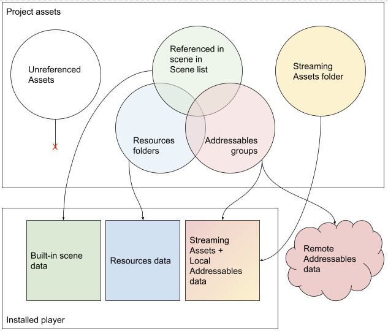
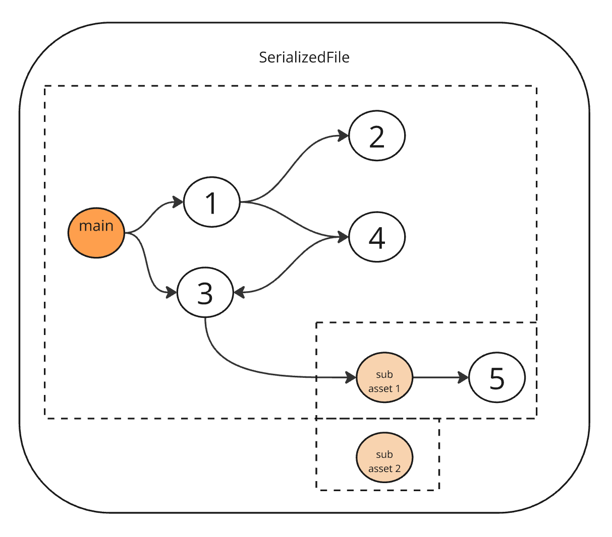
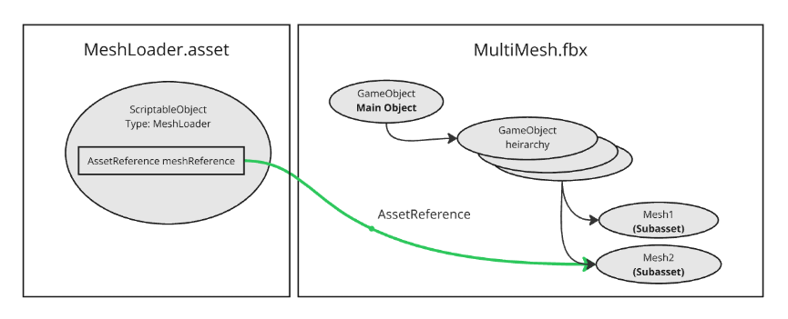
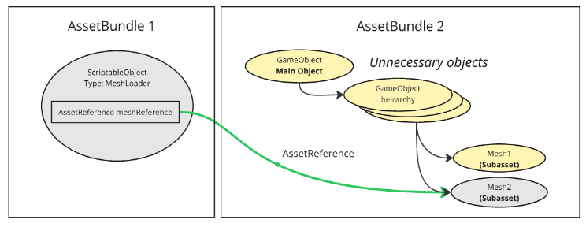
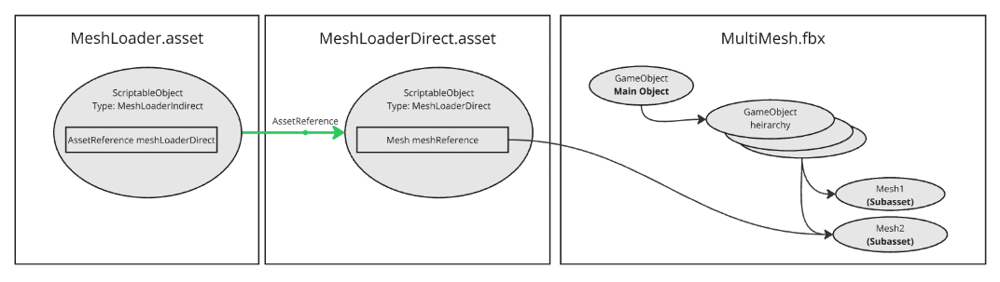
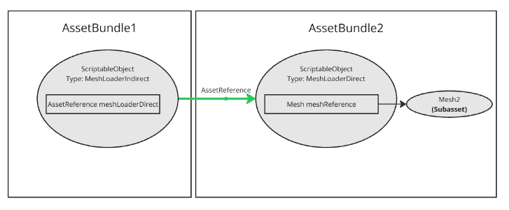

# Addressable asset dependencies

Understanding how assets reference each other can help you optimize the Addressables implementation in your project. Asset dependencies can affect build size, memory usage, and runtime performance.

Unity packages assets differently depending on how you configure them:

- **Addressable assets**: Depending on how you configure the Addressables settings in your project you can either:
    - Build Addressable assets into your application as an additional set of local assets.
    - Keep Addressable assets external to the build as remote assets hosted on a server and downloaded when they're needed. You can update remote assets independently from the application itself, although remote assets can't include code, so you can only change assets and serialized data.
- **Scene assets**: Unity includes scenes from your project's [Scene List](xref:um-build-profile-scene-list) and their dependencies in the application's built-in data.
- **Resources assets**: Unity packages assets in [`Resources` folders](xref:um-loading-resources-at-runtime) as a separate, built-in collection that you can load independently.

 *How different types of project assets are exported to a Player build.*

## Asset organization

To organize Addressable assets effectively, move data from `Resources` folders and any scenes in your project into [Addressable groups](groups-intro.md). Small amounts of data in `Resources` folders typically don't cause performance issues. You don't need to move third-party package assets unless they cause problems. You can't store Addressable assets in `Resources` folders.

Keep at least one scene in your project's Scene List and create a minimal initialization scene if needed.

## Explicit and implicit dependencies

An explicit asset is one you directly add to an [Addressables group](groups-intro.md). Unity packs these into AssetBundles during a [content build](xref:addressables-builds).

An implicit asset is a dependency that Unity automatically includes. If an explicit asset references other assets:

- **Addressable dependencies**: Unity packs these according to their group settings (same or different AssetBundle).
- **Non-Addressable dependencies**: Unity includes these in the referencing asset's AssetBundle.

> [!TIP]
> Use the [Build Layout Report](xref:addressables-build-layout-report) tool to view detailed information about AssetBundles and their dependencies.

## Avoiding asset duplication

When multiple Addressables reference the same non-Addressable asset, Unity creates copies in each AssetBundle:

 *Non-Addressable assets are copied to each bundle with a referencing Addressable.*

As a result, at runtime the following happens:

- Multiple instances of the same asset exist at runtime instead of a single shared instance.
- Changes to one instance don't affect other instances.
- Increased memory usage and build size.

To avoid this problem, make the shared asset Addressable and place it in its own AssetBundle or group it with one of the referencing assets. This creates an AssetBundle dependency that Unity loads automatically when needed.

When you load any asset from an AssetBundle, Unity must also load all dependent AssetBundles. This loading affects runtime performance even if you don't use the dependent assets directly. For more information, refer to [Memory implications of loading AssetBundle dependencies](memory-assetbundles.md).

## Subasset references

In Unity, an asset is a group of objects saved in the same file. Each asset has a top-level main object:

* A prefab asset contains a GameObject as the main object, with all other GameObjects in the prefab hierarchy as part of that asset.
* A ScriptableObject asset contains a single ScriptableObject as the main object.

When you load an asset, Unity typically loads all objects from that asset because they're part of the same dependency graph. For example, loading a prefab requires the entire GameObject hierarchy in memory, regardless of which specific object you access. When you assign assets to [groups](Groups.md) and build them into AssetBundles, the asset path (or AssetDatabase GUID) identifies which objects go into the build.

However, some assets contain subassets (also referred to as subobjects), which you can load independently without requiring Unity to load all objects from the parent asset. This is useful when you only need a specific part of a large asset.

Common examples of assets that contain subassets include:

* **FBX files**: The main object is the root GameObject of the hierarchy. Each mesh and material in the FBX is a subasset.
* **Multiple ScriptableObjects in a single asset**: For more information, refer to [`AssetDatabase.AddObjectToAsset`](xref:UnityEngine.AssetDatabase.AddObjectToAsset).
* **Sprite atlases**: Textures and sprites within a single texture asset.

The following diagram illustrates objects (circles) inside a Unity asset, with direct references shown as arrows. In this example, the main object references (directly or indirectly) all objects except "sub asset 2":

These object relationships mean:

* Loading "main" forces all other objects to load, except "sub asset 2".
* Loading "sub asset 1" only forces object 5 to load.
* Loading "sub asset 2" loads it completely independently.

By default, [`AssetReference`](AssetReferences.md) instances reference the main object of an asset. You can create an AssetReference that points to a subasset by specifying the subasset name in the `AssetReference` instance's `SubObjectName` property. This is the name of the object that's the root of the subasset. The `AssetReferenceT<T>` generic class has a constructor that accepts the subasset name as a parameter.

### Using subasset references

You can use `AssetReference` instances that point to a subasset to load just that subasset at runtime. However, AssetReference only works to reference explicit assets. Because AssetBundle definitions always work at the granularity of assets, Unity builds the entire content of the asset, not just the objects required by the subasset. This can be inefficient if the asset contains large objects that aren't required at runtime.

You can use the following approaches to reference subassets in your project:

 * AssetReference that references a subasset: This references the subasset correctly, but includes the entire asset in the AssetBundle.
 * AssetReference that references an intermediary asset: Only include the portion of the asset that is needed by the subasset. This requires an extra ScriptableObject to reference the subasset.

The following examples illustrate those two approaches in the case of a Mesh inside an FBX file.  Both examples use an AssetReference in a separate AssetBundle to load the mesh on demand.

#### Direct subasset reference

The first example shows the common pattern for using AssetReference. A "MeshLoader" ScriptableObject has an AssetReference that directly points to the Unity object we want to load dynamically.

This approach references the mesh correctly. However, the undesirable side effect is that the entire FBX file gets included in the AssetBundle. This happens because the AssetReference requires the MultiMesh.fbx to be explicitly assigned to a group. As a result, the main GameObject object and all its dependent objects are also included in the build.

#### Intermediary asset reference

The second example shows how to include only a single Mesh in the build. This works by creating a "MeshLoaderDirect" ScriptableObject that directly references the Mesh subasset. The MeshLoaderDirect asset is explicitly assigned to a group, but the MultiMesh.fbx is not. Like the first approach, there's also a MeshLoader.asset in another AssetBundle. However, in this approach, the AssetReference points to the MeshLoaderDirect asset instead of directly to the Mesh.

In the resulting build, the second AssetBundle contains only the objects that are actually needed.

While there's some overhead to create intermediate ScriptableObjects for each dynamically loaded mesh, these are typically quite small compared to the savings from excluding unnecessary content from the build.

## Additional resources

* [Addressables initialization process](InitializeAsync.md)
* [Memory management](MemoryManagement.md)
