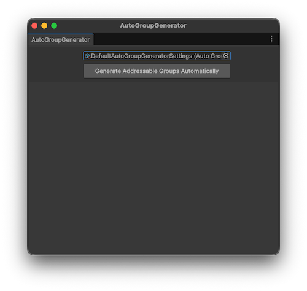
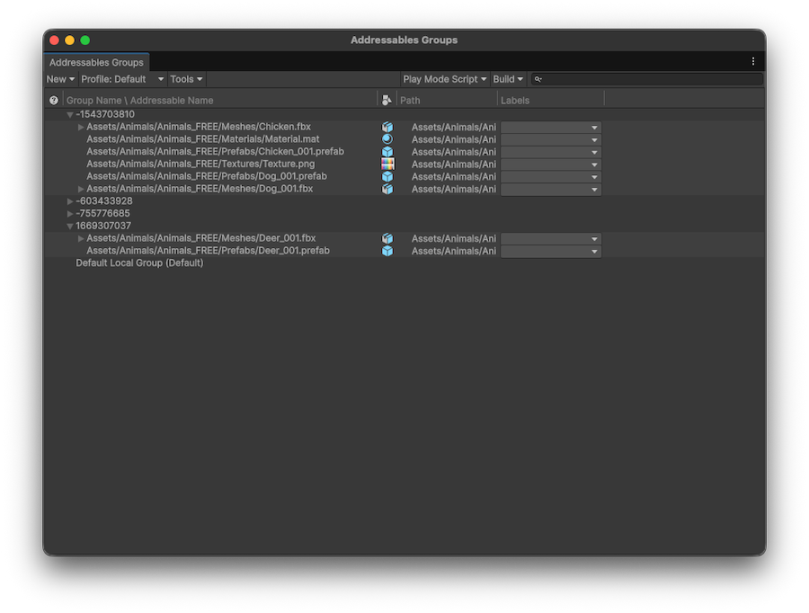

# Automatically create groups

Use the **Auto Group Generator** window to create groups automatically. The **Auto Group Generator** tool uses a standardized graph-based approach to group assets that are commonly used together. To use the window, go to **Window** > **Asset Management** > **Addressables** > **Auto Group Generator**.

The tool automatically adds implicit dependencies and removes unused entries, while preserving any existing address names, labels, and packing mode settings.

It doesn't manage runtime loading logic, resolve duplication from the [`Resources`](xref:um-assets-resources-system) folder, or perform content builds. It also overrides any manual group assignments you make.

<br/>*The **Auto Group Generator** window with a settings file selected.*

## Use the Auto Group Generator

To automatically create groups with the **Auto Group Generator** window, perform the following steps:

1. Go to **Window** > **Asset Management** > **Addressables** > **Auto Group Generator**.
1. If you're using the window for the first time, select **Create Settings File** to create [settings files](groups-auto-group-generator-reference.md) that define which assets to automatically sort into groups. Unity generates the following files in the `AddressablesAssetData` folder of your project:

    * Auto Group Generator settings (`DefaultAutoGroupGeneratorSettings`).
    * Asset Selection Input Rule (`DefaultInputRule`).
    * Default Output Rule (`DefaultOutputRule`).

1. In the **Project** window, select the `DefaultInputRule`.
1. In the **Inspector** window, use the **Add Asset** picker to select the assets you want to automatically add to groups. Only add assets that your code loads asynchronously via strings or [asset references](AssetReferences.md). You can either add assets individually, or [create a JSON file](groups-auto-group-generator-reference.md#json-input-lists) with an array of asset paths.

    >[!NOTE]
    > Don't add common dependencies such as shared textures, or audio clips to the input rules file. The Auto Group Generator automatically detects any dependencies, so including them increases the processing time of group generation.

1. In the **Auto Group Generator** window, select the settings file from the picker.
1. Select **Generate Addressables Groups Automatically**.

The **Auto Group Generator** tool runs and when it's finished the [Addressables Groups window](GroupsWindow.md) displays the automatically created groups.

<br/>*The **Addressables Groups** window with some automatically created groups.*

Generated Addressable groups are named using a hash code rather than human-readable text. This hash is calculated from the GUID of the source assets, meaning that the hash remains stable even if assets are renamed or moved within the project.

You can create a custom output rule to define your own naming convention. For more information, refer to [Customize group names](#customize-group-names).

## Customize group generation

The **Auto Group Generator** uses [input and output rules](groups-auto-group-generator-reference.md) to define which assets to create groups for, and how to group them together. You can create additional rules to further control how assets are loaded, and how groups are created.

### Input rules

Input rules define which assets to analyze for subgraph generation. These are assets that you dynamically load or unload asynchronously, such as scenes loaded by string addresses or prefabs loaded via [asset references](AssetReferences.md).

You don't need to manually include dependencies such as textures or audio clips. Unity automatically detects and includes dependent assets by traversing the dependency graph, which avoids duplication and unnecessary configuration.

You can assign multiple input rules in the [settings asset](groups-auto-group-generator-reference.md). You can also create custom input rule logic with the [`InputRule`](xref:AutoGroupGenerator.InputRule) ScriptableObject. For example, you can create a custom `InputRule` that loads the input list from a JSON file, or automatically includes assets from specific folders or addressable labels.

To create a new input rule, go to **Assets** > **Create** > **Addressables** > **Auto Group Generator** > **Rules** > **Input Rule**.

### Output rules

Output rules define how the resulting Addressable groups are structured and configured. You can add multiple output rules in the [settings asset](groups-auto-group-generator-reference.md).

The built-in output rule targets all group layouts, generates hash-based group names, and applies the default Addressable group template.

To create custom output rules, inherit from the [`OutputRule`](xref:AutoGroupGenerator.OutputRule) ScriptableObject class and implement custom logic. You can use this approach to have control over filtering and group selection, group naming, template assignment, and structural decisions like merging or splitting groups.

Custom rules can target specific group layouts. For example, you can create rules that apply only to groups with specific keywords, override group naming logic, or apply different templates to mark groups as remote. You can also merge small groups for efficiency or split large groups for finer control.

To create a new output rule, go to **Assets** > **Create** > **Addressables** > **Auto Group Generator** > **Rules** > **Output Rule**.

### Customize group names

Using asset names or folder paths to produce more descriptive group names makes group names path-dependent. In that case, renaming or moving an asset makes Unity generate a completely new group, which might trigger AssetBundle updates.

If you prefer custom naming behavior, you can define it by creating a custom `OutputRule` and overriding the `Refine` method. The `OutputRule` abstract class also provides a `Rename` method to assist with this.

```cs
[CreateAssetMenu(menuName = "MyRules/ImprovedNamesOutputRule")]
public class ImprovedNamesOutputRule : OutputRule
{
        protected override bool DoesMatchSelectionCriteria(GroupLayout _)
        {
            // All group layouts match the selection criteria.
            // This means this rule applies to all sub-graphs
            return true;
        }

        public override void Refine()
        {
            // For each selected group layout, perform the following:
            foreach (GroupLayout groupLayout in m_Selection)
            {
                string newName = string.Empty;
                //
                //<- Naming logic here...
                //
                Rename(groupLayout, newName);
            }
            base.Refine();
        }
    }
```

## Additional resources

* [Auto Group Generator settings reference](groups-auto-group-generator-reference.md)
* [Introduction to addressable asset groups](groups-intro.md)