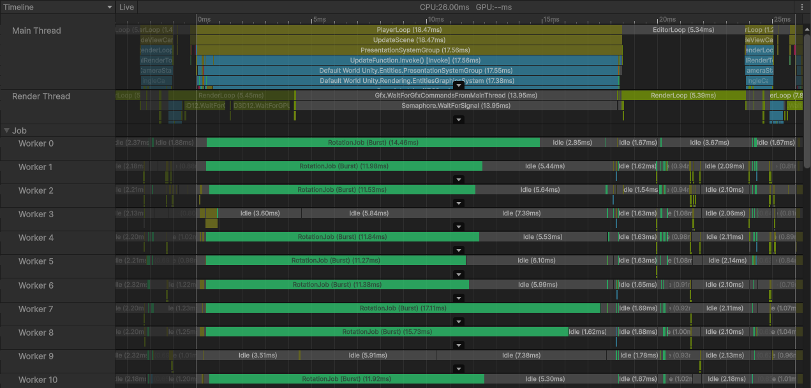

# Make a system multithreaded

This section describes how to modify a system so that it runs [jobs](xref:JobSystem) in parallel on multiple threads.

Topics in this section are workflow steps that depend on previous steps. If you're following along in the Editor, follow the steps in order.

1. Create an authoring component and a system described in the section [Authoring and baking workflow](ecs-workflow-example-authoring-baking.md). This section builds upon that example.
2. [Create an IJobEntity job and schedule it](#create-job).
3. [Visualize multithreading in the Profiler](#visualize).
4. [Read the complete code](#complete-code)

## Prerequisites

1. A Unity 6.X project with the following packages installed:
    * [Entities](https://docs.unity3d.com/Packages/com.unity.entities@latest/index.html)
    * [Entities Graphics](https://docs.unity3d.com/Packages/com.unity.entities.graphics@latest/index.html)

2. Optional: To follow along in the Editor, complete the steps described in [Authoring and baking workflow](ecs-workflow-example-authoring-baking.md#rotation-system).

## Multithreading implementation overview

Consider the [original single-threaded system](ecs-workflow-example-authoring-baking.md#rotation-system):

[!code-cs[The single thread system](../DocCodeSamples.Tests/getting-started/RotationSystem.cs#example-no-using)]

This section shows how to replace the `foreach` loop in the `OnUpdate` method with code that schedules jobs to run in parallel.

## <a id="create-job"></a>Create an IJobEntity job and schedule it

First, create a job that implements the [`IJobEntity`](xref:Unity.Entities.IJobEntity) interface with application logic as in the single-threaded `foreach` loop.

1. Make a copy of the `RotationSystem.cs` file and call it `RotationSystemMultithreaded.cs`. Rename the struct implementing the `ISystem` interface to `RotationSystemMultithreaded`.

1. Create a partial struct that implements [`IJobEntity`](xref:Unity.Entities.IJobEntity). Add the `Execute` method as required by the [`IJobEntity`](xref:Unity.Entities.IJobEntity) interface.

2. Use the arguments of the `Execute` method to query for the same components as in the single-threaded system.

    Use the `ref` and `in` keywords to specify which access the method requires:

    * `ref LocalTransform` indicates read-write access (equivalent to `RefRW<LocalTransform>`).
    * `in RotationSpeed` indicates read-only access (equivalent to `RefRO<RotationSpeed>`)
    
    Code generation automatically creates a query based on the `Execute` method's parameters.

3. Jobs execute asynchronously, and cannot access changing system state after scheduling. That's why there is no access to `SystemAPI` inside an [IJobEntity](xref:Unity.Entities.IJobEntity) job.

    Define a public field `deltaTime` inside the job, so that you can set the `deltaTime` value when scheduling the job:

    ```cs
    public float deltaTime;
    ```

4. Implement the logic to execute on each entity in the `Execute` method. In this example it's the rotation transformation.

    Unlike the `foreach` loop in the single-threaded system, the `Execute` method does not use `RefRW` or `RefRO` wrappers, so there's no need to use the `ValueRW` or `ValueRO` properties. In the `Execute` method, you have direct access to the [LocalTransform](xref:Unity.Transforms.LocalTransform) methods.

The job that implements the application logic is ready:

[!code-cs[](../DocCodeSamples.Tests/getting-started/RotationSystemMultithreaded.cs#RotationJob)]

The next step is to create a new `RotationJob` value in the `OnUpdate` method and schedule it for parallel execution.

1. In the `OnUpdate` method, remove the existing code from the single-threaded implementation. Then create a new `RotationJob` instance. Set the `deltaTime` field to the current frame's `SystemAPI.Time.DeltaTime` value.

    Use the [ScheduleParallel](xref:Unity.Entities.IJobEntityExtensions.ScheduleParallel*) method to add the job instance to the job scheduler queue for parallel execution. 

    [!code-cs[](../DocCodeSamples.Tests/getting-started/RotationSystemMultithreaded.cs#OnUpdate)]

2. Add the `OnCreate` method with the `RequireForUpdate` method to ensure that the system runs only if there's at least one entity with a `RotationSpeed` component in the scene:

    [!code-cs[](../DocCodeSamples.Tests/getting-started/RotationSystemMultithreaded.cs#OnCreate)]

The system is ready to run. Refer to the section [Complete code](#complete-code) for the complete code of the system.

To disable either the `RotationSystem.cs` or the `RotationSystemMultithreaded.cs` system, use the `[DisableAutoCreation]` attribute before the system declaration. The section [Visualize multithreading in the Profiler](#visualize) describes how to see the effect of multithreading clearly with a simple example.

## <a id="visualize"></a>Visualize multithreading in the Profiler

To visualize jobs running in parallel in the [Profiler](https://docs.unity3d.com/Manual/Profiler.html), add a high CPU load function to the system. For example, a recursive Fibonacci number calculation.

1. Add a Fibonacci calculation in the `Execute` method of the `RotationSystemMultithreaded.cs` system. To change the load on the CPU, change the parameter value in the `Fibonacci()` method.
    
    ```cs
    // Demo CPU workload executed per entity.
    int fib = Fibonacci(25);
    int Fibonacci(int n)
    {
        if (n <= 1) return n;
        return Fibonacci(n - 1) + Fibonacci(n - 2);
    }
    ```

2. In the Unity ECS implementation, CPU worker threads are allocated per [chunk](concepts-archetypes.md#archetype-chunks). Each chunk can have up to 128 entities. If there are less than 128 entities affected by a system, a job might run on one thread.
    
    To ensure that you see jobs running in multiple threads, create several hundred GameObjects with the [`RotationSpeedAuthoring`](ecs-workflow-example-authoring-baking.md#authoring-component) component in the ECS subscene. The `RotationSpeedAuthoring` component adds the `RotationSpeed` entity component, which the system in this section queries for.

3. Enter **Play** mode.

4. Open [Profiler](https://docs.unity3d.com/Manual/profiler-introduction.html) and inspect a frame. The **Timeline** view shows multiple `RotationJob` jobs running in multiple worker threads.
    
    <br/>_Profiler window with multiple RotationJob jobs running in parallel_

Try adding the same high CPU load function to the body of the `foreach` loop in the single-threaded system, and use the `[DisableAutoCreation]` attribute on the multithreaded system. Enter **Play** mode and observe the difference in the performance.

## Complete code

The complete code of the multithreaded system is as follows:

[!code-cs[](../DocCodeSamples.Tests/getting-started/RotationSystemMultithreaded.cs#example)]

## Additional resources

* [Introduction to the ECS workflow](ecs-workflow-intro.md)
* [Starter ECS workflow](ecs-workflow-example-starter.md)
* [Authoring and baking workflow example](ecs-workflow-example-authoring-baking.md)
* [Prefab instantiation workflow](ecs-workflow-example-prefab-instantiation.md)
* [Use entity command buffer for structural changes](ecs-workflow-example-ecb.md)