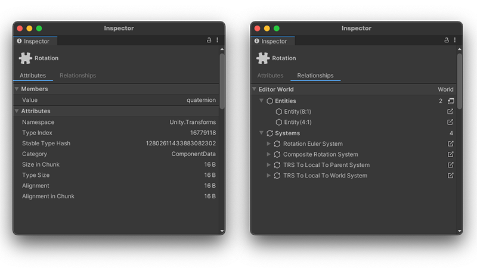

# Component Inspector reference

When you select a component, the [Inspector](https://docs.unity3d.com/Manual/UsingTheInspector.html) displays its information in two tabs:

* **Attributes:** Displays information about the component’s C# type, such as its namespace, member fields, and allocated chunk size.
* **Relationships**: Displays all Entities that have the selected component, and all systems that query the component, per world.

 _Component Inspector, Attributes (Left), Relationships (Right)_

Click on the icon to the right of a system or entity name (), to change the selection to that system or entity. For systems, Unity highlights the system in the [Systems window](editor-systems-window.md). For entities, Unity opens the [Entity Inspector](editor-entity-inspector.md) where possible.

## Additional resources

* [Components user manual](concepts-components.md)
* [Entity Inspector reference](editor-entity-inspector.md)
* [System Inspector reference](editor-system-inspector.md)
* [Query window reference](editor-query-window.md)