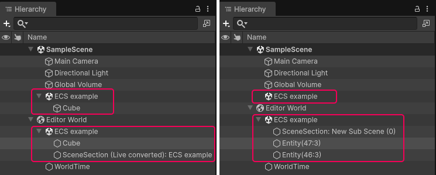

# Entity world view in Hierarchy window

To view [entity worlds](concepts-worlds.md) in the Hierarchy window, enable the [**Use new Hierarchy window**](https://docs.unity3d.com/6000.5/Documentation/Manual/preferences-general.html#hierarchy-window) option the Preferences window. Each entity world node contains the converted [subscenes](conversion-subscenes.md) and [entities](concepts-entities.md) that belong to that world.

World nodes always appear below all Scene nodes in the Hierarchy.

## World node overview

A World node contains the following child nodes:

* **Subscene nodes** display the subscene asset name and use the Unity scene icon. Entities that belong to a subscene are displayed as children of the corresponding subscene node.
* **Entity nodes** display the entity name and use the entity icon. Entities with a [Parent](xref:Unity.Transforms.Parent) component appear nested under their parent entity, which reflects the ECS [transform hierarchy](transforms-concepts.md). Entities that don't belong to any subscene appear directly under the world node.

All entity-related nodes (world, subscene, and entity nodes) are read-only in the Hierarchy window. You can't rename, cut, copy, paste, duplicate, delete, or drag-and-drop these nodes.

In Edit mode, the entity world node has the name **Editor World**, and in Play mode, **Default World**.

When the authoring subscene is open, the Hierarchy window displays converted entities with names that match the authoring GameObjects. When the subscene is closed, all entity nodes have the name Entity followed by the index and version in brackets.

 _Hierarchy view when the subscene is open (left), and closed (right)_

To view information about an entity, select it in the Hierarchy. The [Inspector](editor-entity-inspector.md) displays the entity's data.

### Entity prefabs

Entity prefab root nodes display an entity prefab icon and a blue name. Entity prefab part nodes (children within a prefab) also display blue names but use the standard entity icon. For more information about entity prefabs, refer to [Entity prefabs](baking-prefabs.md).

## Entity world display preferences

To configure how entities appear in the Hierarchy, go to **Preferences** > **Entities** > **Hierarchy Window**. For more information, refer to [Entities Preferences reference](editor-preferences.md).

## Additional resources

* [World concepts](concepts-worlds.md)
* [Entity Inspector reference](editor-entity-inspector.md)
* [Entities Preferences reference](editor-preferences.md)
