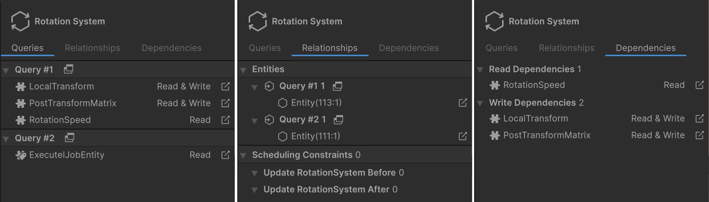

# System Inspector reference

When you select a system in the [Systems window](editor-systems-window.md), the Systems Inspector on the right side of the window displays its information in three tabs:

* **Queries**: Displays the [queries](systems-entityquery.md) that the selected system runs, and the list of components related to each query, along with the system's access rights (**Read** or **Read & Write**).
* **Relationships**: Displays the entities that the system matches, plus any scheduling constraints that the system has.
* **Dependencies**: Displays the components that the system depends on for reading and writing.

 _Systems Inspector: Queries (left), Relationships (middle), Dependencies (right)_

## Queries tab

The Queries tab displays the queries that the selected system runs, plus their components. This view also displays the system's access rights to the components (**Read** or **Read & Write**). Click on the icon to the right of a component name (), to change the selection to that component. Unity also opens the [Component Inspector](editor-component-inspector.md) where possible.

## Relationships tab

The Relationships tab has two sections:

* **Entities**: Lists the entities that the system matches, ordered by query. If there are a lot of entities to display, a **Show All** button is available. When you select **Show All**, Unity displays a list of the matching entities in a [Query window](editor-query-window.md).
* **Scheduling Constraints:** Lists the systems that are affected by any C# attributes that you’ve added to constrain the system. The selected system updates before the systems in the **Before** grouping, and after the systems listed in the **After** grouping

## Dependencies tab

The Dependencies tab displays the component types that the selected system declares as job dependencies. It has two sections:

* **Read Dependencies**: Lists the components that the system registers a read dependency on. These are components the system's jobs read from.
* **Write Dependencies**: Lists the components that the system registers a read-write dependency on. These are components the system's jobs write to.

## Additional resources

* [System user manual](concepts-systems.md)
* [Systems window reference](editor-systems-window.md)
* [Entity Inspector reference](editor-entity-inspector.md)
* [Component Inspector reference](editor-component-inspector.md)
* [Query window reference](editor-query-window.md)