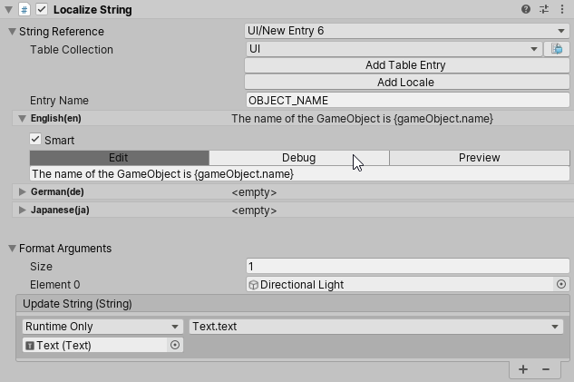
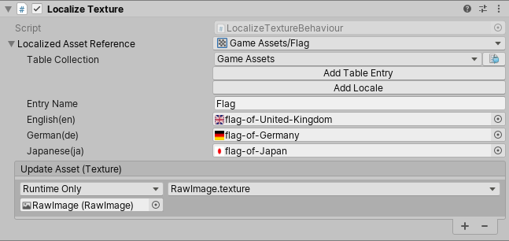
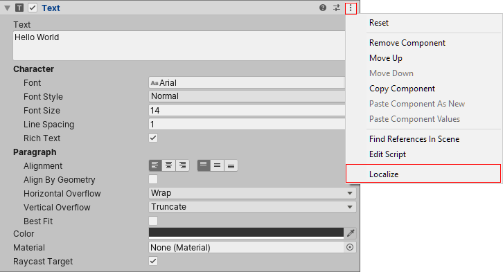
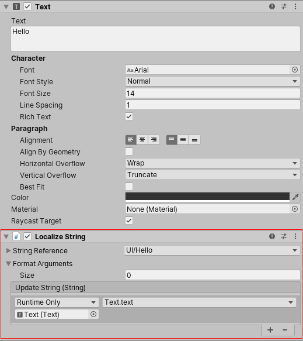

# Component Localizers

Component Localizers are [MonoBehaviours](https://docs.unity3d.com/ScriptReference/MonoBehaviour.html) which you can connect to other components/scripts through [UnityEvents](https://docs.unity3d.com/ScriptReference/Events.UnityEvent.html). Component Localizers allow for localizing without the need to write any scripts.

## LocalizeStringEvent

The LocalizeStringEvent Component Localizer localizes strings and provides additional arguments when using [Smart Strings](Smart/SmartStrings.md) or [String.Format](https://docs.microsoft.com/dotnet/api/system.string.format). In the Inspector, **Format Arguments** must be [UnityEngine.Objects](https://docs.unity3d.com/ScriptReference/Object.html); however, it is possible to pass any type through as an argument via script. You can also use the LocalizeStringEvent editor to edit tables and Localized strings, and preview them after formatting.

## LocalizedAssetEvent

LocalizeAssetEvent can localize a Unity asset, such as a Texture or Audio clip. LocalizedAssetEventis an abstract class that should be inherited from in order to set the Asset type. The Localization System currently features some implemented versions of LocalizedAssetBehaviour for **Texture(LocalizeTextureEvent)** and **Audio Clip(LocalizeAudioClipEvent)**.

This example shows how support could be added for the Font asset.

[!code-cs[source-order](../DocCodeSamples.Tests/LocalizedFontComponent.cs#sample-code)]

## LocalizeDropdownEvent

The LocalizeDropdownEvent Component Localizer populates a list of localized strings suitable for choice-style UI such as `Dropdown` or `TMP_Dropdown`. It supports two source types via a `[SerializeReference]` field:

- **LocalizedStringList** — A single string table entry whose value is split on a configurable separator (default `,`). For example, `"New Game,Load Game,Quit"` becomes three items.
- **LocalizedStringGroup** — A collection of individual `LocalizedString` entries that are aggregated into a list. Each entry is loaded independently.

The component exposes an `OnUpdateList` UnityEvent of type `List<string>` that is invoked whenever the locale changes or the underlying strings load. In the Inspector, connect this field to `Dropdown.AddOptions` or `TMP_Dropdown.AddOptions` alongside `ClearOptions` so that options are replaced rather than appended.

## Automatic Setup

Some Unity components allow you to add an automatic Component Localizer to them. These components have a **Localize** option in their context menus. When you select this, Unity adds a new Component Localizer and hook its events up to the target component.

The following components support automatic setup:

- [Text](https://docs.unity3d.com/Packages/com.unity.ugui@1.0/manual/script-Text.html)
- [RawImage](https://docs.unity3d.com/Packages/com.unity.ugui@1.0/manual/script-RawImage.html)
- [Image](https://docs.unity3d.com/Packages/com.unity.ugui@1.0/manual/script-Image.html)
- [Dropdown](https://docs.unity3d.com/Packages/com.unity.ugui@1.0/manual/script-Dropdown.html)
- [Text - TextMeshPro](https://docs.unity3d.com/Packages/com.unity.textmeshpro@4.0/manual/TMPObjectUIText.html)
- [TMP_Dropdown](https://docs.unity3d.com/Packages/com.unity.textmeshpro@4.0/manual/TMP_Dropdown.html)
- [AudioSource](https://docs.unity3d.com/Manual/class-AudioSource.html)

