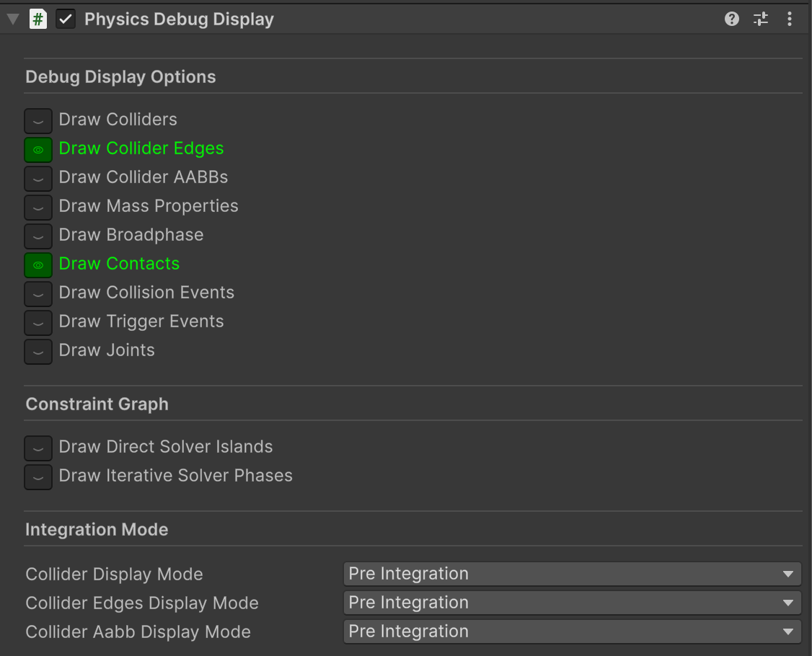
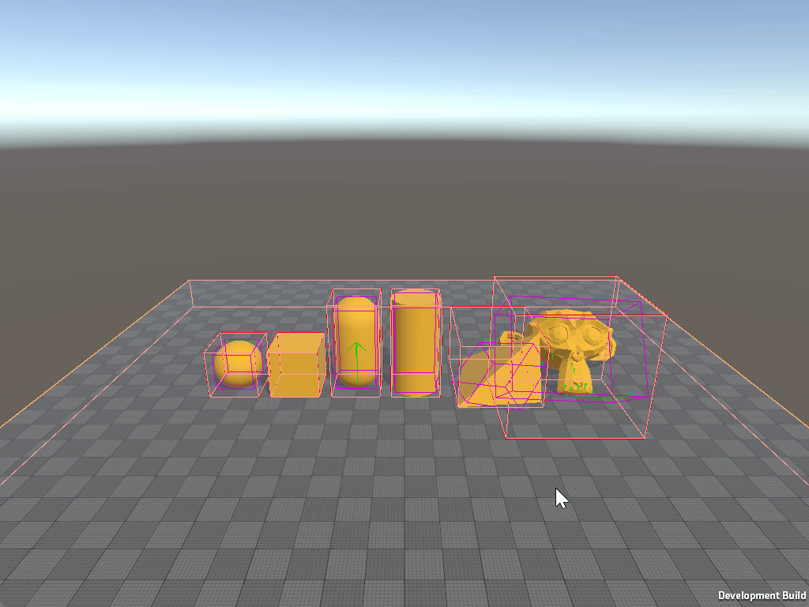

# Physics Debug Display

To visualise Unity Physics, add a `Physics Debug Display` component. As usual, when working with Entities, a **SubScene** is necessary when adding the `Physics Debug Display` component.


| Field                 | Description                                                                                                                                                |
|-----------------------|------------------------------------------------------------------------------------------------------------------------------------------------------------|
| Draw Colliders        | Displays a solid collider around the object.                                                                                                               |
| Draw Collider Edges   | Displays only the edges of the collider.                                                                                                                   |
| Draw Collider AABBs   | Displays the collider's Axis Aligned Bounding Box (AABB), which is usually used in the broadphase.                                                         |
| Draw Broadphase       | Displays the Broadphase expanding the AABB's bodies colliders caused by the collision detection between two bodies. While *Draw Collider AABB's* does not. |
| Draw Mass Properties  | Displays the mass properties.                                                                                                                              |
| Draw Contacts         | Displays a visualization of all contacts.                                                                                                                  |
| Draw Collision Events | Displays a visualization of all collision events.                                                                                                          |
| Draw Trigger Events   | Displays a visualization of all trigger events.                                                                                                            |
| Draw Joints           | Displays a visualization of all Joints, with degrees of freedom, constraints, anchor points and axis alignments.                                           |
| Draw Direct Solver Islands           | Displays the joints and contacts that are solved with the [Direct Solver](constraint-solvers.md) as lines between the connected rigid bodies' centers. Each line color corresponds to a separate sub-problem (a so-called island) solved by the solver individually and in parallel (in a multi-threaded simulation).                             |
| Draw Iterative Solver Phases           | Displays the joints and contacts that are solved with the [Iterative Solver](constraint-solvers.md) as lines between the connected rigid bodies' centers. Each line color corresponds to a sub-set of joints and contacts (a phase) that is potentially solved in parallel (in a multi-threaded simulation). Note that joints and contacts that are solved with the direct solver will also be included in the iterative solver display since these elements need to be processed by both solvers.


<br/>_Physics Debug Display component._

### Integration Mode
The debug display offers two modes for the Collider, Collider Edges and the Collider AABBs displays:
* **Pre Integration:** The colliders are displayed based on their positions and orientations **before the physics step**, that is, as they were seen by Unity Physics in the collision detection stage of the current physics step.
* **Post Integration:** The colliders are displayed based on their position and orientation **after the physics step**, meaning, as they appear after Unity Physics has already updated their positions and orientations at the end of the current physics step.

## Physics Debug Display at Runtime

### Enabling Physics Debug Display
To enable the `Physics Debug Display` component in Player builds:

1. Navigate to **Edit > Project Settings > Physics > Unity Physics**.
2. Check **Enable Player Debug Display** project setting, or manually add the `ENABLE_UNITY_PHYSICS_RUNTIME_DEBUG_DISPLAY` scripting define symbol to your Player settings.

### Important Notes

Using `PhysicsDebugDisplayData` will help **debugging** physics behavior directly in-game if required. However, this debugger may impact performance, so avoid using `ENABLE_UNITY_PHYSICS_RUNTIME_DEBUG_DISPLAY` outside of development builds or for debugging purposes only.

### Toggling Parameters at Runtime

The following script demonstrates how to modify `PhysicsDebugDisplayData` at runtime by accessing the component and updating its values as needed. Refer to the [table above](#physics-debug-display) to enable or disable specific debug options.

```csharp
#if ENABLE_UNITY_PHYSICS_RUNTIME_DEBUG_DISPLAY
using Unity.Burst;
using Unity.Entities;
using Unity.Physics.Authoring;
using UnityEngine;

[RequireMatchingQueriesForUpdate]
[UpdateInGroup(typeof(PhysicsDebugDisplayGroup))]
[BurstCompile]
partial struct RuntimePhysicsDebugDisplayDataManager : ISystem
{
    [BurstCompile]
    public void OnCreate(ref SystemState state)
    {
        state.RequireForUpdate<PhysicsDebugDisplayData>();
    }

    [BurstCompile]
    public void OnUpdate(ref SystemState state)
    {
        var debugDisplayData = SystemAPI.GetSingleton<PhysicsDebugDisplayData>();

        if (Input.GetKeyDown(KeyCode.Alpha1))
            debugDisplayData.DrawColliders ^= 1;

        if (Input.GetKeyDown(KeyCode.Alpha2))
            debugDisplayData.DrawColliderEdges ^= 1;

        if (Input.GetKeyDown(KeyCode.Alpha3))
            debugDisplayData.DrawContacts ^= 1;

        // Enable others:
        //debugDisplayData.DrawCollisionEvents ^= 1;
        //debugDisplayData.DrawColliderAabbs ^= 1;
        //debugDisplayData.DrawTriggerEvents ^= 1;
        //debugDisplayData.DrawJoints ^= 1;
        //debugDisplayData.DrawMassProperties ^= 1;
        //debugDisplayData.DrawBroadphase ^= 1;
        //debugDisplayData.ColliderEdgesDisplayMode = (PhysicsDebugDisplayMode)((byte)debugDisplayData.ColliderEdgesDisplayMode ^ 1);
        //debugDisplayData.ColliderAabbDisplayMode = (PhysicsDebugDisplayMode)((byte)debugDisplayData.ColliderAabbDisplayMode ^ 1);
        //debugDisplayData.ColliderDisplayMode = (PhysicsDebugDisplayMode)((byte)debugDisplayData.ColliderDisplayMode ^ 1);

        SystemAPI.SetSingleton(debugDisplayData);
    }
}
#endif
```

