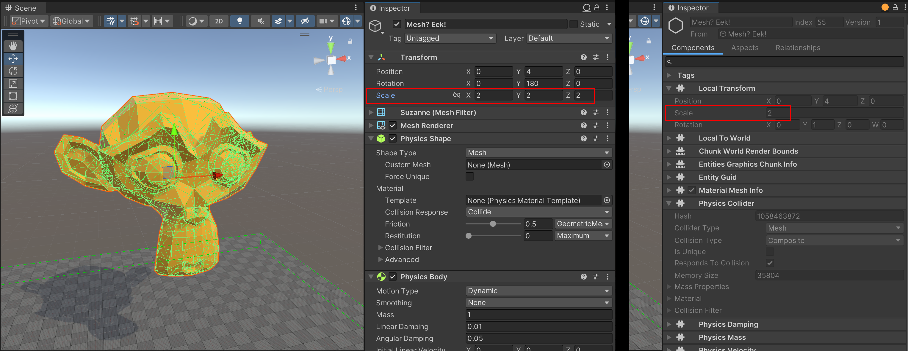

# Rigid Bodies as Entities and Data Components

Unity Physics is based on the [Entity Component System (ECS)](https://docs.unity3d.com/Packages/com.unity.entities@latest). 
Within this framework, rigid bodies can be defined by adding specific data components to the corresponding entities within your project. During the automatic entity baking process in the Unity Editor, both the built-in [`Rigidbody`](xref:Unity.Physics.RigidBody) and [`Collider`](xref:Unity.Physics.Collider) authoring components and the simplified custom [`Physics Body`](custom-bodies.md) and [`Physics Shape`](custom-shapes.md) authoring components on your game objects are converted into rigid body entities with multiple data components (see [Authoring](authoring.md) section).

This is also how rigid bodies are represented at runtime: as entities with specific, optimized data components rather than as game objects with authoring components. This approach allows for smaller, optimized memory footprints leading to higher performance through faster data access speeds. Static bodies for instance require a smaller number of data components than dynamic bodies.

The data components that define rigid bodies are as follows:

| **Component**                      | **Description**                                                                                                                                                                                                                                                                                      |
|--------------------------------|--------------------------------------------------------------------------------------------------------------------------------------------------------------------------------------------------------------------------------------------------------------------------------------------------|
| [`PhysicsCollider`](xref:Unity.Physics.PhysicsCollider)              | The shape of the rigid body. Needed for bodies that can collide.                                                                                                                                                                                                                                   |
| [`PhysicsColliderKeyEntityPair`](xref:Unity.Physics.PhysicsColliderKeyEntityPair) | A buffer element used to associate an original Entity with a collider key in a Compound Collider. Only present when the rigid body contains a compound collider.                                                                                                                                 |
| [`PhysicsCustomTags`](xref:Unity.Physics.PhysicsCustomTags)            | Optional component for applying custom flags to the body. They can be used for certain collision event applications. Assumed to be zero if not present.                                                                                                                                              |
| [`PhysicsDamping`](xref:Unity.Physics.PhysicsDamping)               | Optional component for specifying the amount of damping to apply to the motion of a dynamic body. Assumed to be zero if not present. Every step, a body with this component has its velocities scaled down. This can slow down objects, making them more stable, or provides a simple approximation of aerodynamic drag. |
| [`PhysicsGravityFactor`](xref:Unity.Physics.PhysicsGravityFactor)         | A scalar multiplication factor defining how much a dynamic body should be affected by gravity. This is an optional component, with the factor assumed to be 1 if it is not present. Some objects look more realistic if they appear to fall faster. Other objects (for example, hot air balloons) can rise _up_, which can be emulated with a negative gravity factor. |
| [`PhysicsMass`](xref:Unity.Physics.PhysicsMass)                  | The current mass properties (center of mass and moment of inertia) of a dynamic body. Assumed to be infinite mass if not present.                                                                                                                                                                |
| [`PhysicsSolverType`](xref:Unity.Physics.PhysicsSolverType)              | Optional component used for specifying which type of solver should be used to resolve collisions between this and other rigid bodies. If not present, the default **Iterative Solver** will be used, which is fast and approximate and ideal for situations involving many colliding rigid bodies. For more accurate contact resolution and friction modeling the more computationally demanding **Direct Solver** can be selected with this component instead. See the [Constraint Solvers](constraint-solvers.md) section for more details.|
| [`PhysicsVelocity`](xref:Unity.Physics.PhysicsVelocity)              | The current linear and angular velocities of a dynamic body. Needed for any body that can move.                                                                                                                                                                                                  |
| [`PhysicsWorldIndex`](xref:Unity.Physics.PhysicsWorldIndex)            | Shared component required on any Entity that is involved in physics simulation (body or joint). Its Value denotes the index of physics world that the Entity belongs to (0 by default).                                                                                                          |

All physics bodies require components from [`Unity.Transforms`](xref:Unity.Transforms) to represent their position, orientation and scale in world space.
Depending on whether the body is dynamic or static, that is, whether or not it is expected to move or react to collisions and joints, different transform components are required on the body entity. More details are provided in the following sections.

# Dynamic Bodies

A dynamic body entity requires a `PhysicsVelocity` component and a [`Unity.Transforms.LocalTransform`](xref:Unity.Transforms.LocalTransform) component. For improved performance, the body's `LocalTransform` component is assumed to be in world space and thus fully defines its world space position, orientation and scale.

During the process of baking a dynamic body authored as a GameObject into an entity, the resultant dynamic body entity is unparented from the entity hierarchy, and the GameObject's world-space position, orientation and uniform scale is transferred into the `LocalTransform` component. Information on how non-uniform scales are baked can be found in the [Non-Uniform Scaling and Shearing](#non-uniform-scaling-and-shearing) section.

# Static Bodies

Static bodies are bodies with a `PhysicsCollider` component, but without a `PhysicsVelocity` component. They are considered to be stationary for the most part and are assumed not to collide with other static bodies, and are optimal for representing environmental obstacles, such as terrain surfaces, buildings, trees or rock formations. Such bodies require at least one of either the `LocalTransform`, and/or the [`Unity.Transforms.LocalToWorld`](Unity.Transforms.LocalToWorld) components.

The transformation baking process of static bodies works identical to the process for dynamic bodies described [above](#dynamic-bodies), with one notable exception: Static body entities baked from GameObjects with identity scale (no scale at all) will not be unparented during the baking process. As such, children in the resultant hierarchy will obtain a [`Unity.Transforms.Parent`](xref:Unity.Transforms.Parent) component, pointing to their parent entity. At runtime their world space position and orientation will be obtained directly and efficiently from their `LocalToWorld` component, assuming that such static body entities will not be moved at runtime. The following section provides further details of this approach and discusses its implications.

## Static Bodies and Parents

The world space transformations of static bodies without a `Parent` component, that is, entities outside an entities hierarchy, are obtained by Unity Physics directly from their `LocalTransform` component values, as the local space transformation corresponds to the world space transformation in this case.

However, if a static body has a `Parent` component, its world space transformation is obtained from the current value of its `LocalToWorld` component. This component is updated by the transform systems (specifically, by the [`LocalToWorldSystem`](xref:Unity.Transforms.LocalToWorldSystem)) at the end of every frame. It should therefore be noted that if such static bodies are moved, there is no guarantee that their `LocalToWorld` value is up-to-date when Unity Physics is run next. This can lead to unexpected differences between the supposed state of these bodies in the scene and their state within the physics engine, manifesting in incorrect collisions and wrong results in collision queries such as ray casts or collider casts. Furthermore, the transform systems which update the `LocalToWorld` component don't run as part of the [`FixedStepSimulationSystemGroup`](xref:Unity.Entities.FixedStepSimulationSystemGroup) in which Unity Physics runs. This means that specifically in cases in which the `FixedStepSimulationSystemGroup`, and thereby Unity Physics, is run multiple times per frame, e.g., due to the activities of the [`FixedRateCatchUpManager`](xref:Unity.Entities.RateUtils.FixedRateCatchUpManager), the `LocalToWorld` component will not get updated at the same frequency as the physics systems will run, leading to the aforementioned discrepencies.
To address these issues and for Unity Physics to receive the most up-to-date world space transformation of parented static bodies, they should either not be moved, or, if they are moved, it is advised to manually update their `LocalToWorld` transformation following the move. This can be achieved by running the `LocalToWorldSystem` as part of the `FixedStepSimulationSystemGroup`, which, however, is rather time consuming. Alternatively, the `LocalToWorld` component can be updated manually, in time for the next physics systems update.

# Scaling and Shearing Bodies

The shape of a rigid body, represented by its [PhysicsCollider component](physics-collider-components.md), together with its mass properties, can be scaled or sheared.

## Uniform Scaling

### In the Editor
Any pure, world-space uniform scale of the GameObject representing the rigid body at edit time is transferred into the `LocalTransform` component's `Scale` property during baking. See Figure 1 for an example.
 _Figure 1: This example displays the uniform scale vector (2,2,2) of a GameObject is transferred into the entity's `LocalTransform` component as a `Scale` of 2._

This scale automatically also applies to the collider geometry contained in the entity if it is present (for example, within its `PhysicsCollider` component), regardless of the geometry type, and to its moment of inertia (defined by its `PhysicsMass` component if present).

### During Runtime
Dynamic bodies can be uniformly scaled at runtime by modifying their `LocalTransform` component's `Scale` property mentioned previously. The resultant change in the collider scale is automatically considered during collision detection and resolution, and the change in mass properties is accounted for in the rigid body's dynamics simulation.

## Non-Uniform Scaling and Shearing

### In the Editor
If a GameObject has any **non-uniform scale or shear**, the scale and shear portion of its world-space transformation matrix is transferred into a `PostTransformMatrix` component which is added to the resultant entity during baking. At runtime, this post-transform matrix is automatically applied to the entity's `LocalTransform` matrix, and used to calculate the final local-to-world matrix. This process ensures that any render mesh associated with the GameObject is correctly scaled and sheared and appears as expected.

In addition, the same scale and shear is baked into the body's collider geometry if present, thereby also affecting its mass distribution (the moment of inertia). This occurs regardless of the collider type, with the limitation that certain non-uniform scales and shears can only be exactly represented in some types of collider geometries. For example, any non-uniform scale can be perfectly applied to a box collider if the scale occurs along the box's principal axes. However, this is not the case for a cylinder, capsule or sphere. Conversely, any scale and shear can be perfectly applied to mesh-based colliders such as mesh colliders or convex colliders.

This baking process attempts to apply the GameObject's edit-time non-uniform scale and shear to the rigid body's collider geometry as best as possible, but will not be able to fully represent the scale and shear if the collider geometry type does not support it.
After this process, the entity's `LocalTransform.Scale` will be set to `1`, as the full scale and shear has already been applied to the collider geometry.

### During Runtime
It is possible to apply **non-uniform scale and shear** to the shape of a rigid body at runtime by directly modifying the `Collider` blob located within the body's `PhysicsCollider` component. For more information, refer to the subsection on modifying colliders in the [PhysicsCollider component](physics-collider-components.md#modifying-collider-geometry) section.

# Additional Topics

Next in this chapter, the [PhysicsCollider component](physics-collider-components.md) section describes how the shape and geometry of rigid bodies is defined.

Subsequent chapters describe how to [add rigid bodies to your scenes](authoring.md), and how to [interact with rigid bodies and their runtime data](interacting-with-bodies.md).
