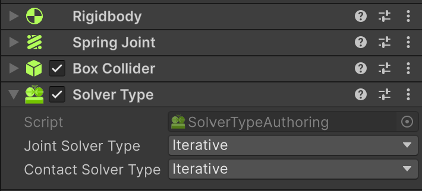
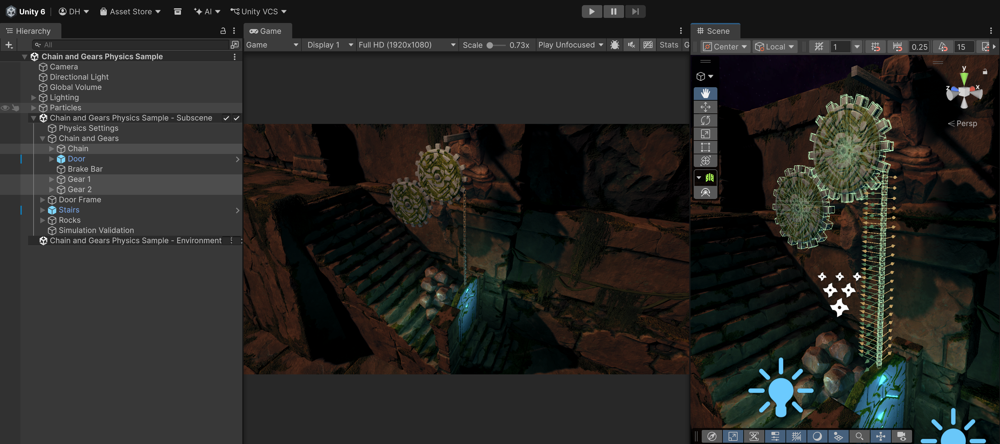

# Choosing constraint solvers
Unity Physics provides two types of constraint solvers for the calculation of joint and contact forces, an **Iterative Solver** (the default) and a **Direct Solver**. Both solver technologies have unique strengths and weaknesses.

* The **Iterative Solver** deals well with common scenarios found in games, such as large quantities of loosely piled objects. It provides high simulation performance but produces approximate results. As such, it has trouble dealing with situations encountered in more complex physics-based scenarios involving long joint chains, stiff joints, or high mass ratios.
* In contrast, the **Direct Solver** deals well with these situations but has a much higher computational complexity, leading to slowdowns if the number of simulated entities becomes too large.

Considering the complementary advantages and disadvantages of these solver types, it seems difficult to choose the right solver for your game.
Luckily, Unity Physics offers a unique simulation system that combines the iterative and direct solvers in a hybrid setting, thereby allowing you to make use of the strengths of both solver types.
This makes it possible to add more advanced physical elements to your projects including complex gearing systems, chains, ropes and more. Such elements unlock a variety of use cases ranging from physics-based puzzle game mechanics (see Fig. 1) to realistic AR/VR-based object manipulations, as well as advanced industrial scenarios, such as robotics simulations.

 _**Figure 1:** Hybrid solver simulation in Unity Physics of advanced physics-based game mechanics in a puzzle game environment. The simulation combines the Direct Solver for accurate simulation of the stiff chain links and the gears, with the Iterative Solver for efficient simulation of all the collisions in the scene_

## Assigning constraint solvers to joints and rigid bodies

The direct and iterative solvers can be freely combined in a simulation simply by assigning them to different joints and rigid bodies. Unity Physics will automatically integrate the results of both solvers, producing two-way force coupling at the solver interfaces, allowing you to choose the best tool for the job. You simply have to decide which physics elements in your game need performance and which elements need accuracy, and then assign either the iterative (for performance) or the direct solver (for accuracy).

Figure 1 shows an example where the joints of the gears and the chain were assigned the direct solver for accurate simulation of the stiff chain joints and the large mass at the end of the chain, and all the rigid bodies were assigned the iterative solver for fast simulation of all the contacts between the chain and the gears. Here we can see that the combination of both solvers allows for accurate real-time simulation of complex emerging effects such as the chain getting squeezed between the gears and consequently jamming the gearing mechanism. Still, the chain links remain intact despite being subjected to very high contact forces.

In the following sections you will learn how to make use of this simulation system by assigning different solver types to the physics elements in your scene through either built-in or custom physics authoring components, and how these assignments are passed into the underlying physics engine.

### Assigning solvers using built-in physics authoring

#### Joints and joint forces:
To assign a solver to a built-in `Joint` component (e.g., `HingeJoint`, `SpringJoint` etc.), add the `Solver Joint` authoring component and select the solver from the "Joint Solver Type" drop-down.

 

This will assign all joint components present on the same game object to the selected solver type for computation of the joint forces.

#### Colliders and contact forces:
You can assign solvers to `Colliders` in the same way, by choosing the solver type from the "Contact Solver Type" drop-down. Once two colliders intersect, the solver used to compute the forces of the contacts between them is determined as follows:
* The **Iterative Solver** will be used if **at least one** of the two colliders is assigned to it.
* The **Direct Solver** will be used if **both** colliders are assigned to it.

This makes sure that if any of the two colliders requires fast contact resolution, the faster iterative solver is used, prefering speed over accuracy. Analogously, only if both colliders require high precision contact and friction interactions will the more accurate direct solver be used.

### Assigning solvers using custom physics authoring

Similarly to the built-in authoring, solvers can be assigned to custom joints and custom shapes. The contact solver determination logic works the same as explained [above](#colliders-and-contact-forces). For custom authoring components, however, the solver selection is performed directly on the components themselves.

* **Custom Joint**: Select the solver from the joint's "Solver Type" drop-down.
* **Custom Physics Shape**: Select the solver using the "Advanced -> Solver Type" property.

### Baking of the solver assignments into entities
The entities baking process will automatically bake the solver assignment from the authoring components (see above) into entities data. That is, it will add the `PhysicsSolverType` component to the corresponding baked rigid body and joint entities. The solver choice will then be passed on to the Unity Physics engine when building the underlying `PhysicsWorld`, where the different solvers will be applied to compute the desired simulation outcome.

### Enabling the direct solver in a manual simulation
When assigning the direct solver to rigid body or joint entities using the `PhysicsSolverType` component, as described above, Unity Physics will automatically enable the direct solver in the pipeline as part of the automatic `PhysicsWorld` building process. However, if you are creating your own `PhysicsWorld` for manual simulation and you want to make use of the direct solver in `Unity.Physics.RigidBody` or `Unity.Physics.Joint` elements, you need to enable it manually using the `DynamicsWorld.EnableDirectSolver` property on the dynamics world, contained in your physics world.

## Sample: Hybrid solver simulation for advanced physics
Unity Physics comes with a package sample demonstrating how to make use of both the iterative and the direct solver for adding complex game physics to your scene (see Fig. 2). You can import this "Advanced Game Physics Sample - Chain and Gears" directly into your project (URP) from the Package Manager via the "Samples" tab of the Unity Physics package.

 _**Figure 2:** Package sample "Advanced Game Physics Sample - Chain and Gears", demonstrating the use of a hybrid solver setup for creating complex game physics._

The sample provides an advanced physics-based game element that leverages Unity Physics' hybrid solver technology to simulate a complex mechanism involving gears interacting with a chain (see Fig. 1). It combines the Direct Solver for accurate simulation of the stiff chain links and the gears with the Iterative Solver for efficient simulation of all the collisions in the scene. This setup demonstrates how both solvers combined can capture exciting emerging physical behaviors at real-time simulation rates, such as the jamming of the gears caused by the chain getting stuck between the gears' teeth in this example scenario.

## Tips and Tricks
* **Visualizing where the direct solver is used:** The "Draw Direct Solver Islands" option in the [Physics Debug Display](component-debug-display.md) provides a simple debug overlay that visualizes which joints and contacts in your scene are solved by the direct solver, represented by lines between rigid bodies. Each line color corresponds to a separate isolated sub-problem (a so-called island) that is solved independently. If you expect certain parts of your scene to be simulated with the direct solver, but the visualization indicates that it is not, check your solver assignments.
* **Simulating long and stiff chains:** 
Long chains, configured to be relatively stiff along the central axis, can lead to vibration build up and instabilities in the direct solver if the chosen joints don't impose sufficient restriction to lateral motion, such as a ball and socket or a hinge. Consider using configurable joints with locked angular axes rather than ball and sockets or hinges with free angular motion and relaxing the angular axes with a low stiffness and damping to stabilize the motion. Alternatively, add angular damping to the rigid bodies that form the chain in order to ensure sufficient energy dissipation, or make their inertia tensors more spherical.
* **Accurate friction:** 
The direct solver is an excellent choice for cases that require accurate friction modeling. For contact rich simulations however, consider combining the direct solver (for joints) with the iterative solver (for contacts) for faster simulation, just as demonstrated in the [Advanced Game Physics Sample](#sample-hybrid-solver-simulation-for-advanced-physics).
* **High impact velocities in the direct solver:** 
When using the direct solver for contacts, the system-wide "Collision Tolerance" in the [Physics Step component](component-step.md) might need to be increased in cases where high impact velocities can occur or if the "Contact Stiffness" in the [Direct Solver Settings](component-step.md#direct-solver-settings) is set to very high. Otherwise, contact instabilities could arise.
* **Improving robustness and speed of the direct solver:** 
In excessively stiff or complex cases, the direct solver might struggle to find a solution. In this case, consider reducing the stiffness of the system to improve solver speed and robustness.
    * You can manually reduce the stiffness of the joints in your simulation, e.g., by adjusting the "Spring" property in your built-in joints.
    * Alternatively, you can impose a maximum stiffness in the direct solver for joints and contacts using the "Maximum Joint Stiffness" and "Contact Stiffness" properties in the [Direct Solver Settings](component-step.md#direct-solver-settings) of the `Physics Step` component. When increasing or reducing the stiffness settings, make sure to also adjust the corresponding damping settings accordingly to prevent overdamping or applying insufficient damping to joints and contacts.
    * Similarly, when simulating motorized joints or contacts with friction, the "Minimum Motor Slip" and "Contact Slip" properties can be increased slightly to make it easier for the direct solver to find a solution. However, setting a too high value here can lead to undesired slippyness in motors, preventing them from reaching their target velocity, or sliding in frictional contacts.
    * As a rule of thumb, making things less stiff (lower stiffness) and more slippery (higher slip), makes the solver faster and more robust, but less accurate.