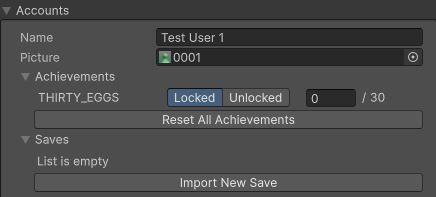

# Create and configure test accounts

To support testing games using the Platform Toolkit package, you can create and manage test accounts with customizable data.

> [!NOTE]
> To access the following control settings, you must have a **Play Mode Controls Settings** asset in your project. For more information on how to create this asset, refer to [Create a Play Mode Controls Settings asset](../playmodecontrols/play-mode-create.md).

*Example of a test account inside Play Mode Controls Settings.*

## Create a test account

A **Play Mode Controls Settings** asset file contains pre-configured information for four test accounts. You can add or remove test accounts as required.

### Configure test accounts

To configure test accounts:

1. Navigate to **Window** > **Platform Toolkit** > **Play Mode Controls** to open the **Play Mode Controls** window.
1. Select **Test Account Data**.
1. In the **Accounts** section configure data for each test account as required.

You can set and modify the following data for each account. For more information, refer to [Play Mode Controls window reference](play-mode-controls-settings-reference.md):

* An account name
* A profile picture
* Unlock specific achievements
* Manage save files
* Set custom attribute values for testing in-game workflows that rely on platform account attributes. For more information, refer to [Create Play Mode Controls attributes](create-pmc-attributes.md).

> [!NOTE]
> When in **Play** mode, you can't edit information in the **Play Mode Controls Settings** asset.

## Additional resources

* [Create a Play Mode Controls Settings asset](play-mode-create.md)
* [Play Mode Controls window reference](play-mode-controls-settings-reference.md)