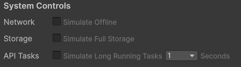
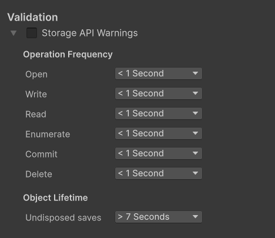

# Simulate common failures

The Play Mode Controls in the Unity Editor allow for testing for common failure cases when using the Platform Toolkit API.

*System Controls in the Play Mode Controls window*

Using the System Controls section of the **Play Mode Controls** window, it's possible to simulate the following scenarios:

* Losing network connection.
* No available storage space remaining.
* Simulate long running asynchronous tasks.

When enabling the **Network** and **Storage** options, API calls that might fail when these cases are true will throw appropriate exceptions, allowing you to test these edge cases in your games without having to deploy to a device.

As the behavior of all API methods in the Platform Toolkit package is simulated within the Unity Editor, and doesn't communicate directly with any platform systems and services, these methods can often complete too quickly to effectively test loading screens and UI transitions. By enabling **Simulate Long Running Tasks**, you can introduce an artificial delay into all asynchronous methods.

### API Validation

The Validation section of Play Mode Controls can be used to catch API usage which might lead to certain failure cases, either at submission or runtime.

*Validation Settings in the Play Mode Controls window*

Using the Validation settings section of the **Play Mode Controls** window, it's possible to test for the following:

Storage APIs:
* Leaving save objects undisposed for a long period of time, which could lead to locked file handles or submission failures on some platforms.
* Performing various types of operation too frequently with the same operands. This can be useful when you want to make sure you're not redundantly re-reading savedata, or overwriting the same data frequently. Examples of settings you can configure here include:
  * Opening the same save for either read or write twice within 1 second
  * Writing to the same file within a save twice within 1 second

## Additional resources

* [Play Mode Controls window reference](play-mode-controls-settings-reference.md)
