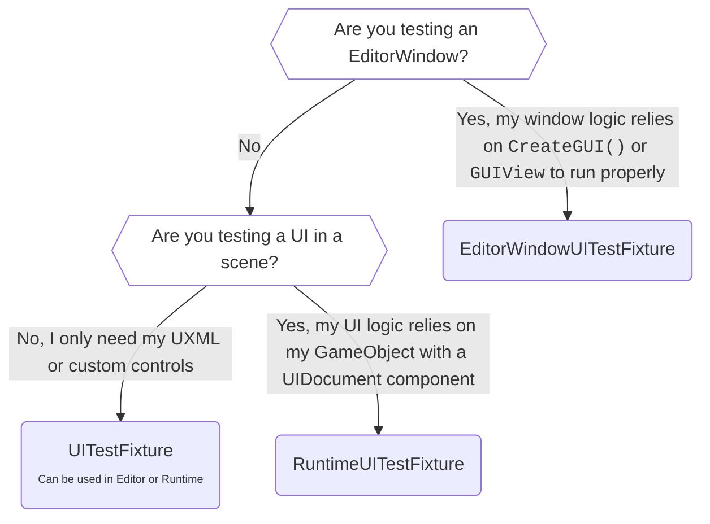
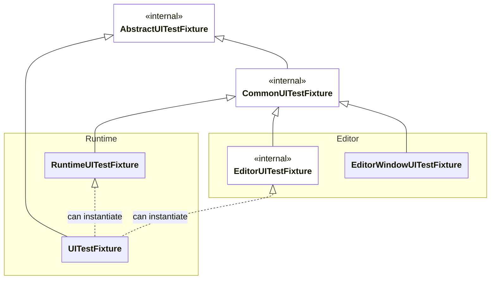

# Introduction to UI test fixtures

The UI test fixtures are base classes that your test classes can inherit from. The test fixtures manage the lifetime (set up and tear down) of your test's UI. Depending on the test fixture, they can provide your test with an empty UI ready for you to populate, or they can spawn an existing UI you provide to it.

## Choose the appropriate test fixture

There are 4 test fixtures available to use. The following table summarizes each test fixture and its intended purpose:

| Test fixture | Intended purpose |
|:---|:---|
| [UITestFixture](xref:UnityEngine.UIElements.TestFramework.UITestFixture) | [Create tests that run in both Editor and Runtime states](xref:test-in-both-editor-and-runtime-states). This fixture provides an empty panel instance for you to populate during the test. |
| [EditorWindowUITestFixture](xref:UnityEditor.UIElements.TestFramework.EditorWindowUITestFixture`1) | [Create tests that require an actual `EditorWindow` instance](xref:test-ui-with-editor-window-instances). This fixture spawns and manages an `EditorWindow` instance for you. |
| [RuntimeUITestFixture](xref:UnityEngine.UIElements.TestFramework.RuntimeUITestFixture) | [Create tests that run in the runtime state](xref:test-ui-in-runtime). This fixture provides an empty `UIDocument` object for runtime testing. |

The following decision tree can help you decide which test fixture to use based on how you structure your UI:

## PanelSimulator

A key aspect of the test fixtures is the [PanelSimulator](xref:UnityEngine.UIElements.TestFramework.PanelSimulator). Each test fixture initializes a `simulate` property, which inherits from the `PanelSimulator` base class. This property allows you to [control the timing of your UI, update the UI as needed](xref:trigger-and-update-ui), and [simulate user interactions and events](xref:simulate-ui-interaction-landing).

There are different types of `PanelSimulator`, each designed to work in specific environments or scenarios. For more information about the different types of `PanelSimulator` and which test fixture uses which type, refer to [Create multi-window tests](xref:create-multi-window-tests).

## Test fixture properties

The test fixtures share common base classes and therefore have some common properties that are important to know for writing tests.

The following table summarizes several important properties for writing tests. 

| Common Property | Description |
|:---|:---|
| [`simulate`](xref:UnityEngine.UIElements.TestFramework.CommonUITestFixture#UnityEngine_UIElements_TestFramework_CommonUITestFixture_simulate) | Simulates events and time increments, and updates your UI. |
| [`rootVisualElement`](xref:UnityEngine.UIElements.TestFramework.PanelSimulator#UnityEngine_UIElements_TestFramework_PanelSimulator_rootVisualElement) | Modifies your UI, adds or removes elements, or queries for elements. |
| [`panelSize`](xref:UnityEngine.UIElements.TestFramework.AbstractUITestFixture#UnityEngine_UIElements_TestFramework_AbstractUITestFixture_panelSize) | Sets the size of the panel managed by the test fixture. |

For a complete reference of all the common properties and methods, refer to [AbstractUITestFixture](xref:UnityEngine.UIElements.TestFramework.AbstractUITestFixture) and [CommonUITestFixture](xref:UnityEngine.UIElements.TestFramework.CommonUITestFixture).

## Test fixture class diagram

This class diagram illustrates the relationships between the different test fixtures:

## Additional resources

- [EditorWindow](xref:UnityEditor.EditorWindow)
- [PanelSimulator](xref:UnityEngine.UIElements.TestFramework.PanelSimulator)
- [Panels](xref:UIE-panels)