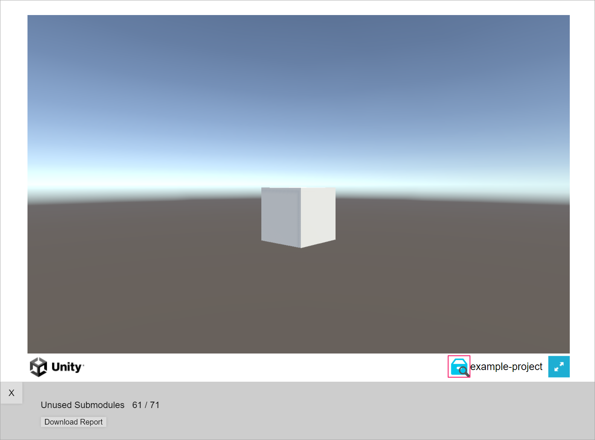
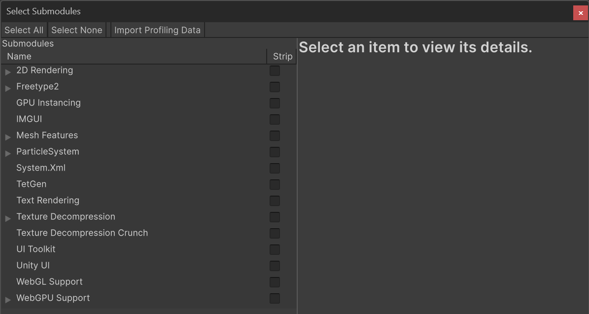

# Strip submodules from a build

Configure submodule stripping settings, profile your build to identify and remove unused submodules, and run the stripped build.

For an overview of the submodule stripping process, refer to [Submodule stripping workflow](submodule-stripping-workflow.md).

## Prerequisites

In [**Player** settings](xref:class-PlayerSettingsWebGL), enable **Enable Submodule Stripping Compatibility**.

## Configure submodule stripping settings

To set up submodule stripping:

1. Go to **Window** > **Web Optimization** > **Submodule Stripping**.
1. In the [Submodule Stripping window](submodule-stripping-window-reference.md), select a build from the list or select **Add Build** to choose one from your directory.

   >[!NOTE]
   >The build must have been created or rebuilt after this package was installed.

   >[!NOTE]
   >Enable [debug symbols](xref:class-PlayerSettingsWebGL#Publishing) in the build during testing.

   >[!NOTE]
   >Don't add `--profiling` or `--profiling-funcs` to `PlayerSettings.WebGL.emscriptenArgs`. Consider using [embedded debug symbols](xref:class-PlayerSettingsWebGL#Publishing) instead.

1. In the **Stripping Settings** property, choose the submodule stripping settings to use.
1. Enable **Strip Automatically After Build**, if you want these stripping settings to run automatically on new builds.

## Profile the build for unused submodules

To profile the build for unused submodules:

1. In the **Submodule Stripping** window, select **Add Profiling**.
1. Select **Run** to launch the build in a browser.
1. Play the game and interact with all elements to ensure all submodules load. A report of used and unused submodules generates while you play.
1. When you're done, open the profiling overlay and select **Download Report**. Save the report to your computer.

    

## Remove unused submodules

To strip out the unused submodules:

1. In the **Submodule Stripping** window, select **Select Submodules**.
1. In the **Select Submodules** window, select **Import Profiling Data** and choose the report you downloaded. Overwrite the existing selection or combine the report with the existing selection. Alternatively, select submodules manually.

    

1. Select **Strip** or return to the Submodule Stripping window to configure more settings.

## Run the stripped build

To run the build:

1. Select **Run** to launch a build in the browser.
1. Check the build for errors and missing elements. If everything works as expected and the build is error-free, you stripped the right submodules.

>[!NOTE]
>Refer to [Test the stripped build](test-stripped-build.md) for the detailed testing process.

## Additional resources

* [Test the stripped build](test-stripped-build.md)
* [Optimize the stripped build](optimize-stripped-build.md)
* [Backup and additional files](backup-files.md)
