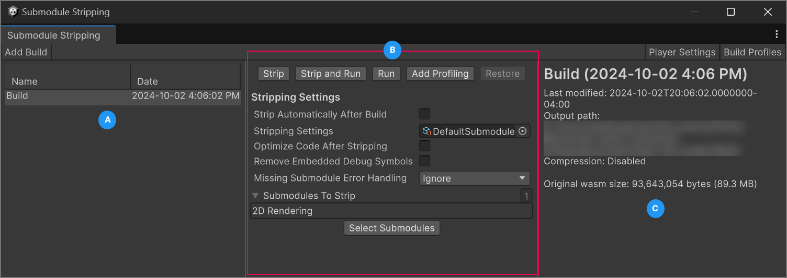

# Submodule Stripping Settings reference

Use these settings to configure submodule stripping.

To view these settings, go to **Window** > **Web Optimization** > **Submodule Stripping**.

You can also view the settings of individual **SubmoduleStrippingSettings** assets in the **Inspector** window.

 _The Submodule Stripping Settings in the Unity Editor_ 
A: Add new builds and review a list of existing builds. Only builds created while this package was installed are listed. 
B: Options to configure and run [submodule stripping settings](#stripping-settings) on the selected build. 
C: Information about the selected build and shortcuts to the [Player Settings](xref:um-class-player-settings-webgl) and [Build Profiles](xref:um-web-build-settings) windows.

## Stripping Settings

|**Property**||**Description**|
|:---|:---|:---|
|**Strip Automatically After Build**|Enable automatic submodule stripping at the end of each player build.|
|**Stripping Settings**|The currently active submodule stripping settings for the project.|
|**Optimize Code After Stripping**|Enable an additional compiler optimization pass after submodule stripping. This will increase the build time. Refer to [Optimize the stripped build](optimize-stripped-build.md) for more information.|
|**Remove Debug Information**|Remove [debug information](https://docs.unity3d.com/Documentation/ScriptReference/PlayerSettings.WebGL-debugSymbolMode.html) after stripping. Debug symbols are required to identify functions during stripping, but they increase the size of WebAssembly files. Use on release builds if debug symbols aren't required for other uses cases.|
|**Missing Submodule Error Handling**|Choose the error handling behavior when a build tries to use a function of a stripped submodule. For the release build, use the **Ignore** option.|
||**Ignore**|No error-handling action occurs.|
||**Log Error**|An error message is printed in the browser console.|
||**Throw Exception**|The build throws an exception and stops execution.|
|**Submodules To Strip**|Lists the submodules to strip from the build. Select **Select Submodules** to add or remove submodules.|

### Stripping actions

|**Actions**|**Description**|
|:---|:---|
|**Strip**|Strip the selected submodules from the build.|
|**Strip and Run**|Strip the selected submodules from the build and run the build in the browser.|
|**Run**|Run the build in the browser.|
|**Add Profiling**|Add [submodule profiling](submodule-profiling.md) to the build.|
|**Restore**|Restore the build to its original state.|

## Additional resources

* [Strip submodules from a build](strip-submodules.md)
* [Change the active stripping settings](change-stripping-settings.md)
* [Create multiple stripping settings](create-multiple-stripping-settings.md)

